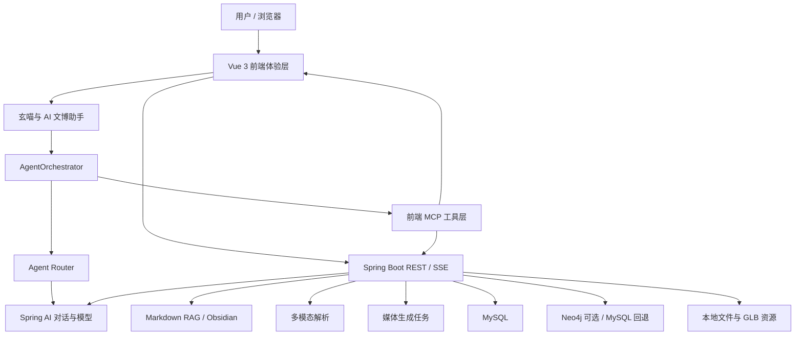
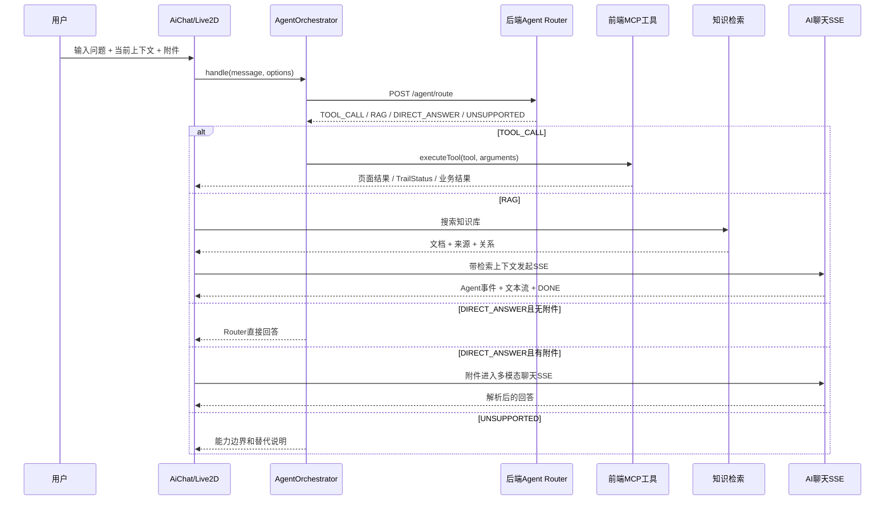
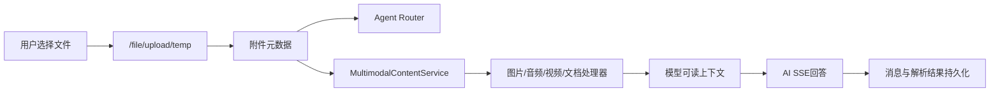
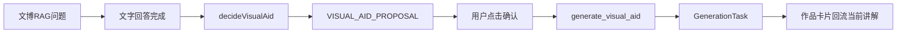

# 青铜数元项目全景 README 与 Agent 交接指南

> 面向对象：下一位项目接手者、开发者、代码审查者和 AI Agent  
> 文档目标：在不依赖历史聊天记录的情况下，准确理解当前项目、架构、运行链路、开发边界和验证方式  
> 当前主目录：`G:\终版`  
> 当前主分支：`master`  
> 文档核对基线：`4dbe50a feat: add continuous exploration visual aid flow`  
> 前端默认端口：`8800`  
> 后端默认端口：`8889`

---

## 目录

1. [项目速查卡](#1-项目速查卡)
2. [项目介绍与定位](#2-项目介绍与定位)
3. [当前完成状态](#3-当前完成状态)
4. [用户角色与业务边界](#4-用户角色与业务边界)
5. [总体系统架构](#5-总体系统架构)
6. [仓库目录结构](#6-仓库目录结构)
7. [前端架构](#7-前端架构)
8. [后端架构](#8-后端架构)
9. [Agent 智能路由架构](#9-agent-智能路由架构)
10. [上下文与连续参观状态](#10-上下文与连续参观状态)
11. [智能导览规划器](#11-智能导览规划器)
12. [TrailStatus 与导览体验编排](#12-trailstatus-与导览体验编排)
13. [RAG 与 Obsidian 知识库](#13-rag-与-obsidian-知识库)
14. [多模态问答](#14-多模态问答)
15. [语音输入与 TTS](#15-语音输入与-tts)
16. [AI 图片、视频与视觉辅助](#16-ai-图片视频与视觉辅助)
17. [3D、时空展线与知识图谱](#17-3d时空展线与知识图谱)
18. [传统业务模块](#18-传统业务模块)
19. [数据库设计](#19-数据库设计)
20. [API 总览](#20-api-总览)
21. [配置体系](#21-配置体系)
22. [本地启动与初始化](#22-本地启动与初始化)
23. [测试与回归](#23-测试与回归)
24. [部署与文件存储](#24-部署与文件存储)
25. [开发约定](#25-开发约定)
26. [已知限制与技术债](#26-已知限制与技术债)
27. [修改功能时应从哪里入手](#27-修改功能时应从哪里入手)
28. [下一位 Agent 的接手清单](#28-下一位-agent-的接手清单)
29. [核心演示链路](#29-核心演示链路)
30. [术语表](#30-术语表)

---

## 1. 项目速查卡

| 项目项 | 当前事实 |
|---|---|
| 项目名称 | 青铜数元 |
| 核心定位 | AI 驱动的三星堆文化智能体验生态 |
| 核心角色 | 玄喵，三星堆数字讲解员与文博 Agent |
| 前端 | Vue 3 + Vite 4 + Ant Design Vue + Vant |
| 后端 | Spring Boot 3.4.1 + Java 17 + MyBatis-Plus |
| 数据库 | MySQL 8.x |
| 可选图数据库 | Neo4j 5.x，关闭时回退 MySQL/前端关系数据 |
| AI 调用 | Spring AI，OpenAI 兼容协议 |
| 主对话配置 | `spring.ai.openai.*`，当前模板面向 SiliconFlow 兼容接口 |
| Agent Router | 后端 LLM 路由，四类结果：`TOOL_CALL`、`RAG`、`DIRECT_ANSWER`、`UNSUPPORTED` |
| 工具执行 | 主要由前端 `AgentOrchestrator + MCP_TOOLS` 执行 |
| 知识库 | `springboot/knowledge-vault/wiki`，当前 38 份 Markdown |
| RAG | 后端 Markdown 词法索引 + 关系加权；前端保留 7 份静态知识文件兜底 |
| 3D | Three.js + 5 个核心 GLB 模型 |
| 图谱 | AntV G6；后端可接 Neo4j，默认可回退 |
| 多模态 | 图片理解、音频转写、视频关键帧与音轨、PDF/Word/文本解析 |
| 语音 | 浏览器录音 + 后端 ASR；TTS 支持智谱、MiMo、SiliconFlow 和本地兜底 |
| 媒体生成 | 图片/视频任务化生成，当前供应商实现为 SiliconFlow |
| 当前 Git 主线 | `master`，HEAD 与 `origin/master` 同为 `4dbe50a` |
| 当前主目录 | `G:\终版` |

### 1.1 一句话理解

青铜数元不是“给三星堆网站加一个聊天框”，而是把用户浏览状态、文博知识、智能导览、浏览器工具、语音、多模态和文化消费连接起来，让玄喵能够陪用户完成一次连续的数字参观。

### 1.2 最重要的业务闭环

```text
用户探索文物
→ 玄喵理解当前页面与文物
→ Agent 判断问答、知识检索或工具操作
→ 生成导览计划或执行页面动作
→ TrailStatus 确认页面真实到达
→ 文字、语音、图片等方式继续讲解
→ 推荐下一步探索
→ 可延伸到课程、答题、活动和文创商城
```

### 1.3 新 Agent 先看哪些文件

按优先级阅读：

1. `PROJECT-HANDOFF.md`：本文件，当前架构总说明。
2. `docs/青铜数元系统使用教程.md`：用户如何操作系统。
3. `vue3/src/agent/AgentOrchestrator.js`：前端 Agent 总编排。
4. `springboot/src/main/java/org/example/springboot/agent/AgentRouterService.java`：后端模型路由。
5. `vue3/src/components/Live2DAvatar.vue`：全局玄喵。
6. `vue3/src/views/frontend/AiChat.vue`：AI 文博助手主页面。
7. `vue3/src/views/frontend/TimeSpaceTrail.vue`：时空展线与真实状态同步。
8. `vue3/src/agent/context.js`：上下文状态。
9. `vue3/src/agent/activeGuide.js`：GuidePlan 与导览状态。
10. `vue3/src/agent/guideExperience.js`：导览体验阶段。
11. `vue3/src/utils/knowledgeSearch.js` 与后端 `knowledge/`：RAG。
12. `springboot/src/main/java/org/example/springboot/service/MultimodalContentService.java`：多模态。
13. `springboot/src/main/java/org/example/springboot/service/MediaGenerationService.java`：媒体生成任务。

---

## 2. 项目介绍与定位

### 2.1 项目背景

项目围绕三星堆、金沙和古蜀文明进行数字化表达，目标是降低文博知识的理解门槛，并把“看文物”升级为“理解文物、探索关系、获得讲解、继续参观”。

传统数字博物馆常见的问题是：

- 页面之间相互独立，用户看完一页就结束。
- 搜索只能返回内容，不能理解用户当前参观状态。
- AI 只能聊天，无法实际控制页面。
- 文物知识以静态文字堆叠，缺少关系和叙事。
- 3D、语音、知识库、生图和商城各自分散。

青铜数元通过玄喵 Agent 把这些能力组织成连续体验。

### 2.2 产品定位

项目当前定位为：

> AI 驱动的三星堆文化智能体验生态。

玄喵的定位是：

> 能理解当前参观状态、连接文博知识、规划导览、调用工具并提供多模态反馈的数字文化伙伴。

它不是：

- 无限制自治的通用 Agent。
- 代替考古专家的权威研究系统。
- 自动执行付款、删除、发布等高风险动作的机器人。
- 复杂长期用户画像系统。

### 2.3 项目价值维度

| 维度 | 项目体现 |
|---|---|
| 智能性 | Agent Router、Context、GuidePlan、工具调用、连续探索 |
| 文化内涵 | 三星堆、金沙、古蜀祭祀体系、青铜工艺、宇宙观知识库 |
| 审美体验 | 玄喵形象、博物馆式界面、Three.js、全景漫游、AI 文化示意图 |
| 技术创新 | RAG、知识关系、SSE、TrailStatus、GuideExperience、多模态任务化 |
| 市场潜力 | 文创商城、文化 IP 创作、可迁移到其他博物馆和文化主题 |
| 社会价值 | 文化传播、研学教育、低门槛数字参观、知识可视化 |

---

## 3. 当前完成状态

### 3.1 已完成的核心能力

当前 `master` 已具备：

1. 前后台用户体系与 JWT 登录状态。
2. 首页、文物、专家、课程、活动、商城、订单和个人中心。
3. 三星堆时空筛选和四幕式时空展线。
4. 5 件核心文物 GLB 3D 模型。
5. 文物关系图谱和节点叙事。
6. 全局玄喵悬浮问答。
7. AI 文博助手的会话、历史和流式回答。
8. Agent Router 四路分流。
9. 前端工具调用与真实页面操作。
10. 短期上下文记忆和探索历史。
11. GuidePlan、activeGuideState 和 TrailStatus。
12. GuideExperience 导览准备、介绍、导航、到达和讲解阶段。
13. Agent Trace 和游客/专家双层展示。
14. Obsidian Markdown 知识库索引和资料来源。
15. 图片、音频、视频和文档多模态问答。
16. 浏览器语音输入，识别结果先回填输入框确认。
17. TTS 多供应商和前端语音队列。
18. 图片/视频 GenerationTask 生命周期。
19. 生图快速/品质模式、作品卡片和“我的作品”。
20. 视觉辅助建议、用户确认和图片回流当前讲解。
21. 知识答题、排行榜、历史记录和 80 分证书。
22. Agent、语音、导览、媒体生成和 UI 回归脚本。

### 3.2 当前主线最近升级

近期重要提交：

| 提交 | 作用 |
|---|---|
| `4dbe50a` | 连续探索视觉辅助闭环、ExperienceEvent 预留、会话状态持久化 |
| `58e3d3c` | AI 生图产品化、GenerationTask 阶段、作品卡片和我的作品 |
| `a353dbd` | 玄喵 Agent 导览体验、Context、GuidePlan、Trace、Voice |
| `9caa214` | Agent API 参数修复和模型配置调整 |
| `2f0a341` | 考古全景更新合并 |
| `1b38866` | AI 聊天多模态整合 |

### 3.3 文档关系

- 根目录 `README.md`：基础安装说明，较短。
- 根目录 `agent-readme.md`：早期 Agent 说明，部分架构已落后。
- `docs/项目总览与架构交接文档.md`：上一阶段交接说明。
- `docs/技术架构详解.md`：技术细节丰富，但早于最新视觉辅助提交。
- `docs/青铜数元系统使用教程.md`：最新零基础用户操作手册。
- `PROJECT-HANDOFF.md`：以当前 `4dbe50a` 为基线，后续 Agent 应优先参考。

---

## 4. 用户角色与业务边界

### 4.1 未登录游客

可以访问部分公开页面：

- 首页。
- 古蜀瑰宝列表与详情。
- 文博专家。
- 课程浏览。
- 活动浏览。
- 商城浏览。
- 3D 数字馆。
- 时空展线。
- 考古全景漫游。

受限能力：AI 文博助手、完整探秘、知识答题、订单和个人中心需要登录。

### 4.2 普通用户

注册页面默认提交 `userType: USER`。普通用户可使用完整前台，包括：

- AI 文博助手。
- 多模态上传。
- AI 图片和视频创作。
- 探索会话与作品历史。
- 答题和证书。
- 活动报名。
- 商城订单。
- 地址与个人内容管理。

### 4.3 管理员

管理员进入 `/back` 后台，管理：

- 用户。
- 瑰宝内容和媒体。
- 文博专家及作品映射。
- 活动和报名审核。
- 课程和章节。
- 商品分类、商品和库存。
- 订单和发货。
- 平台统计。

### 4.4 当前权限实现边界

前端路由守卫会根据 `USER` 和非 `USER` 区分前后台。后端使用 JWT 工具在部分 Controller 中读取当前用户。

必须注意：`SecurityConfig` 当前把 `/api/**` 配置为公开路径，实际权限较多依赖 Controller 内部校验和前端路由。这适合竞赛演示，但不是生产级最小权限策略。上线前必须收紧 Spring Security 路径和方法级权限。

---

## 5. 总体系统架构

### 5.1 分层图



### 5.2 一次问答的完整链路



### 5.3 关键架构判断

1. 路由判断由后端模型完成，不再只靠前端关键词 `case`。
2. 工具调用主要在前端执行，因为需要直接操作 Vue Router、页面状态和浏览器事件。
3. 后端 Agent Registry 是模型可选工具的白名单和参数校验源。
4. 前端 `MCP_TOOLS` 是实际执行器集合，包含部分历史兼容工具。
5. RAG、直接回答、多模态和工具调用共享一套 Agent 入口。
6. Trace、SSE、Context 和 GuideExperience 是不同职责层，不应合并成一个大对象。

---

## 6. 仓库目录结构

```text
G:\终版\
├── PROJECT-HANDOFF.md               # 当前最新项目与 Agent 交接指南
├── README.md                        # 基础启动说明
├── agent-readme.md                  # 早期 Agent 说明，部分内容已过时
├── heritage_db.sql                  # 基础业务数据库导出
├── docs\                            # 架构、方案、迁移和用户文档
│   ├── 青铜数元系统使用教程.md
│   ├── 技术架构详解.md
│   ├── 项目总览与架构交接文档.md
│   ├── media-generation-implementation-plan.md
│   ├── multimodal_optimization_summary.md
│   ├── neo4j-graph-seed.cypher
│   └── sql\                         # 增量 SQL
├── vue3\                            # Vue 3 前端，端口 8800
│   ├── src\
│   │   ├── agent\                   # Agent、Context、导览、Trace、Voice
│   │   ├── api\                     # 业务和 AI API 封装
│   │   ├── assets\                  # 源码引用资源
│   │   ├── components\              # 玄喵、作品卡片、前后台组件
│   │   ├── config\                  # 站点与回复配置
│   │   ├── data\                    # 前端种子和 UI 数据
│   │   ├── layouts\                 # 前台、后台、认证布局
│   │   ├── mcp\                     # 浏览器端工具实现
│   │   ├── plugins\                 # MCP 事件监听
│   │   ├── router\                  # 路由和角色守卫
│   │   ├── store\ / stores\        # Pinia/Vuex 状态
│   │   ├── styles\                  # 全局样式和动效
│   │   ├── utils\                   # 请求、RAG、语音、媒体意图等
│   │   └── views\                   # 业务页面
│   ├── public\
│   │   ├── data\                    # 静态 RAG、种子和语音清单
│   │   ├── glbs\                    # 5 个核心 3D 模型
│   │   ├── images\                  # 展线、全景和展示图片
│   │   └── audio\                   # 预制导览音频
│   ├── scripts\                     # 前端回归和语音生成脚本
│   ├── package.json
│   └── vite.config.js
├── springboot\                      # Spring Boot 后端，端口 8889
│   ├── src\main\java\org\example\springboot\
│   │   ├── agent\                   # Agent Router、工具白名单、天气时间
│   │   ├── ai\                      # 主聊天服务和 Prompt
│   │   ├── config\                  # Security、AI、跨域、媒体配置、迁移
│   │   ├── controller\              # 17 个业务 Controller
│   │   ├── dto\                     # 命令和响应 DTO
│   │   ├── entity\                  # 20 个数据库实体
│   │   ├── knowledge\               # Markdown 知识索引
│   │   ├── mapper\                  # MyBatis-Plus Mapper
│   │   ├── mcp\                     # 后端历史 MCP 数据工具
│   │   ├── scheduler\               # 视频生成轮询
│   │   ├── service\                 # 业务、多模态、媒体和 TTS
│   │   └── util\                    # JWT、文件等工具
│   ├── src\main\resources\
│   │   ├── application-template.yml # 安全配置模板
│   │   └── mapper\                  # MyBatis XML
│   ├── src\test\                    # 后端单元测试
│   ├── knowledge-vault\wiki\        # 38 份 Markdown 知识库
│   ├── files\bussiness\             # 业务上传资源
│   ├── files\generated\             # AI 生成结果，运行时目录
│   └── pom.xml
├── scripts\                         # 根目录回归和素材辅助脚本
├── data\                            # 数据种子
├── outputs\                         # PPT、讲稿等交付物
├── logs\                            # 运行日志
├── tools\                           # 项目辅助工具
└── XunFeiTest\                      # 旧讯飞中继，当前主问答链路不使用
```

### 6.1 不能误删的资源

- `vue3/public/glbs`：核心 3D 模型，大文件。
- `vue3/public/data/trail-voice-guide.manifest.json`：导览语音清单。
- `springboot/knowledge-vault/wiki`：当前 Obsidian/RAG 知识源。
- `springboot/files/bussiness`：业务图片与上传内容。
- `heritage_db.sql` 与 `docs/sql`：数据库初始化和增量迁移。

### 6.2 当前工作区注意事项

文档编写时工作区存在未跟踪内容：

- `docs/青铜数元系统使用教程.md`
- `scripts/build_ppt_asset_candidate_pool.py`
- `scripts/finalize_ppt_heritage_assets.py`
- `vue3/public/images/ppt-heritage-assets/`

后续 Agent 不应擅自删除、覆盖或回滚这些文件。是否提交由用户决定。

---

## 7. 前端架构

### 7.1 启动入口

`vue3/src/main.js`：

- 创建 Vue App。
- 注册 Pinia。
- 注册 Vue Router。
- 注册 Ant Design Vue 和 Vant。
- 引入 Font Awesome。
- 挂载到 `#app`。

`vue3/src/App.vue`：

- 在根级挂载 `Live2DAvatar`，因此玄喵贯穿前台和后台路由。
- 挂载路由视图。
- 初始化 MCP 浏览器事件监听。

如果修改全局玄喵显示范围，需要先判断是否应该在后台、登录页和全屏页面隐藏，而不是直接从 `App.vue` 删除。

### 7.2 路由体系

路由文件：`vue3/src/router/index.js`。

#### 前台主要路由

| 路由 | 页面 | 登录要求 |
|---|---|---:|
| `/home` | 首页 | 否 |
| `/heritage` | 古蜀瑰宝 | 否 |
| `/heritage/:id` | 文物详情 | 否 |
| `/inheritor` | 文博专家 | 否 |
| `/activity` | 文化活动 | 浏览否 |
| `/course` | 研学课堂 | 否 |
| `/shop` | 文创商城 | 浏览否 |
| `/ai-chat` | AI 文博助手 | 是 |
| `/order/confirm` | 确认订单 | 是 |
| `/orders` | 我的订单 | 是 |
| `/profile` | 个人中心 | 是 |
| `/3dlist` | 3D 藏品列表 | 否 |
| `/3d` | 3D 藏品 | 否 |
| `/tanmi` | 三星堆探秘 | 是 |
| `/trail` | 四幕式时空展线 | 否 |
| `/quiz` | 知识问答 | 是 |
| `/ai-image-generator` | 古蜀 AI 创作 | 是 |
| `/archaeology-panorama` | 考古全景漫游 | 否 |

#### 后台路由

统一位于 `/back`：

- `/back/dashboard`
- `/back/user`
- `/back/heritage`
- `/back/inheritor`
- `/back/activity`
- `/back/course`
- `/back/shop/category`
- `/back/shop/product`
- `/back/shop/orders`
- `/back/profile`

#### 路由权限

- `meta.requiresAuth` 控制未登录跳转。
- `userStore.isUser` 决定进入前台还是后台。
- 普通用户访问 `/back` 会回到 `/home`。
- 管理员访问普通前台路由会回到 `/back/dashboard`。

### 7.3 页面层

核心页面：

| 文件 | 职责 |
|---|---|
| `views/frontend/Home.vue` | 首页与核心入口 |
| `views/frontend/tanmi.vue` | 文化阶段探秘、全景和创作入口 |
| `views/frontend/TimeSpaceTrail.vue` | 四幕展线、3D、图谱、讲解和 TrailStatus |
| `views/3ddemo.vue` | 3D 文物列表 |
| `views/Three3dDemo.vue` | 独立 3D 与关系图谱 |
| `views/frontend/AiChat.vue` | Agent 问答、RAG、多模态、生图和会话 |
| `views/frontend/ai-image-generator.vue` | 独立图片/视频创作工作页 |
| `views/ArchaeologyPanorama.vue` | 全景热点探索 |
| `views/frontend/quiz/index.vue` | 答题、排名、历史和证书 |
| `views/profile/index.vue` | 用户资料、个人内容和地址 |

### 7.4 核心组件

| 文件 | 职责 |
|---|---|
| `components/Live2DAvatar.vue` | 全局玄喵、气泡、输入、TTS、Agent 和工具执行 |
| `components/ai/GenerationWorkCard.vue` | 媒体任务阶段、结果、AI 标识和操作 |
| `components/ai/MyGenerationWorksDrawer.vue` | 当前用户作品历史抽屉 |
| `components/frontend/Navbar.vue` | 前台菜单和用户入口 |
| `components/backend/Sidebar.vue` | 后台导航 |
| `components/common/HeritageItemCreate.vue` | 用户/管理员创建文物内容 |
| `components/common/HeritageMediaUpload.vue` | 文物媒体上传 |
| `components/common/RichTextEditor.vue` | 商品等富文本编辑 |

### 7.5 API 层

`vue3/src/api` 按业务拆分：

- `AgentApi.js`
- `AiChatApi.js`
- `VisualAidApi.js`
- `MediaGenerationApi.js`
- `TtsApi.js`
- `SpacetimeApi.js`
- `HeritageApi.js`
- `InheritorApi.js`
- `ActivityApi.js`
- `CourseApi.js`
- `ShopProductApi.js`
- `ShopCategoryApi.js`
- `OrderApi.js`
- `AddressApi.js`
- `FileApi.js`
- `quiz.js`
- `user.js`

统一 Axios 封装位于 `utils/request.js`：

- 默认 `baseURL=/api`。
- 超时 15 秒。
- 自动加 `Authorization: Bearer <token>`。
- 统一解析业务响应 `code === "200"`。
- 401 时清理本地登录状态。
- 开发环境会输出请求和响应日志。

### 7.6 状态管理

项目同时存在 Pinia 和 Vuex 历史：

- `store/user.js`：当前主用户状态，Pinia。
- `store/heritage.js`：文物状态。
- `store/app.js`：应用状态。
- `stores/archaeology.js`：全景探索状态。

新增功能优先沿用 Pinia 或当前模块的局部 Composition API，不要再引入第三套状态框架。

### 7.7 前端 Agent 模块

`vue3/src/agent` 是当前智能体验核心：

| 文件 | 职责 |
|---|---|
| `AgentOrchestrator.js` | 路由请求、GuidePlan、工具执行和结果组装 |
| `routes.js` | 四类 Agent Route 常量 |
| `context.js` | 玄喵短期上下文和探索历史 |
| `activeGuide.js` | GuidePlan、activeGuideState、TrailStatus 结构和路线规则 |
| `guideExperience.js` | 导览体验状态机和到达确认 |
| `knowledgeGraph.js` | 轻量实体、关系和视觉潜力目录 |
| `visualAid.js` | 是否提出视觉辅助建议 |
| `streamEvents.js` | AgentStreamEvent 结构和友好文案 |
| `explorationTrace.js` | 游客视角探索过程 |
| `trace.js` | 技术 Trace 构建 |
| `voiceManager.js` | TTS 分段、队列、字幕和气泡阅读时长 |
| `voicePolicy.js` | 不同 Agent 事件的语音策略 |
| `speechInputService.js` | 浏览器录音与转写状态机 |
| `toolSchemas.js` | 前端核心工具 Schema |

### 7.8 浏览器 MCP 工具

实际工具位于 `vue3/src/mcp/tools.js`，包括导航、文物、商城、课程、活动、天气、日期、时空展线和视觉辅助等。

需要区分：

- 后端 `AgentToolRegistry`：模型允许选择的白名单。
- 前端 `MCP_TOOLS`：真正执行的浏览器工具集合。
- `toolSchemas.js`：Agent 核心工具的前端 Schema，不包含全部历史工具。

不要只在前端增加工具。正确流程通常是：

1. 后端 Registry 注册并校验。
2. 前端 Schema 补充。
3. 前端 MCP 实现执行。
4. Agent Router Prompt 说明使用边界。
5. 增加回归测试。

### 7.9 静态资源

`vue3/public` 中的重要资源：

- 5 个 GLB 文物模型。
- 时空展线坑位和文物图片。
- 7 份静态 RAG 兜底知识文件。
- `competition-artifacts.seed.json`。
- 全景图片。
- 预制玄喵和展线语音。
- `trail-voice-guide.manifest.json`。

---

## 8. 后端架构

### 8.1 分层

```text
Controller
→ Service / Agent / Knowledge
→ Mapper / Provider
→ MySQL / Neo4j / 外部AI / 本地文件
```

### 8.2 启动与框架

- Spring Boot `3.4.1`。
- Java `17`。
- Maven Wrapper：`mvnw.cmd`。
- MyBatis-Plus `3.5.7`。
- Spring Security + JWT。
- Spring AI OpenAI 兼容模型。
- Reactor `Flux` 提供 SSE。
- Knife4j / SpringDoc 提供 API 文档。

### 8.3 Controller 模块

后端当前有 17 个业务 Controller：

- `ActivityController`
- `AiChatController`
- `CourseController`
- `DashboardController`
- `FileController`
- `HeritageItemController`
- `InheritorController`
- `MediaGenerationController`
- `OrderController`
- `QuizRecordController`
- `ShopCategoryController`
- `ShopProductController`
- `SpacetimeController`
- `TtsController`
- `UserAddressController`
- `UserController`
- `VisualAidController`

Agent 和知识库另有：

- `AgentRouterController`
- `AgentIntentController`
- `AgentToolController`
- `KnowledgeController`

### 8.4 Service 模块

传统业务 Service：用户、地址、文物、专家、活动、课程、商品、订单、答题、统计和文件。

AI 与体验 Service：

| Service | 职责 |
|---|---|
| `HeritageAssistantService` | 主聊天、SSE、聊天记忆和知识增强 |
| `AiChatSessionService` | 会话、消息、Trace、引用和 UI Payload 持久化 |
| `MultimodalContentService` | 附件统一解析和模型上下文构建 |
| `ImageAnalysisService` | 图片视觉理解 |
| `AudioTranscriptionService` | 音频 ASR |
| `VideoAnalysisService` | FFmpeg 抽帧、音轨和组合摘要 |
| `DocumentTextExtractionService` | PDFBox/Apache POI 文本提取 |
| `TtsService` | 多 Provider TTS |
| `MediaGenerationService` | 图片/视频任务生命周期 |
| `GeneratedMediaService` | 下载并保存供应商结果 |
| `GenerationPromptService` | 提示词增强和参数整理 |
| `GenerationContentSafetyService` | 媒体生成内容安全词校验 |
| `VisualAidProposalService` | 视觉辅助建议持久化与确认 |
| `Neo4jGraphService` | 可选图数据库查询 |

### 8.5 数据访问

- 每个核心实体有对应 MyBatis-Plus Mapper。
- 部分复杂查询位于 `src/main/resources/mapper/*.xml`。
- 默认开启下划线转驼峰。
- 模板当前开启 MyBatis SQL 标准输出，开发时日志较多。

### 8.6 运行时 Schema 迁移

`config/AiChatSchemaMigration.java` 在启动时确保以下结构存在：

- `ai_chat_session` 及上下文字段。
- `ai_chat_message` 及 Trace、引用、UI Payload 字段。
- `ai_chat_message_attachment`。
- `ai_visual_aid_proposal`。

它不会创建 `ai_media_generation_task`。媒体生成表仍应通过 SQL 初始化。

---

## 9. Agent 智能路由架构

### 9.1 四种路由

| Route | 含义 | 后续动作 |
|---|---|---|
| `TOOL_CALL` | 用户要求系统真实执行操作 | 前端调用 MCP 工具 |
| `RAG` | 文博、三星堆、金沙、古蜀、文物或当前文物知识问题 | 检索知识库，再调用聊天模型 |
| `DIRECT_ANSWER` | 普通聊天、日期、简单常识或附件任务 | 无附件时可直接使用 Router 回答；有附件时进入多模态聊天 |
| `UNSUPPORTED` | 当前没有对应能力 | 明确边界并给出替代方案 |

### 9.2 后端 Router

文件：`springboot/src/main/java/org/example/springboot/agent/AgentRouterService.java`。

主要职责：

1. 接收用户消息、附件元数据、当前 Context 和启用工具列表。
2. 用模型输出一个 JSON 路由对象。
3. 用 `AgentRouteParser` 解析和修复。
4. 校验工具是否在 `AgentToolRegistry` 中。
5. 模型调用失败时执行安全 fallback。

Router Prompt 的关键约束：

- 纯知识问题不能误判成工具调用。
- “查找今天天气”必须走天气工具，不应搜索商城。
- “打开商城搜索 X”必须走 `search_product`，而不是只打开商城。
- 上传文件并要求总结时优先附件，不因出现“三星堆”自动走 RAG。
- 只有明确要求参观、规划、带路或给出时间限制时才生成导览。
- `DIRECT_ANSWER` 默认控制为简短中文答案，避免 TTS 过长。

### 9.3 Safe fallback

Router 模型不可用时，不是统一返回错误，而是按高置信规则兜底：

- 商城搜索 → `search_product`。
- 明确导览 → `control_trail`。
- 时空展线操作 → `control_trail`。
- 天气 → `get_weather`。
- 日期时间 → `get_current_datetime`。
- 明确页面导航 → `navigate_to`。
- 文博或当前文物问题 → `RAG`。
- 其他 → `DIRECT_ANSWER`。

这些规则只是模型不可用时的安全 fallback，不应重新扩展成旧式大规模本地意图树。

### 9.4 后端启用工具

当前 Registry 包含：

- `search_product`
- `navigate_to`
- `view_cart`
- `view_orders`
- `search_heritage`
- `open_artifact_detail`
- `play_voice_intro`
- `start_quiz`
- `search_activity`
- `view_courses`
- `get_user_location`
- `get_weather`
- `get_current_datetime`
- `control_trail`
- `generate_visual_aid`

`generate_visual_aid` 风险等级为 `CONFIRMATION_REQUIRED`，必须带已有 `proposal_id` 和幂等 `client_request_id`。

### 9.5 前端 Orchestrator

文件：`vue3/src/agent/AgentOrchestrator.js`。

职责：

1. 获取后端启用工具名。
2. 构造 Context Payload。
3. 提前识别 GuidePlan、`continue_guide` 和 `restart_guide`。
4. 调用后端 Router。
5. 验证路由结果。
6. 对 `TOOL_CALL` 调用前端 MCP。
7. 对导览工具插入 GuideExperience。
8. 将工具结果、TrailStatus、Trace 和活跃路线状态返回页面。

### 9.6 Trace 与探索过程

系统不向游客暴露模型思维链。当前展示分两层：

- 游客层：查阅资料、整理关系、定位展陈、完成讲解等自然语言状态。
- 专家层：`route`、`tool`、`arguments`、`duration` 和结构化 Trace。

主要文件：

- `streamEvents.js`
- `explorationTrace.js`
- `trace.js`

Agent 事件使用 `[AGENT_EVENT]` 前缀在 SSE 内容中传递，前端解析后内嵌到 AI 消息气泡。

---

## 10. 上下文与连续参观状态

### 10.1 Context 设计目标

Context 是轻量短期参观状态，不是长期用户画像。

文件：`vue3/src/agent/context.js`。

核心字段：

```js
{
  sessionId,
  conversationId,
  userId,
  currentPage,
  currentScene,
  currentArtifact,
  currentArtifactId,
  currentTrailNode,
  currentTrailNodeId,
  trailStatus,
  activeGuideState,
  recentMessages,
  recentTools,
  lastAction,
  lastResult,
  explorationHistory,
  pendingVisualAidProposal,
  lastVisualAidTask
}
```

### 10.2 存储方式

- 全局玄喵短期 Context 存入 `sessionStorage`。
- 页面刷新或同一浏览器标签中可恢复压缩后的上下文。
- AI 文博助手会话状态还会同步到后端 `ai_chat_session`。
- 不做跨账号长期兴趣画像。

### 10.3 Context 更新来源

- 路由变化：更新 `currentPage/currentScene`。
- 打开文物：更新 `currentArtifact/currentArtifactId`。
- 展线切幕或点击图谱：更新 `currentTrailNode`。
- Agent 工具完成：记录 `recentTools/lastAction/lastResult`。
- 对话：记录最近消息。
- TrailStatus 到达：更新真实位置和探索历史。
- 生图建议和任务：记录当前视觉辅助状态。

### 10.4 指代消解

`buildContextualQuestion` 会把当前文物和页面状态加入问题上下文，使：

```text
介绍金面具
→ 它为什么特别？
```

能够理解“它”指当前的金面具。

---

## 11. 智能导览规划器

### 11.1 三层状态模型

```text
GuidePlan
“计划怎么带用户参观”
        ↓
activeGuideState
“当前执行到哪一站”
        ↓
TrailStatus
“页面实际上到达哪里”
```

这三层不能混合。

### 11.2 GuidePlan

文件：`vue3/src/agent/activeGuide.js`。

结构示意：

```js
{
  id,
  title,
  mode,
  duration,
  reason,
  routeSource,
  nodes: [
    {
      order,
      artifactId,
      artifact,
      artifactType,
      duration,
      reason,
      relation,
      knowledgeFocus,
      status
    }
  ],
  currentNode,
  completedNodes
}
```

关键字段：

- `routeSource`: `agent_generated` 或 `template_fallback`。
- `artifactType`: 预留文物、展厅、祭祀坑等未来节点类型。
- `knowledgeFocus`: 当前站讲解重点，可供 RAG、TTS 和视觉辅助使用。

### 11.3 activeGuideState

```js
{
  routeId,
  routeTitle,
  mode,
  currentNode,
  nextNode,
  progress: { completed, total },
  startedAt,
  updatedAt,
  status,
  guidePlan
}
```

状态：

- `active`
- `paused`
- `completed`
- `cancelled`

### 11.4 当前支持的路线意图

- 首次游客路线。
- 时间约束路线。
- 基础兴趣路线。
- 已探索避重。

识别示例：

- “我第一次来三星堆。”
- “我只有 20 分钟。”
- “我对青铜器感兴趣。”
- “带我看看代表性文物。”

### 11.5 当前文物候选

当前 GuidePlan 主要围绕：

- 青铜大立人 `HI-2025-005`
- 青铜神树 `HI-2025-006`
- 金面具 `HI-2025-002`
- 青铜纵目面具 `HI-2025-003`
- 金杖 `HI-2025-004`

### 11.6 continue 与 restart

`continue_guide`：

- 必须读取 `activeGuideState`。
- 路线未完成才推进下一站。
- 通过 `control_trail` 执行，不允许按钮直接调用 Vue Router。
- 到达后更新进度。

`restart_guide`：

- 旧路线标记 `cancelled`。
- 读取当前 Context、探索历史和用户新需求。
- 生成新的 GuidePlan。
- 不保存复杂历史路线列表。

### 11.7 当前规划算法边界

v1 是规则、轻量 KnowledgeGraph 和 Agent 路由协同，不是通用 LLM 路线优化器。兴趣分类依赖关键词和固定关系，当前适合比赛闭环，不适合直接宣称为大规模真实博物馆路径优化算法。

---

## 12. TrailStatus 与导览体验编排

### 12.1 TrailStatus

结构：

```js
{
  artifactId,
  artifactName,
  trailNodeId,
  scene,
  page,
  status,
  reason
}
```

状态只使用：

- `pending`
- `executing`
- `arrived`
- `failed`

### 12.2 为什么必须有 TrailStatus

Agent 不能因为调用了 `control_trail` 就假设页面已经到达。正确流程：

```text
Agent 计划打开青铜神树
→ control_trail 发出浏览器事件
→ TimeSpaceTrail 真正切换文物和幕
→ 页面返回 arrived TrailStatus
→ Context 更新
→ 玄喵说“我们到了”
```

否则会出现“幻觉式导览”：玄喵说已到达，页面却仍停留在原处。

### 12.3 浏览器事件协议

`control_trail` 在 `vue3/src/mcp/tools.js` 中通过：

```text
xuanmiao:trail-command
```

把结构化动作发送给 `TimeSpaceTrail.vue`。

页面执行后返回：

- 当前文物。
- 当前场景。
- 页面路径。
- `arrived` 或 `failed`。

### 12.4 GuideExperience

文件：`vue3/src/agent/guideExperience.js`。

体验状态机：

```text
preparing
→ introducing
→ navigating
→ arrived
→ explaining
→ completed
```

失败可以从中间阶段进入 `failed`。

对应用户事件：

- `guide_preparing_visit`
- `guide_introducing_destination`
- `guide_navigating`
- `guide_arrived`
- `guide_explaining`

GuideExperience 只负责用户体验节奏，不替代 GuidePlan 和 TrailStatus。

---

## 13. RAG 与 Obsidian 知识库

### 13.1 知识源

主知识库：

```text
springboot/knowledge-vault/wiki
```

当前约 38 份 Markdown，包含：

- 三星堆与金沙遗址。
- 青铜神树、青铜大立人、纵目面具等文物实体。
- 古蜀祭祀体系。
- 范铸、分铸等工艺概念。
- 研究资料和来源文档。
- 对比研究与元数据页面。

### 13.2 后端索引

核心文件：

- `springboot/src/main/java/org/example/springboot/knowledge/KnowledgeIndexService.java`
- `springboot/src/main/java/org/example/springboot/knowledge/KnowledgeMarkdownParser.java`
- `springboot/src/main/java/org/example/springboot/knowledge/KnowledgeController.java`

行为：

1. 启动时同步知识库。
2. 默认每 60 秒增量刷新。
3. 遍历 Markdown 文件。
4. 通过文件 Hash 复用未变化文档。
5. 构建标题、正文、标签、related 和词频索引。
6. 搜索时进行词法评分。
7. 对标题、元数据、实体/概念类型加权。
8. 对 Markdown 关系链接进行小幅关系增强。
9. 默认最多返回 8 条，页面通常请求 3 条。
10. 上下文总长度限制约 7000 字符。

这不是向量数据库 RAG，而是适合当前小型知识库的可解释词法索引。

### 13.3 前端兜底

`vue3/src/utils/knowledgeSearch.js` 先请求后端：

```text
/agent/knowledge/search
```

后端不可用时，回退到 `vue3/public/data` 中的 7 份静态知识文件。

### 13.4 RAG 展示逻辑

AI 文博助手只有在 Agent 选择 `RAG`，且没有图片、音频、视频阻断附件时，才把检索结果作为可见“资料来源”。

资料来源在回答 `[DONE]` 后绑定，默认折叠。游客看到标题和简化信息；专家层可查看路径、分数和类型。

### 13.5 后端聊天的额外知识增强

`HeritageAssistantService` 在构造模型输入时还会调用后端知识索引搜索前 3 条。即使前端没有显示资料来源，后端聊天模型也可能获得知识上下文。

因此需要区分：

- “是否给模型知识增强”。
- “是否向用户显示资料来源”。

当前两者不是完全同一个开关。修改 RAG 分流时必须同时检查前端 `AiChat.vue` 和后端 `HeritageAssistantService`。

### 13.6 Obsidian URI

知识来源返回：

```text
obsidian://open?vault=<VaultName>&file=<EncodedPath>
```

配置：

```yaml
agent:
  knowledge:
    path: ./knowledge-vault/wiki
    obsidian-vault-name: 青铜数元
```

如果出现 `Vault not found`，通常是本机 Obsidian Vault 名称和配置不一致，而不是文档检索失败。

### 13.7 前端轻量 KnowledgeGraph

`vue3/src/agent/knowledgeGraph.js` 是固定实体和关系目录，用于：

- 识别当前文物和概念。
- 提供关系摘要。
- 生成继续探索问题。
- 辅助 GuidePlan。
- 提供 `visualPotential`。

它不是 Neo4j 的替代，也不是从 Obsidian 自动生成的完整知识图谱。未来如果自动生成关系索引，应保持输出结构兼容。

---

## 14. 多模态问答

### 14.1 支持模态

- 文字。
- 图片。
- 音频。
- 视频。
- PDF、Word、TXT、Markdown 等文档。

### 14.2 完整链路



### 14.3 MultimodalContentService

职责：

1. 校验附件数量，后端单条消息最多 5 个附件。
2. 根据 `fileId` 读取 `sys_file_info`。
3. 识别媒体类型。
4. 调用对应解析器。
5. 复用同一 `fileId + mediaType` 的已完成解析结果。
6. 把解析文本和元数据拼入模型上下文。
7. 保存附件与消息关联。

### 14.4 各模态处理方式

| 模态 | 实现 |
|---|---|
| 图片 | `ImageAnalysisService` 调用视觉模型；默认 25 秒超时 |
| 音频 | `AudioTranscriptionService` 调用 OpenAI 兼容 ASR |
| 视频 | FFprobe 获取时长，FFmpeg 抽帧和音轨，再组合视觉与转写 |
| PDF | PDFBox |
| Word/Office | Apache POI |
| TXT/Markdown | 直接读取并限制长度 |

### 14.5 降级策略

- 图片超时：标记失败，并基于用户文字和附件元数据继续回答。
- 音频失败：保留错误说明，不伪造转写。
- 视频失败：返回失败状态，模型仍可根据文字提问回答能力边界。
- 文档失败：明确显示解析失败。

### 14.6 约束

- AI 文博助手前端建议上限：图片 10 MB、音频 50 MB、视频 200 MB、文档 20 MB。
- 后端全局 multipart 最大 500 MB，但不代表所有页面都允许 500 MB。
- 视频默认最大 120 秒。
- 文档提取默认最多 12000 字符。
- 视频分析依赖本机 `ffmpeg` 和 `ffprobe`。

---

## 15. 语音输入与 TTS

### 15.1 语音输入

前端：`agent/speechInputService.js`。

流程：

```text
MediaRecorder录音
→ 生成浏览器支持的音频文件
→ POST /ai-chat/speech-input
→ 后端ASR转写
→ 文字回填输入框
→ 用户确认/修改
→ 用户主动发送
```

语音识别不会自动提交问题，这是为了避免识别错误直接触发错误回答。

支持要求：

- 浏览器存在 `MediaRecorder`。
- 浏览器支持 `navigator.mediaDevices.getUserMedia`。
- 推荐 Chrome 或 Edge。

### 15.2 `V` 键快捷录音

全局玄喵支持按 `V` 开始/结束语音输入。玄喵空闲时会偶尔展示提示气泡，提示本身不会自动录音。

### 15.3 TTS 后端

文件：`service/TtsService.java`。

`tts.provider` 支持：

- `zhipu`
- `mimo`
- 默认 SiliconFlow CosyVoice

云端失败后尝试本地 `moss-nano` URL。全部失败时，前端继续显示文字并提示语音不可用。

### 15.4 TTS 前端队列

文件：`agent/voiceManager.js`。

当前策略：

- 流式文字按句切分。
- 首段较短，尽快开始合成和播放。
- 后续段落进入队列。
- 播放速度 `1.3`。
- 气泡最短显示 6 秒，最长约 15 秒。
- 阅读时间随文字长度增加。
- TTS 失败只降级为文字，不中断回答。

### 15.5 VoicePolicy

`voicePolicy.js` 决定哪些 Agent 事件需要说出来。游客不应听到 `route`、JSON 参数、技术 Trace 等工程内容。

---

## 16. AI 图片、视频与视觉辅助

### 16.1 GenerationTask

媒体生成不是同步返回图片，而是任务系统。

核心实体：`AiMediaGenerationTask`。

状态：

- `PENDING`
- `PROCESSING`
- `SUCCEEDED`
- `FAILED`
- `CANCELED`

真实阶段：

- `QUEUED`
- `PREPARING`
- `GENERATING`
- `DOWNLOADING`
- `SAVING`
- `SUCCEEDED`
- `FAILED`
- `CANCELED`

前端不伪造百分比。`progress` 只有供应商返回真实值时才使用。

### 16.2 图片模式

- `FAST`
- `QUALITY`

配置位于 `application-template.yml` 的：

```yaml
media-generation.image.profiles
```

每个 Profile 可以配置模型、尺寸、比例和内容标识。

### 16.3 视频模式

- 文生视频：`TEXT_TO_VIDEO`。
- 图生视频：`IMAGE_TO_VIDEO`。
- 默认模型：Wan 2.2 T2V/I2V。
- 后端 Scheduler 默认每 8 秒查询供应商任务状态。

### 16.4 结果保存

供应商返回的短时 URL 会被后端下载到本地，写入 `sys_file_info`，再返回项目内稳定 URL。这样避免外部 URL 过期后历史作品失效。

### 16.5 作品能力

- 历史列表。
- 进行中状态恢复。
- 失败重试。
- 取消。
- 收藏。
- 分享令牌。
- 下载。
- AI 内容可信标识。

### 16.6 AI 内容标识

枚举：

- `AI_CREATION`
- `AI_ILLUSTRATION`
- `AI_RECONSTRUCTION`

文化复原和辅助图必须显示“非考古原貌”或同等可信提示。

### 16.7 视觉辅助建议

文件：

- 前端 `agent/visualAid.js`
- 前端 `api/VisualAidApi.js`
- 后端 `VisualAidController.java`
- 后端 `VisualAidProposalService.java`

流程：



建议条件：

- Route 必须是 `RAG`。
- 必须有完整文字回答。
- 问题涉及结构、造型、工艺、祭祀场景、宇宙观、太阳崇拜、复原等视觉潜力。
- 当前消息不能已经包含图片附件。
- 日期、天气、商城、订单、导航等问题不建议生图。
- 用户明确说不需要图片时不建议。

### 16.8 费用与幂等

- Agent 只产生 Proposal，不自动生图。
- 用户确认后才调用 `generate_visual_aid`。
- `client_request_id` 用于防止重复点击创建重复任务。
- `proposal_id` 必须属于当前用户和会话。

### 16.9 ExperienceEvent 预留

媒体结果包含轻量 ExperienceEvent 结构，用于未来统一图片、视频、3D 和 TTS 的体验事件，但当前没有重构为庞大的统一体验框架。

---

## 17. 3D、时空展线与知识图谱

### 17.1 核心 GLB

`vue3/public/glbs` 当前包含：

- `黄金面具残片.glb`
- `青铜大立人像.glb`
- `青铜神树.glb`
- `三星堆金杖.glb`
- `纵目面具.glb`

这些文件单个约 46 MB 至 84 MB，首次加载较慢。

### 17.2 四幕式展线

`TimeSpaceTrail.vue`：

1. 时空定点：祭祀坑、年代、遗址、工艺筛选。
2. 文物驻足：文物卡片与焦点选择。
3. 展品现场：Three.js 3D、档案和 G6 图谱。
4. 玄喵讲解：上下文问答、推荐、语音和挑战入口。

### 17.3 真实数据 API

- `POST /spacetime/search`
- `GET /spacetime/artifacts/{entityId}`
- `GET /graph/artifacts/{entityId}`
- `GET /graph/nodes/{nodeId}/neighbors`

### 17.4 图谱数据源

默认 `graph.neo4j.enabled=false`。

启用 Neo4j：

1. 配置 URI、用户名、密码和数据库。
2. 执行 `docs/neo4j-graph-seed.cypher`。
3. 重启后端。

Neo4j 不可用时，后端回退到 MySQL 关联和业务数据。前端另有轻量固定知识关系用于 Agent，不要混淆这三种图谱来源。

### 17.5 全景漫游

`ArchaeologyPanorama.vue` 使用 Photo Sphere Viewer：

- 场景热点。
- 解锁下一场景。
- 遗址地图。
- 探索笔记和导出。

它是独立全屏路由，不使用普通前台 Navbar。

---

## 18. 传统业务模块

### 18.1 用户

- 注册。
- 登录。
- 忘记密码三要素校验。
- 用户资料。
- 修改密码。
- 管理员分页和新增用户。

密码使用 BCrypt 存储，JWT 默认有效期 24 小时。

### 18.2 文物内容

- 文物列表、搜索、详情。
- 用户创建个人文博内容。
- 管理员创建、编辑、发布、下架、删除。
- 媒体文件管理。
- 竞赛扩展字段支持遗址、时代、工艺、GLB 和寓意。

### 18.3 专家/传承人

- 列表和详情。
- 专家资料管理。
- 与文物内容建立映射。

### 18.4 课程

- 课程列表和详情。
- 章节学习。
- 管理员课程和章节 CRUD。
- 视频属于大文件，不保证 Git 仓库中完整存在。

### 18.5 活动

- 活动筛选和详情。
- 用户报名。
- 管理员查看报名、通过、拒绝和签到。

### 18.6 答题

- 练习和挑战模式。
- 成绩提交。
- 排行榜。
- 用户历史。
- 80 分及以上生成前端证书图片。

### 18.7 商城和订单

- 商品分类。
- 商品筛选、详情和推荐。
- 库存。
- 收货地址。
- 创建订单。
- 支付、取消、发货、确认收货状态流转。

支付是否为真实支付或演示状态取决于部署配置，不能在文档或答辩中无条件宣称已经接入生产支付。

---

## 19. 数据库设计

### 19.1 核心业务表

| 表 | 作用 |
|---|---|
| `user` | 用户与角色 |
| `user_address` | 收货地址 |
| `heritage_item` | 文物/非遗内容 |
| `inheritor` | 专家/传承人 |
| `inheritor_item` | 专家与文物映射 |
| `activity` | 活动 |
| `activity_signup` | 报名与审核 |
| `course` | 课程 |
| `course_chapter` | 章节 |
| `shop_category` | 商品分类 |
| `shop_product` | 商品 |
| `shop_order` | 订单 |
| `shop_order_item` | 订单明细 |
| `quiz_record` | 答题记录 |
| `sys_file_info` | 文件索引 |

基础 SQL 中还有历史 `review_task`，当前 Java 实体层没有对应核心业务实体。

### 19.2 AI 表

| 表 | 作用 |
|---|---|
| `ai_chat_session` | 会话、摘要、当前文物、导览状态和 Context |
| `ai_chat_message` | 文本、消息类型、Trace、引用和 UI Payload |
| `ai_chat_message_attachment` | 附件与解析结果 |
| `ai_media_generation_task` | 图片/视频任务全生命周期 |
| `ai_visual_aid_proposal` | 视觉辅助建议、确认和任务关联 |

### 19.3 heritage_item 竞赛扩展字段

- `site_code`
- `site_name`
- `era_code`
- `era_name`
- `time_start_year`
- `time_end_year`
- `craft_codes`
- `craft_names`
- `glb_url`
- `symbolic_meaning`

### 19.4 AI 会话持久化

`ai_chat_session` 保存：

- `summary`
- `status`
- `current_artifact`
- `current_trail_node`
- `active_guide_state`
- `context_json`
- `last_visual_aid_task`

`ai_chat_message` 保存：

- `message_type`
- `raw_content`
- `processed_content`
- `client_message_id`
- `trace_json`
- `references_json`
- `ui_payload`

### 19.5 媒体任务关键字段

- 用户、会话和消息关联。
- 原始与增强提示词。
- 模型、供应商和供应商任务 ID。
- 状态、真实阶段和可选真实进度。
- FAST/QUALITY。
- AI 内容标签。
- Experience Context。
- 幂等请求 ID。
- 本地结果文件和 URL。
- 错误、重试、收藏和分享。

---

## 20. API 总览

前端开发环境通过 Vite 把 `/api` 代理到 `http://localhost:8889`。后端 Controller 本身大多不带 `/api` 前缀。

### 20.1 Agent

| 方法 | 路径 | 作用 |
|---|---|---|
| POST | `/agent/route` | 统一模型路由 |
| POST | `/agent/intent` | 兼容意图接口 |
| GET | `/agent/tools` | 启用工具列表 |
| GET | `/agent/tools/weather` | 天气工具 |
| GET | `/agent/tools/datetime` | 当前日期时间 |

Controller 同时兼容 `/api/agent/...` 映射。

### 20.2 知识库

| 方法 | 路径 | 作用 |
|---|---|---|
| GET | `/agent/knowledge/status` | 索引状态 |
| GET | `/agent/knowledge/search` | 搜索 Markdown |
| POST | `/agent/knowledge/sync` | 手动同步 |

### 20.3 AI 聊天

| 方法 | 路径 | 作用 |
|---|---|---|
| POST | `/ai-chat/session/start` | 创建会话 |
| GET | `/ai-chat/session/list` | 会话列表 |
| GET | `/ai-chat/session/{id}/messages` | 历史消息 |
| POST | `/ai-chat/stream` | SSE 流式聊天 |
| POST | `/ai-chat/chat` | 非流式聊天 |
| POST | `/ai-chat/speech-input` | 语音转文字 |
| PUT | `/ai-chat/session/{id}/title` | 修改标题 |
| PUT | `/ai-chat/session/{id}/state` | 同步 Context 和导览状态 |
| DELETE | `/ai-chat/session/{id}` | 删除会话 |

### 20.4 视觉辅助

| 方法 | 路径 | 作用 |
|---|---|---|
| POST | `/visual-aid/proposals` | 保存建议 |
| GET | `/visual-aid/proposals/{id}` | 查询建议 |
| POST | `/visual-aid/proposals/{id}/confirm` | 用户确认并创建任务 |
| DELETE | `/visual-aid/proposals/{id}` | 跳过/删除建议 |

### 20.5 媒体生成

| 方法 | 路径 | 作用 |
|---|---|---|
| POST | `/media-generation/image` | 创建图片任务 |
| POST | `/media-generation/video` | 创建视频任务 |
| GET | `/media-generation/tasks/{id}` | 查询任务 |
| GET | `/media-generation/history` | 用户历史 |
| POST | `/media-generation/tasks/{id}/retry` | 重试 |
| POST | `/media-generation/tasks/{id}/cancel` | 取消 |
| PUT | `/media-generation/tasks/{id}/favorite` | 收藏 |
| POST | `/media-generation/tasks/{id}/share` | 创建分享 |
| DELETE | `/media-generation/tasks/{id}/share` | 取消分享 |
| GET | `/media-generation/shared/{token}` | 公开作品 |
| GET | `/media-generation/templates` | 创作模板 |

### 20.6 时空与图谱

| 方法 | 路径 | 作用 |
|---|---|---|
| POST | `/spacetime/search` | 多维筛选文物 |
| GET | `/spacetime/artifacts/{entityId}` | 文物详情 |
| GET | `/graph/artifacts/{entityId}` | 文物图谱 |
| GET | `/graph/nodes/{nodeId}/neighbors` | 邻居懒加载 |

### 20.7 文件

关键接口：

- `/file/upload/temp`
- `/file/upload`
- `/file/confirm/{tempFileId}`
- `/file/business/{businessType}/{businessId}`
- `/file/{fileId}`
- `/file/cleanup/temp`

临时文件超过 24 小时可清理。

### 20.8 业务 API

- `/user/**`
- `/user/address/**`
- `/heritage-item/**`
- `/inheritor/**`
- `/activity/**`
- `/course/**`
- `/shop/category/**`
- `/shop/product/**`
- `/shop/order/**`
- `/quiz/**`
- `/dashboard/statistics`
- `/tts/**`

完整接口可启动后端后查看：

```text
http://localhost:8889/doc.html
http://localhost:8889/swagger-ui.html
```

---

## 21. 配置体系

### 21.1 配置文件

模板：

```text
springboot/src/main/resources/application-template.yml
```

本地真实配置：

```text
springboot/src/main/resources/application.yml
```

真实文件已被 `.gitignore` 忽略，不应提交。

### 21.2 数据库

```yaml
spring.datasource.url
spring.datasource.username
spring.datasource.password
```

模板默认数据库名：`sanxingdui_repro`。

### 21.3 主 AI

```yaml
spring.ai.openai.api-key
spring.ai.openai.base-url
spring.ai.openai.chat.options.model
```

项目依赖 OpenAI 兼容协议，不应把供应商密钥写在前端。

### 21.4 备选模型

```yaml
mimo.api-key
mimo.base-url
mimo.chat.model

deepseek.api-key
deepseek.base-url
deepseek.chat.model
```

是否真正使用取决于当前 Service 注入和配置，不要仅凭配置块存在就宣称已在主链路启用。

### 21.5 TTS

```yaml
tts.provider
zhipu.api-key
zhipu.base-url
zhipu.tts.model
mimo.api-key
mimo.tts.model
spring.ai.openai.*
```

推荐使用环境变量：

```text
ZHIPU_API_KEY
```

### 21.6 ASR 和视频

```yaml
asr.openai.transcriptions-path
asr.openai.model
asr.openai.language
video.ffmpeg.path
video.ffmpeg.ffprobe-path
video.ffmpeg.max-duration-seconds
```

### 21.7 媒体生成

```yaml
media-generation.enabled
media-generation.storage-dir
media-generation.safety.blocked-terms
media-generation.image.provider
media-generation.image.base-url
media-generation.image.api-key
media-generation.image.default-profile
media-generation.image.profiles
media-generation.video.provider
media-generation.video.base-url
media-generation.video.api-key
media-generation.video.text-model
media-generation.video.image-model
```

环境变量优先：

- `IMAGE_GENERATION_API_KEY`
- `IMAGE_GENERATION_BASE_URL`
- `IMAGE_GENERATION_DEFAULT_PROFILE`
- `VIDEO_GENERATION_API_KEY`
- `VIDEO_GENERATION_BASE_URL`
- `VIDEO_TEXT_MODEL`
- `VIDEO_IMAGE_MODEL`

没有独立图片/视频 Key 时，模板配置会回退使用 `spring.ai.openai.api-key`。

### 21.8 知识库

```yaml
agent.knowledge.enabled
agent.knowledge.path
agent.knowledge.obsidian-vault-name
agent.knowledge.refresh-ms
```

### 21.9 Neo4j

```yaml
graph.neo4j.enabled
graph.neo4j.uri
graph.neo4j.username
graph.neo4j.password
graph.neo4j.database
```

### 21.10 JWT 和文件

```yaml
jwt.secret
jwt.expiration
file.upload.path
file.upload.maxSize
spring.servlet.multipart.max-file-size
spring.servlet.multipart.max-request-size
```

### 21.11 前端环境

Vite 当前通过 `vite.config.js` 强制定义：

```text
VITE_APP_BASE_API=/api
```

`.env` 中的 `VITE_IMAGE_API_BASE` 是历史配置。当前图片和视频生成统一走 Spring Boot `/media-generation/**`，不要再让浏览器直接持有供应商 Key。

---

## 22. 本地启动与初始化

### 22.1 环境要求

- Windows PowerShell。
- JDK 17。
- Node.js 20/22 LTS。
- MySQL 8.x。
- Git。
- FFmpeg/FFprobe，多模态视频需要。
- Neo4j 5.x，可选。
- Obsidian，可选，用于点击资料来源跳转。

### 22.2 克隆

```powershell
git clone https://github.com/cshhhhh110/sanxingdui.git
Set-Location sanxingdui
```

当前本地正式工作目录是：

```powershell
Set-Location "G:\终版"
```

### 22.3 初始化数据库

创建库：

```powershell
mysql -u root -p -e "CREATE DATABASE IF NOT EXISTS sanxingdui_repro DEFAULT CHARACTER SET utf8mb4 COLLATE utf8mb4_unicode_ci;"
```

导入基础 SQL：

```powershell
cmd /c "mysql -u root -p sanxingdui_repro < heritage_db.sql"
```

#### 新数据库的 AI 增量

基础 SQL 不包含最新媒体任务表。至少执行：

```powershell
cmd /c "mysql -u root -p sanxingdui_repro < docs\sql\ai-media-generation.sql"
```

`AiChatSchemaMigration` 会在启动时补齐 AI 会话、消息、附件和视觉辅助表。

#### 关于增量 SQL 的重要说明

- `competition-p0.sql` 适用于没有竞赛扩展字段的旧库；当前 `heritage_db.sql` 已包含这些字段，不要重复执行。
- `multimodal-ai-chat.sql` 适用于旧聊天表；当前运行时迁移也会补齐，不要在已经有字段的库中无脑重复执行。
- 当前 `ai-media-generation.sql` 已包含 P0 阶段字段。全新数据库执行它后，不要再执行 `ai-media-generation-p0.sql`。
- `ai-media-generation-p0.sql` 只用于早期已经有媒体任务表但缺少 P0 字段的数据库。

执行任何增量前先：

```sql
SHOW COLUMNS FROM <table_name>;
```

### 22.4 创建 application.yml

```powershell
Copy-Item "springboot\src\main\resources\application-template.yml" "springboot\src\main\resources\application.yml"
```

填写数据库、JWT 和需要使用的 AI Key。不要提交真实配置。

### 22.5 启动后端

```powershell
Set-Location "G:\终版\springboot"
.\mvnw.cmd spring-boot:run
```

检查：

```text
http://localhost:8889
```

日志中应出现：

- Spring Boot 启动成功。
- AI chat schema migration checked。
- Knowledge index synced。
- 没有数据库连接失败。

### 22.6 启动前端

```powershell
Set-Location "G:\终版\vue3"
npm ci
npm run dev
```

访问：

```text
http://localhost:8800
```

### 22.7 端口检查

```powershell
Get-NetTCPConnection -State Listen -LocalPort 8800,8889 |
  Select-Object LocalAddress, LocalPort, OwningProcess
```

### 22.8 停止

优先在启动窗口按 `Ctrl + C`。

如果窗口已经关闭：

```powershell
Get-NetTCPConnection -State Listen -LocalPort 8800,8889 |
  Select-Object LocalPort, OwningProcess
```

核对 PID 后：

```powershell
Stop-Process -Id <PID>
```

禁止不核对就批量结束所有 Java/Node 进程。

---

## 23. 测试与回归

### 23.1 前端构建

```powershell
Set-Location "G:\终版\vue3"
npm run build
```

### 23.2 后端编译

```powershell
Set-Location "G:\终版\springboot"
.\mvnw.cmd -DskipTests package
```

### 23.3 后端测试

```powershell
Set-Location "G:\终版\springboot"
.\mvnw.cmd test
```

当前后端测试覆盖：

- Agent 路由解析。
- 知识索引。
- AI 会话状态。
- 生成结果保存。
- 内容安全。
- 提示词增强。
- 媒体生成 P0。
- 视觉辅助 Proposal。
- 图片/视频供应商适配。

### 23.4 前端 Agent 回归

`vue3/package.json` 提供：

```powershell
npm run test:agent-ui
npm run test:agent-active-guide
npm run test:agent-knowledge
npm run test:agent-voice
npm run test:agent-speech-input
npm run test:browser-media
npm run test:media-generation-p0
npm run test:agent-visual-aid
npm run test:agent-continuous-exploration-ui
```

### 23.5 根目录 Agent Demo 回归

```powershell
Set-Location "G:\终版"
.\scripts\agent-demo-regression.ps1
```

运行前先阅读脚本参数，确认它是否期望前后端已经启动。

### 23.6 手工黄金链路

每次大改 Agent、展线、Context 或 TTS 后必须手工验证：

1. 登录。
2. 输入“我第一次来三星堆，只有20分钟”。
3. 看到路线和第一站介绍。
4. 页面进入青铜大立人。
5. TrailStatus 为 `arrived`。
6. 玄喵进行文字和语音讲解。
7. 输入“继续”。
8. 进入青铜神树。
9. 问“它为什么重要”。
10. 检查上下文指向青铜神树。
11. 检查 RAG 来源在回答完成后出现。
12. 检查视觉辅助建议和确认生图。
13. 检查作品卡片回流当前对话。
14. 输入“打开商城搜索金面具文创”。
15. 检查真实跳转和搜索条件。

### 23.7 测试结论表述规则

没有实际运行测试时，只能写“项目提供该测试”，不能写“测试已通过”。下一位 Agent 在汇报时必须区分：

- 静态代码检查。
- 构建通过。
- 单元测试通过。
- 浏览器回归通过。
- 人工体验通过。

---

## 24. 部署与文件存储

### 24.1 开发代理

Vite：

```text
/api   → http://localhost:8889
/files → http://localhost:8889
```

### 24.2 文件目录

```text
springboot/files/bussiness/activity
springboot/files/bussiness/course
springboot/files/bussiness/heritage_item
springboot/files/bussiness/inheritor
springboot/files/bussiness/shop_product
springboot/files/bussiness/user_avatar
springboot/files/generated
```

### 24.3 Git 文件边界

不应提交：

- `application.yml`。
- API Key。
- 数据库密码。
- `node_modules`。
- `dist`。
- `target`。
- 运行日志。
- 临时上传文件。
- AI 生成运行结果，除非明确作为展示素材整理。

大文件策略必须谨慎。GLB 是项目核心展示资源，当前仓库保留；课程视频等非核心大文件通常不提交。

### 24.4 生产部署缺口

当前主要是本地/竞赛演示架构。生产化仍需要：

- Nginx 或网关。
- HTTPS。
- 收紧 CORS 和 Security。
- 对象存储代替本地文件。
- 数据库迁移工具 Flyway/Liquibase。
- 密钥管理服务。
- 日志脱敏和监控。
- 媒体任务队列与并发控制。
- 支付沙箱/生产环境隔离。

---

## 25. 开发约定

### 25.1 Git

1. 开始前执行 `git status --short --branch`。
2. 不覆盖用户未提交改动。
3. 不擅自提交或推送。
4. 不使用 `git reset --hard`。
5. 当前正式主线为 `master`。
6. 新分支建议使用 `codex/` 前缀。

### 25.2 配置安全

- 不在文档中写真实 Key。
- 不把 Key 写死到前端。
- 不提交 `application.yml`。
- 如果 Key 曾提交到远程，应立刻轮换。

### 25.3 前端

- 保持现有博物馆青铜绿、米白和金色视觉语言。
- 不新增与现有风格冲突的通用 AI 卡片界面。
- Agent 状态默认简单，工程细节放专家层。
- 不让探索过程抢占回答主体。
- 复杂页面改动后必须桌面和移动端检查。
- 修改 `AiChat.vue` 和 `Live2DAvatar.vue` 时注意它们都实现 Agent 交互，但 UI 和职责不同。

### 25.4 Agent

- 不回退为“先写大量本地 case，再问模型”。
- 不让模型调用未注册工具。
- 高风险或收费能力必须用户确认。
- 工具执行失败必须明确返回，不能伪装成功。
- TrailStatus 是事实层，不允许 Agent 自己猜页面状态。
- 不展示隐藏思维链，只展示用户可理解的过程。

### 25.5 RAG

- 多模态附件任务优先使用附件内容。
- 文博文本问题才展示知识库来源。
- 来源应在回答完成后显示。
- AI 最终回答不要输出原始 Markdown 元数据和内部路径。
- Obsidian URI 是跳转能力，不应作为普通用户的主要内容。

### 25.6 数据库

- 增量 SQL 必须先检查列是否存在。
- 不重复运行会添加相同字段的脚本。
- 大改 Schema 应引入版本化迁移，而不是继续扩大启动时手工 DDL。

### 25.7 文件编辑边界

本项目工作区可能存在用户或其他 Agent 的并行修改。发现非本任务改动：

- 不相关：忽略，不回滚。
- 相关但不冲突：兼容现有改动。
- 直接冲突：停止并向用户确认。

---

## 26. 已知限制与技术债

### 26.1 Agent 工具存在双源

后端 `AgentToolRegistry`、前端 `toolSchemas.js` 和前端 `MCP_TOOLS` 不是完全同一个源。新增工具容易遗漏某一层。

建议未来：生成共享 Schema 或由后端工具列表驱动前端注册校验，但不要在当前任务中无目标地大重构。

### 26.2 工具主要在前端执行

优点：能直接控制 Vue Router、DOM 和展线。缺点：

- 后端缺少完整审计。
- 页面未挂载时依赖浏览器事件和等待帧。
- 多端执行一致性较弱。

### 26.3 Security 仍偏演示

`/api/**` 当前公开，部分业务依赖 Controller 手工读取 JWT。生产前必须收紧。

### 26.4 数据库迁移分散

存在：

- 基础 SQL。
- 多个增量 SQL。
- 启动时 Schema Migration。

缺少 Flyway/Liquibase 版本顺序。新环境初始化容易重复字段。

### 26.5 KnowledgeGraph 仍是轻量固定目录

前端关系目录没有从 Obsidian 自动生成。当前足以支持 Agent 推荐和视觉潜力，但不是动态专家知识图谱。

### 26.6 GuidePlan v1 范围有限

- 核心文物只有 5 件。
- 兴趣路线主要依赖关键词。
- 没有真实展馆距离、拥堵和开放状态。
- 没有路线 CMS。
- 不做多人导览。

### 26.7 RAG 可见层与后端增强层不完全一致

前端控制“是否显示资料来源”，后端 `HeritageAssistantService` 仍可能检索知识库。修改分流时需要双端一起看。

### 26.8 多模态性能

- 图片视觉调用有网络延迟。
- 视频抽帧和 ASR 较慢。
- 大文件使用本地磁盘。
- 没有独立消息队列。

### 26.9 媒体生成任务

- 依赖外部供应商。
- 图片通常同步等待供应商，视频需要轮询。
- 没有分布式队列和多实例锁。
- 作品管理第一阶段主要接在 AI 文博助手和独立创作页。

### 26.10 TTS

- 云端失败会回退本地，但本地服务不一定启动。
- 字幕与音频依赖网络和分句时机。
- 很长回答仍可能导致语音等待。

### 26.11 前端大组件

`vue3/src/views/frontend/AiChat.vue`、`vue3/src/components/Live2DAvatar.vue` 和 `vue3/src/views/frontend/TimeSpaceTrail.vue` 体积较大，职责较多。未来可按稳定边界拆分，但不要为了“代码好看”在比赛前做高风险重构。

### 26.12 环境文件有历史残留

`.env` 的 `VITE_IMAGE_API_BASE` 指向旧的独立图片服务概念；当前主链路已走 Spring Boot。下一位 Agent 不应根据该变量重新接回前端直连供应商。

### 26.13 旧模块

- `XunFeiTest` 不参与当前主问答链路。
- 后端 `mcp` 包是历史数据工具，不等同于当前 Agent 工具执行中枢。
- WebSocket 旧问答配置不是当前 SSE 主链路。

---

## 27. 修改功能时应从哪里入手

### 27.1 修改 AI 文博助手 UI

主要文件：

- `vue3/src/views/frontend/AiChat.vue`
- `vue3/src/components/ai/GenerationWorkCard.vue`
- `vue3/src/components/ai/MyGenerationWorksDrawer.vue`

同时检查：

- 消息历史恢复。
- SSE `[DONE]`。
- 资料来源显示时机。
- Agent Trace。
- Context 同步。
- 多模态附件。
- 生图任务恢复。

### 27.2 修改全局玄喵

主要文件：

- `vue3/src/components/Live2DAvatar.vue`
- `vue3/src/agent/voiceManager.js`
- `vue3/src/agent/speechInputService.js`
- `vue3/src/agent/voicePolicy.js`

注意：玄喵和 AI 文博助手共享 Agent 能力，但玄喵使用气泡和悬浮输入，不应直接复制整套 AI Chat UI。

### 27.3 修改 Agent 路由

必须一起看：

- `springboot/src/main/java/org/example/springboot/agent/AgentRouterService.java`
- `springboot/src/main/java/org/example/springboot/agent/AgentRouteParser.java`
- `springboot/src/main/java/org/example/springboot/agent/AgentToolRegistry.java`
- `vue3/src/agent/AgentOrchestrator.js`
- `vue3/src/agent/routes.js`
- `vue3/src/agent/toolSchemas.js`
- `vue3/src/mcp/tools.js`

### 27.4 新增工具

最小步骤：

1. 明确工具是查询、导航还是高风险动作。
2. 在后端 Registry 注册 Schema 和风险级别。
3. 在 Router Prompt 写清何时调用、何时不能调用。
4. 在前端实现工具 Handler。
5. 必要时增加页面事件协议。
6. 在 Orchestrator 中处理特殊生命周期。
7. 增加正常、失败和误触发测试。

### 27.5 修改 Context

文件：

- `vue3/src/agent/context.js`
- `vue3/src/views/frontend/AiChat.vue`
- `vue3/src/components/Live2DAvatar.vue`
- `vue3/src/views/frontend/TimeSpaceTrail.vue`
- `springboot/src/main/java/org/example/springboot/service/AiChatSessionService.java`
- `springboot/src/main/java/org/example/springboot/dto/command/AiChatConversationStateDTO.java`

新增字段时要同时处理：默认值、压缩存储、恢复、后端 JSON 和旧会话兼容。

### 27.6 修改 GuidePlan

文件：

- `vue3/src/agent/activeGuide.js`
- `vue3/src/agent/AgentOrchestrator.js`
- `vue3/src/agent/guideExperience.js`
- `vue3/src/views/frontend/TimeSpaceTrail.vue`
- `vue3/src/mcp/tools.js`
- Agent 导览回归脚本。

### 27.7 修改 RAG

文件：

- `springboot/src/main/java/org/example/springboot/knowledge/*`
- `springboot/src/main/java/org/example/springboot/ai/HeritageAssistantService.java`
- `vue3/src/utils/knowledgeSearch.js`
- `vue3/src/views/frontend/AiChat.vue`
- `springboot/knowledge-vault/wiki`

### 27.8 修改多模态

文件：

- `springboot/src/main/java/org/example/springboot/service/MultimodalContentService.java`
- `springboot/src/main/java/org/example/springboot/service/ImageAnalysisService.java`
- `springboot/src/main/java/org/example/springboot/service/AudioTranscriptionService.java`
- `springboot/src/main/java/org/example/springboot/service/VideoAnalysisService.java`
- `springboot/src/main/java/org/example/springboot/service/DocumentTextExtractionService.java`
- `springboot/src/main/java/org/example/springboot/controller/AiChatController.java`
- `vue3/src/views/frontend/AiChat.vue`
- `vue3/src/components/Live2DAvatar.vue`

### 27.9 修改媒体生成

文件：

- `springboot/src/main/java/org/example/springboot/controller/MediaGenerationController.java`
- `springboot/src/main/java/org/example/springboot/service/MediaGenerationService.java`
- `springboot/src/main/java/org/example/springboot/service/GeneratedMediaService.java`
- `springboot/src/main/java/org/example/springboot/service/provider/*`
- `springboot/src/main/java/org/example/springboot/config/MediaGenerationConfig.java`
- `springboot/src/main/java/org/example/springboot/config/ImageGenerationProfileProperties.java`
- `vue3/src/api/MediaGenerationApi.js`
- `vue3/src/components/ai/GenerationWorkCard.vue`
- `vue3/src/views/frontend/ai-image-generator.vue`
- 数据库迁移 SQL。

### 27.10 修改视觉辅助

文件：

- `vue3/src/agent/visualAid.js`
- `vue3/src/agent/knowledgeGraph.js`
- `vue3/src/api/VisualAidApi.js`
- `vue3/src/views/frontend/AiChat.vue`
- `springboot/src/main/java/org/example/springboot/controller/VisualAidController.java`
- `springboot/src/main/java/org/example/springboot/service/VisualAidProposalService.java`
- `springboot/src/main/java/org/example/springboot/agent/AgentToolRegistry.java`

---

## 28. 下一位 Agent 的接手清单

### 28.1 开始前

1. 运行 `git status --short --branch`。
2. 确认当前目录是 `G:\终版`。
3. 确认 HEAD 是否仍为预期提交。
4. 识别未提交和未跟踪文件，不回滚。
5. 阅读用户当前任务，不把历史计划自动当成新授权。
6. 不提交、不推送，除非用户明确要求。

### 28.2 建立事实基线

1. 阅读本文件。
2. 阅读相关代码，而不是只依据历史聊天。
3. 检查当前 `application.yml` 是否存在，但不要输出 Key。
4. 检查 8800/8889 是否已被旧进程占用。
5. 检查数据库表和迁移状态。
6. 根据任务选择最小验证范围。

### 28.3 改动前

1. 明确改动层：UI、数据映射、Agent、工具、知识、多模态或数据库。
2. 找到现有测试。
3. 识别是否同时影响 AI Chat 和 Live2D。
4. 识别是否影响 Context、Trace、SSE、TTS 或资料来源。
5. 不无目标重构大组件。

### 28.4 改动后

至少完成：

1. `git diff --check`。
2. 前端修改后 `npm run build`。
3. 后端修改后 `mvnw.cmd -DskipTests package`。
4. 运行对应 Agent/UI 回归。
5. 手工验证关键链路。
6. 汇报修改文件、行为变化、测试结果和残余风险。

### 28.5 汇报格式建议

```text
解决方案
修改文件
行为变化
验证结果
未验证项/残余风险
```

不要只说“已优化”或“应该可以”。

---

## 29. 核心演示链路

### 29.1 智能导览黄金链路

输入：

```text
我第一次来三星堆，只有20分钟。
```

预期：

1. Agent 识别首次参观和时间限制。
2. 生成三星堆 20 分钟精华路线。
3. 展示 GuidePlan。
4. GuideExperience 介绍第一站。
5. `control_trail` 打开青铜大立人。
6. TrailStatus 返回 `arrived`。
7. 玄喵开始讲解和 TTS。
8. 用户输入“继续”。
9. `continue_guide` 打开青铜神树。
10. Context 更新当前文物。

### 29.2 上下文链路

```text
介绍青铜神树
→ 它为什么重要？
```

预期“它”指青铜神树。

切换金面具后再次问“它有什么特点”，预期上下文更新为金面具。

### 29.3 RAG 链路

输入：

```text
三星堆和金沙之间有什么联系？
```

预期：

- Route 为 `RAG`。
- 检索 Markdown 知识库。
- 回答自然简洁。
- 回答完成后出现“资料来源”。
- 专家层可查看检索信息。

### 29.4 工具链路

输入：

```text
打开商城搜索金面具文创。
```

预期：

- Route 为 `TOOL_CALL`。
- Tool 为 `search_product`。
- 跳转 `/shop`。
- 搜索关键词进入商城状态。

### 29.5 多模态链路

上传图片并输入：

```text
请识别这张图片中的文物特征，并说明判断依据。
```

预期：

- 图片上传并解析。
- 不因图片内容强制显示 RAG 来源。
- 回答基于附件分析，不编造看不到的内容。

### 29.6 视觉辅助链路

输入：

```text
青铜神树为什么被认为和古蜀人的宇宙观有关？
```

预期：

1. RAG 回答。
2. 出现视觉辅助 Proposal。
3. 用户点击确认。
4. 创建一条图片任务。
5. 显示真实任务阶段和等待时间。
6. 生成结果回到当前讲解。
7. 显示 AI 辅助示意、非考古原貌。

### 29.7 失败链路

必须验证：

- Router 模型失败时 safe fallback。
- TTS 失败时文字继续。
- RAG 失败时不显示假来源。
- 图片解析超时时明确降级。
- TrailStatus failed 时不说“我们到了”。
- 生图失败时显示错误和重试。
- 未注册工具不执行。

---

## 30. 术语表

| 术语 | 含义 |
|---|---|
| 玄喵 | 项目的 AI 数字讲解员 |
| Agent Router | 用模型决定问题应该回答、检索还是调用工具 |
| AgentOrchestrator | 前端组织 Router、GuidePlan、工具和结果的核心类 |
| Tool Calling | Agent 选择一个注册工具并传入结构化参数 |
| MCP_TOOLS | 当前浏览器端工具执行集合，项目内部使用 MCP 命名 |
| RAG | 检索本地知识后增强模型回答 |
| Context | 当前页面、文物、消息、工具和参观状态 |
| ExplorationTrace | 用户可见的探索过程摘要 |
| Agent Trace | 专家层结构化路由和工具信息 |
| GuidePlan | 一次导览任务的计划 |
| activeGuideState | GuidePlan 的当前执行进度 |
| TrailStatus | 页面真实位置和动作状态 |
| GuideExperience | 准备、介绍、导航、到达和讲解的体验编排 |
| KnowledgeGraph | 当前前端轻量实体关系目录，或后端图谱数据 |
| Obsidian Vault | 本地 Markdown 知识库仓库 |
| SSE | 服务端持续向浏览器推送 Agent 状态和回答文本 |
| ASR | 自动语音识别，语音转文字 |
| TTS | 文字转语音 |
| GenerationTask | 图片或视频生成任务 |
| VisualAidProposal | 玄喵提出、等待用户确认的视觉辅助建议 |
| ExperienceEvent | 面向用户体验结果的轻量事件预留 |
| fallback | 模型或工具失败时的安全降级路径 |

---

## 结语

理解本项目时，应始终抓住三个事实：

1. 玄喵是连接现有页面和能力的 Agent，不是独立于业务的聊天插件。
2. Context、GuidePlan、TrailStatus 和 GuideExperience 共同保证连续参观，任何一层都不能用“模型认为成功”代替真实状态。
3. 当前项目以比赛演示和产品原型为目标，核心闭环已经完整，但权限、迁移、分布式任务和动态知识图谱仍需生产化升级。

后续开发应优先增强现有闭环的稳定性、解释性和真实体验，不应在没有明确目标时继续堆叠页面、工具或框架。
