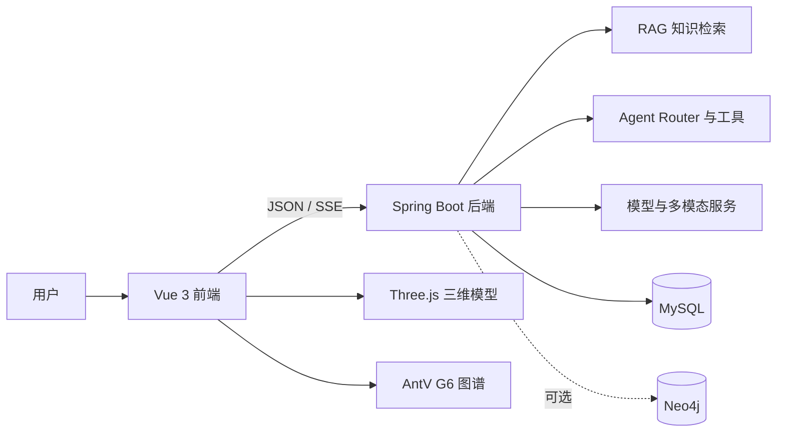

# 青铜数元｜三星堆数字文博体验系统

把文物从“看一眼”变成“顺着关系探索一圈”。

青铜数元是一套面向三星堆文博场景的前后端分离系统：用户可以按时间、空间和工艺浏览文物，查看三维模型和知识图谱，也可以向 AI 文博助手提问、上传图片、体验数字导览。

## 项目亮点

- **知识问答**：整理38份 Markdown 文档，支持带来源的 RAG 检索和回答。
- **状态驱动 Agent**：根据当前页面、文物和导览状态，选择问答、工具调用或直接回应。
- **三维文物**：使用 Three.js 加载5件 GLB 文物模型。
- **关系探索**：使用 AntV G6 展示文物、年代、遗址、工艺和文化含义之间的关系。
- **多模态体验**：支持图片理解、语音输入、视觉辅助以及图片/视频创作。
- **可验证工程**：提供 Agent/UI 回归脚本，覆盖检索、路由、上下文、导览和多模态关键链路。

## 项目作者

| 项目 | 信息 |
|---|---|
| GitHub | [cshhhhh110](https://github.com/cshhhhh110) |
| 学校 | 长春理工大学 |
| 学院 | 计算机科学与技术学院 |
| 专业 | 数据科学与大数据技术 |
| 项目职责 | 项目作者/维护者，Agent / RAG 核心模块负责人 |
| 联系邮箱 | `18238053579@163.com` |

## 系统结构



## 技术栈

| 层次 | 技术 |
|---|---|
| 前端 | Vue 3、Vite、Ant Design Vue、Three.js、AntV G6 |
| 后端 | Spring Boot 3、Java 17、MyBatis-Plus、Spring AI |
| 数据 | MySQL 8.x；Neo4j 5.x 可选 |
| AI能力 | OpenAI 兼容接口、Qwen 多模态模型、SiliconFlow 媒体服务 |
| 流式交互 | SSE |
| 测试 | JUnit 5、Playwright/Node 回归脚本 |

## 快速开始

### 1. 环境要求

- JDK 17
- Node.js 20 或 22 LTS
- MySQL 8.x
- Git
- Neo4j 5.x（可选）

### 2. 克隆项目

```powershell
git clone https://github.com/cshhhhh110/sanxingdui.git
cd sanxingdui
```

### 3. 初始化数据库

建议使用独立数据库，避免影响本机已有数据：

```powershell
mysql -u root -p -e "CREATE DATABASE IF NOT EXISTS sanxingdui_repro DEFAULT CHARACTER SET utf8mb4 COLLATE utf8mb4_unicode_ci;"
cmd /c "mysql -u root -p sanxingdui_repro < heritage_db.sql"
```

如果数据库已经导入过旧版本结构，更新代码后可按需补跑：

```powershell
cmd /c "mysql -u root -p sanxingdui_repro < docs\sql\competition-p0.sql"
```

### 4. 配置后端

复制配置模板：

```powershell
copy springboot\src\main\resources\application-template.yml springboot\src\main\resources\application.yml
```

至少填写以下内容：

- `spring.datasource.username`
- `spring.datasource.password`
- `jwt.secret`
- `spring.ai.openai.api-key`（使用对话能力时）
- `graph.neo4j.password`（启用 Neo4j 时）

图片、视频、语音等能力按实际需要配置对应服务密钥。真实的 `application.yml` 已被 Git 忽略，请不要提交密码、授权码或 API Key。

### 5. 启动后端

```powershell
cd springboot
.\mvnw.cmd spring-boot:run
```

后端地址：<http://localhost:8889>

### 6. 启动前端

另开一个终端：

```powershell
cd vue3
npm ci
npm run dev
```

前端地址：<http://localhost:8800>

Vite 已配置以下代理：

- `/api` → `http://localhost:8889`
- `/files` → `http://localhost:8889`

## 页面入口

启动后可以直接打开这些页面：

| 页面 | 地址 | 可以体验什么 |
|---|---|---|
| 时空探索 | <http://localhost:8800/tanmi> | 按时间、空间和工艺探索文物 |
| 导览与图谱 | <http://localhost:8800/trail> | 三维模型、关系图谱和连续导览 |
| 三维文物 | <http://localhost:8800/3dlist> | 浏览可用 GLB 文物模型 |
| AI文博助手 | <http://localhost:8800/ai-chat> | RAG问答、来源查看和多模态交互 |
| 图片创作 | <http://localhost:8800/ai-image-generator> | 视觉辅助和图片创作 |

更多公开技术说明见：

- [项目架构说明](docs/项目架构说明.md)
- [开发与目录说明](docs/开发与目录说明.md)
- [项目状态说明](docs/项目状态说明.md)
- [RAG实现说明](docs/rag-implementation-plan.md)

## 可选：启用 Neo4j 图谱

默认配置中 Neo4j 关闭：

```yaml
graph:
  neo4j:
    enabled: false
```

如需启用：

1. 启动本机 Neo4j；
2. 设置 `graph.neo4j.enabled: true`；
3. 填写 `graph.neo4j.password`；
4. 执行 `docs/neo4j-graph-seed.cypher` 中的种子脚本。

Neo4j 未启用时，后端会回退到 MySQL 中的结构化关系数据。

## 常用验证

前端构建：

```powershell
cd vue3
npm run build
```

后端编译：

```powershell
cd springboot
.\mvnw.cmd -DskipTests package
```

后端测试：

```powershell
cd springboot
.\mvnw.cmd test
```

前端回归脚本位于 `vue3/scripts/`，覆盖 Agent、知识图谱、导览、语音、视觉辅助和媒体创作等流程。

## 运行小贴士

- 没有配置模型服务时，基础页面和部分结构化内容仍可浏览；AI问答和媒体创作需要对应服务密钥。
- 没有启用 Neo4j 时，图谱数据会使用后端回退方案。
- 课程视频等大文件不纳入 Git，复现环境缺少视频时，课程页仍会显示文字章节。
- 遇到接口异常时，先确认 MySQL、后端端口 `8889` 和前端代理是否正常。

## 开源说明

项目主要代码由本人完成并持续维护，欢迎通过 Issue 提交可复现的问题或改进建议。提交代码前请确认没有带入本地配置、密钥、日志、`node_modules`、`target`、`dist` 或临时文件。
