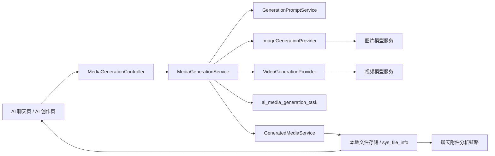
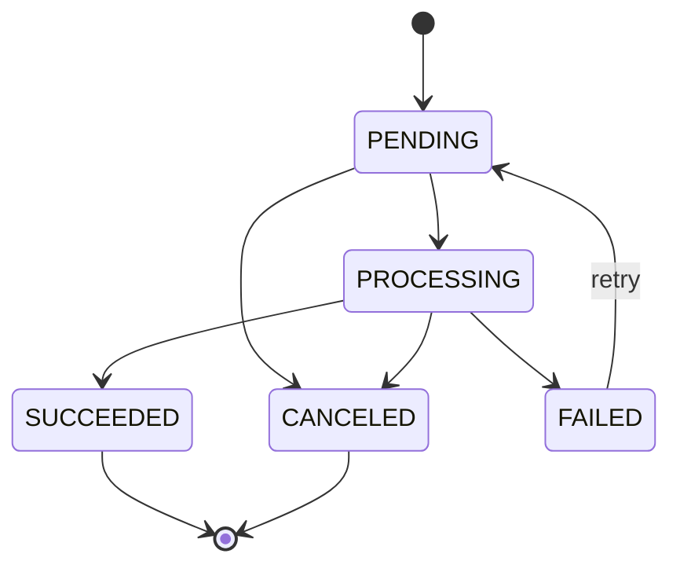

# 多模态图片与视频生成详细实现方案

## 1. 文档说明

### 1.1 建设目标

在现有 AI 聊天多模态“输入理解”能力上，增加图片生成、视频生成、参考图生成和生成结果回流能力，形成完整链路：

```text
文字/附件输入
  -> 多模态理解与知识检索
  -> 生成意图与参数确认
  -> 图片/视频生成任务
  -> 任务状态查询
  -> 结果文件入库
  -> 页面展示、下载、再次编辑或作为聊天附件使用
```

本文是待实施的技术设计，不代表相关接口已经全部上线。现有能力与新增能力的边界如下：

| 能力 | 当前状态 | 本方案目标 |
|---|---|---|
| 文字聊天 | 已实现 | 保持兼容 |
| 图片、音频、视频、文档理解 | 已实现 | 生成结果可重新进入该链路 |
| 麦克风语音转文字 | 已实现 | 保持兼容 |
| 独立图片生成页 | 已有原型，前端直连外部服务 | 改为统一后端接口并保存任务与结果 |
| 聊天内图片生成 | 未实现 | 一期实现 |
| 文生视频、图生视频 | 未实现 | 二期实现 |
| 生成历史、失败重试、配额控制 | 未实现 | 一期/二期逐步实现 |

### 1.2 设计原则

1. 输入理解与媒体生成是两条独立业务链路，通过文件 ID 和聊天消息关联。
2. 浏览器不直接持有第三方模型密钥，也不直接依赖具体供应商协议。
3. 图片和视频统一使用任务模型；图片可快速完成，视频必须异步执行。
4. 第三方返回的临时 URL 不能作为最终结果，后端应下载并保存到项目文件系统。
5. 前端只依赖稳定的项目接口，不感知 SiliconFlow、ComfyUI、可灵等供应商差异。
6. 生成任务必须归属当前用户，查询、取消、重试、下载均校验所有权。

## 2. 当前项目基础

### 2.1 多模态输入链路

当前聊天页位于：

```text
vue3/src/views/frontend/AiChat.vue
```

附件先通过以下接口上传：

```http
POST /api/file/upload/temp
```

聊天请求携带附件元数据，通过以下接口流式提交：

```http
POST /api/ai-chat/stream
Content-Type: application/json
Accept: text/event-stream
```

后端由 `MultimodalContentService` 按附件类型分发：

| 类型 | 服务 | 产物 |
|---|---|---|
| `IMAGE` | `ImageAnalysisService` | 图片描述 |
| `AUDIO` | `AudioTranscriptionService` | 语音转写 |
| `VIDEO` | `VideoAnalysisService` | 关键帧分析和音轨转写 |
| `DOCUMENT` | `DocumentTextExtractionService` | 文档正文 |

处理后的文本进入 `HeritageAssistantService`，结合知识检索结果生成回答。

### 2.2 现有图片生成原型

现有页面：

```text
vue3/src/views/frontend/ai-image-generator.vue
```

当前页面直接调用：

```http
POST /api/media-generation/image
```

该方式存在以下限制：

- 供应商地址暴露在浏览器配置中。
- 无统一登录校验、配额、审计和错误码。
- 结果只保留远程 URL，没有写入 `sys_file_info`。
- 页面刷新后任务和生成结果丢失。
- 无法与聊天消息、文物资料和后续视频生成建立稳定关联。

## 3. 总体架构



建议新增后端模块：

```text
controller/MediaGenerationController.java
service/MediaGenerationService.java
service/GenerationPromptService.java
service/GeneratedMediaService.java
service/provider/ImageGenerationProvider.java
service/provider/VideoGenerationProvider.java
service/provider/SiliconFlowImageGenerationProvider.java
service/provider/SiliconFlowVideoGenerationProvider.java
entity/AiMediaGenerationTask.java
mapper/AiMediaGenerationTaskMapper.java
```

建议新增前端模块：

```text
vue3/src/api/MediaGenerationApi.js
vue3/src/views/frontend/AiCreation.vue
vue3/src/components/ai-creation/GenerationForm.vue
vue3/src/components/ai-creation/GenerationTaskCard.vue
vue3/src/components/ai-creation/GenerationHistory.vue
vue3/src/components/ai-chat/GeneratedMediaMessage.vue
```

第一期可以继续复用并改造 `ai-image-generator.vue`，不要求一次性拆分全部组件。

## 4. 核心业务流程

### 4.1 文生图

1. 用户输入描述，选择风格、比例和生成数量。
2. 前端调用 `POST /api/media-generation/image`。
3. 后端校验登录、参数、用户配额和参考文件归属。
4. `GenerationPromptService` 根据原始描述、文物资料和风格模板构建最终提示词。
5. 创建任务记录，状态为 `PENDING`。
6. 调用图片生成供应商，状态变为 `PROCESSING`。
7. 获取结果后，后端下载图片并校验 MIME、大小和有效性。
8. 图片保存到项目文件目录，并写入 `sys_file_info`。
9. 任务状态更新为 `SUCCEEDED`，返回稳定的项目文件 URL。
10. 前端展示结果，并允许下载、再次生成、图生视频或发送到聊天。

### 4.2 参考图生成

1. 参考图先通过 `POST /api/file/upload/temp` 上传。
2. 创建任务时只提交 `referenceFileId`，不接受浏览器提交本地绝对路径。
3. 后端根据 `sys_file_info` 校验文件存在、归属、类型和大小。
4. 供应商支持原生图生图时传入图片；不支持时先调用图片理解服务生成视觉描述，再增强提示词。
5. 生成结果保存为新文件，不覆盖原参考图。

### 4.3 文生视频

1. 用户提交提示词、时长、比例和镜头运动参数。
2. 后端创建本地任务，并向视频供应商提交任务。
3. 保存 `providerTaskId`，立即向前端返回本地 `taskId`。
4. 后端定时查询供应商状态，或接收供应商回调。
5. 前端每 2 至 5 秒轮询本地任务状态。
6. 供应商完成后，后端下载视频、使用 `ffprobe` 校验时长和编码，再保存文件记录。
7. 任务完成后前端展示视频播放器和后续操作。

### 4.4 图生视频

图生视频与文生视频共用任务接口，通过 `mode = IMAGE_TO_VIDEO` 区分。必须提供 `referenceFileId`，首期建议优先实现该模式，因为画面主体一致性通常比纯文生视频更稳定。

### 4.5 聊天内生成

聊天内不应把耗时生成请求塞进现有 SSE 回答流中。推荐流程：

1. 聊天路由识别 `IMAGE_GENERATION` 或 `VIDEO_GENERATION` 意图。
2. 参数不足时，AI 先询问比例、时长或风格。
3. 参数完整后创建生成任务。
4. 聊天消息中插入任务卡片，卡片根据 `taskId` 更新进度。
5. 完成后把 `resultFileId` 写入消息附件表，任务卡片切换为图片或视频结果。

如果一期暂不改 Agent 路由，可以在 `AiChat.vue` 增加明确的“图片创作/视频创作”模式切换，由用户主动选择，避免仅靠关键词误判。

## 5. 数据库设计

### 5.1 生成任务表

建议新增 SQL 文件：

```text
docs/sql/ai-media-generation.sql
```

建议表结构：

```sql
CREATE TABLE IF NOT EXISTS ai_media_generation_task (
  id bigint NOT NULL AUTO_INCREMENT COMMENT '主键',
  task_id varchar(64) NOT NULL COMMENT '对外任务ID，建议UUID',
  user_id bigint NOT NULL COMMENT '创建用户ID',
  session_id varchar(64) NULL COMMENT '来源聊天会话ID',
  message_id bigint NULL COMMENT '关联聊天消息ID',
  media_type varchar(20) NOT NULL COMMENT 'IMAGE/VIDEO',
  mode varchar(30) NOT NULL COMMENT 'TEXT_TO_IMAGE/IMAGE_TO_IMAGE/TEXT_TO_VIDEO/IMAGE_TO_VIDEO',
  prompt_raw text NOT NULL COMMENT '用户原始提示词',
  prompt_final longtext NULL COMMENT '增强后的最终提示词',
  negative_prompt text NULL COMMENT '负面提示词',
  artifact_id bigint NULL COMMENT '关联文物ID',
  reference_file_id bigint NULL COMMENT '参考文件ID',
  provider varchar(50) NOT NULL COMMENT '供应商标识',
  model varchar(100) NULL COMMENT '实际模型',
  provider_task_id varchar(255) NULL COMMENT '供应商任务ID',
  status varchar(20) NOT NULL DEFAULT 'PENDING' COMMENT 'PENDING/PROCESSING/SUCCEEDED/FAILED/CANCELED',
  progress int NOT NULL DEFAULT 0 COMMENT '0-100',
  request_params json NULL COMMENT '尺寸、比例、时长等参数',
  provider_response json NULL COMMENT '脱敏后的供应商响应',
  result_file_id bigint NULL COMMENT 'sys_file_info.id',
  result_url varchar(500) NULL COMMENT '项目内稳定访问地址',
  error_code varchar(64) NULL COMMENT '标准错误码',
  error_message varchar(500) NULL COMMENT '可展示的失败原因',
  retry_count int NOT NULL DEFAULT 0 COMMENT '已重试次数',
  started_time datetime NULL,
  finished_time datetime NULL,
  create_time datetime NOT NULL DEFAULT CURRENT_TIMESTAMP,
  update_time datetime NOT NULL DEFAULT CURRENT_TIMESTAMP ON UPDATE CURRENT_TIMESTAMP,
  PRIMARY KEY (id),
  UNIQUE KEY uk_task_id (task_id),
  KEY idx_user_create_time (user_id, create_time),
  KEY idx_status_update_time (status, update_time),
  KEY idx_provider_task_id (provider_task_id),
  KEY idx_message_id (message_id),
  KEY idx_result_file_id (result_file_id)
) COMMENT='AI图片和视频生成任务';
```

### 5.2 状态机



状态约束：

| 状态 | 含义 | 允许操作 |
|---|---|---|
| `PENDING` | 已入库，等待提交或执行 | 查询、取消 |
| `PROCESSING` | 供应商正在生成或后端正在落盘 | 查询、取消（供应商支持时） |
| `SUCCEEDED` | 结果已保存到本地文件系统 | 查看、下载、再次生成、发送到聊天 |
| `FAILED` | 任务失败 | 查询错误、重试 |
| `CANCELED` | 用户或系统取消 | 查询 |

服务层必须控制状态转换，禁止控制器直接任意修改状态。

### 5.3 与现有表的关系

- `result_file_id` 和 `reference_file_id` 指向 `sys_file_info.id`。
- 聊天触发的任务通过 `session_id`、`message_id` 关联现有聊天记录。
- 生成完成后，可在 `ai_chat_message_attachment` 新增一条附件记录。
- 建议在附件 `extracted_meta` 中记录 `generationTaskId`、`generationMode` 和 `provider`，无需修改现有附件表结构。

## 6. 后端详细设计

### 6.1 Controller

`MediaGenerationController` 只负责：

- 获取当前用户。
- 基础参数校验。
- 调用应用服务。
- 返回项目统一响应体。

控制器不应直接调用第三方 HTTP 服务，也不应写文件或修改任务状态。

建议接口：

```java
@RestController
@RequestMapping("/media-generation")
public class MediaGenerationController {
    @PostMapping("/image")
    public Result<?> createImageTask(@RequestBody CreateImageGenerationDTO command) {}

    @PostMapping("/video")
    public Result<?> createVideoTask(@RequestBody CreateVideoGenerationDTO command) {}

    @GetMapping("/tasks/{taskId}")
    public Result<?> getTask(@PathVariable String taskId) {}

    @GetMapping("/history")
    public Result<?> getHistory(MediaGenerationQuery query) {}

    @PostMapping("/tasks/{taskId}/retry")
    public Result<?> retry(@PathVariable String taskId) {}

    @PostMapping("/tasks/{taskId}/cancel")
    public Result<?> cancel(@PathVariable String taskId) {}
}
```

### 6.2 DTO

图片请求 DTO：

```java
public class CreateImageGenerationDTO {
    private String prompt;
    private String mode;
    private String style;
    private String aspectRatio;
    private Integer width;
    private Integer height;
    private Integer count;
    private Long artifactId;
    private Long referenceFileId;
    private String negativePrompt;
    private String sessionId;
    private Long messageId;
}
```

视频请求 DTO：

```java
public class CreateVideoGenerationDTO {
    private String prompt;
    private String mode;
    private String aspectRatio;
    private Integer durationSeconds;
    private String cameraMotion;
    private Long artifactId;
    private Long referenceFileId;
    private String negativePrompt;
    private String sessionId;
    private Long messageId;
}
```

统一任务响应 DTO：

```java
public class MediaGenerationTaskVO {
    private String taskId;
    private String mediaType;
    private String mode;
    private String status;
    private Integer progress;
    private String promptRaw;
    private String promptFinal;
    private Long referenceFileId;
    private Long resultFileId;
    private String resultUrl;
    private String errorCode;
    private String errorMessage;
    private LocalDateTime createTime;
    private LocalDateTime finishedTime;
}
```

参数建议：

| 参数 | 图片 | 视频 | 校验建议 |
|---|---|---|---|
| `prompt` | 必填 | 必填 | 去空格后 2-2000 字符 |
| `mode` | 必填 | 必填 | 枚举白名单 |
| `aspectRatio` | 可选 | 可选 | `1:1`、`4:3`、`3:4`、`16:9`、`9:16` |
| `count` | 可选 | 不适用 | 一期限制 1-4 |
| `durationSeconds` | 不适用 | 必填 | 当前 SiliconFlow Wan2.2 模型支持约 5 秒 |
| `referenceFileId` | 图生图必填 | 图生视频必填 | 必须是当前用户可访问的图片 |
| `artifactId` | 可选 | 可选 | 文物不存在时返回业务错误 |

### 6.3 MediaGenerationService

主要职责：

1. 校验用户权限、任务参数和配额。
2. 读取关联文物和参考文件。
3. 调用提示词增强服务。
4. 根据媒体类型和模式选择 Provider。
5. 创建、更新、查询、取消和重试任务。
6. 生成完成后调用 `GeneratedMediaService` 保存结果。
7. 必要时将生成结果关联到聊天消息。

建议事务边界：

- 创建本地任务使用短事务。
- 第三方 HTTP 调用不能放在数据库长事务中。
- 供应商调用成功后再用独立事务写入 `providerTaskId` 和状态。
- 文件下载与落盘完成后，最后更新为 `SUCCEEDED`。

### 6.4 GenerationPromptService

输入：

- 用户原始提示词。
- 文物资料，如名称、年代、材质、纹饰和文化背景。
- 参考图片分析文本。
- 风格模板、比例、用途和媒体类型。

输出：

- `promptFinal`：面向具体生成模型的完整提示词。
- `negativePrompt`：需要规避的内容。
- 可选结构化标签，便于审计和后续推荐。

首期风格枚举建议：

| style | 用途 |
|---|---|
| `ARTIFACT_RESTORE` | 文物复原和原貌推演 |
| `MUSEUM_POSTER` | 博物馆展览海报 |
| `CULTURAL_IP` | 三星堆文化 IP 形象 |
| `INK_STYLE` | 水墨和传统绘画风格 |
| `THREE_D_SCENE` | 三维展陈或场景概念图 |
| `EDUCATION_CARD` | 科普教育卡片 |

提示词增强必须保留 `promptRaw`，不要覆盖用户原始输入。涉及文物复原时，应明确“AI 想象复原”属性，避免把推测性画面描述成考古事实。

### 6.5 Provider 抽象

图片 Provider：

```java
public interface ImageGenerationProvider {
    String getProviderName();
    boolean supports(String mode);
    ImageGenerationResult generate(ImageGenerationRequest request);
}
```

视频 Provider：

```java
public interface VideoGenerationProvider {
    String getProviderName();
    boolean supports(String mode);
    VideoSubmitResult submit(VideoGenerationRequest request);
    VideoTaskResult query(String providerTaskId);
    void cancel(String providerTaskId);
}
```

Provider 返回对象使用项目内统一结构，隔离不同供应商字段：

```text
ImageGenerationResult
  - success
  - remoteUrls
  - model
  - rawResponseSanitized

VideoTaskResult
  - providerStatus
  - progress
  - remoteUrl
  - errorCode
  - errorMessage
```

当前实现使用 `SiliconFlowImageGenerationProvider` 由 Spring Boot 直接调用 `/v1/images/generations`。前端不读取供应商地址或密钥，也不依赖独立的本地中转服务。

### 6.6 GeneratedMediaService

该服务负责把供应商结果转成项目内稳定资产：

1. 只允许下载 `http/https`，并校验目标域名白名单，防止 SSRF。
2. 设置连接超时、读取超时和最大响应大小。
3. 根据文件头验证真实媒体类型，不能只相信扩展名或响应头。
4. 图片解码验证；视频使用 `ffprobe` 校验编码、时长和尺寸。
5. 生成服务端文件名，禁止使用远程 URL 中未经清理的文件名。
6. 保存到生成媒体专用目录。
7. 写入 `sys_file_info`，返回 `fileId` 和项目访问路径。

推荐目录：

```text
files/generated/{userId}/{yyyyMM}/image/{uuid}.png
files/generated/{userId}/{yyyyMM}/video/{uuid}.mp4
```

### 6.7 异步执行与调度

一期在单实例部署中可使用 Spring `TaskExecutor` 加数据库任务表：

- 图片任务进入线程池执行。
- 视频提交任务后，由 `@Scheduled` 每 5 至 10 秒扫描 `PROCESSING` 任务。
- 使用条件更新或乐观锁，防止同一任务被重复处理。
- 服务重启后根据数据库状态继续查询未完成任务。

当部署扩展到多实例或任务量明显增加时，再迁移到 RabbitMQ、Redis Stream 或其他任务队列。业务接口和数据库状态机无需改变。

建议线程池隔离：

```text
mediaImageExecutor: 核心 2，最大 4，队列 20
mediaVideoExecutor: 核心 1，最大 2，队列 10
```

具体数量应根据供应商限流和服务器资源调整。

### 6.8 配置

建议在 `application-template.yml` 中增加：

```yaml
media-generation:
  enabled: true
  storage-dir: files/generated
  poll-interval-ms: 5000
  max-retry-count: 2
  image:
    provider: siliconflow
    base-url: ${IMAGE_GENERATION_BASE_URL:${spring.ai.openai.base-url}}
    api-key: ${IMAGE_GENERATION_API_KEY:${spring.ai.openai.api-key}}
    model: ${IMAGE_GENERATION_MODEL:Qwen/Qwen-Image}
    timeout-seconds: 180
    max-result-bytes: 20971520
  video:
    provider: siliconflow
    base-url: ${VIDEO_GENERATION_BASE_URL:${spring.ai.openai.base-url}}
    api-key: ${VIDEO_GENERATION_API_KEY:${spring.ai.openai.api-key}}
    text-model: ${VIDEO_TEXT_MODEL:Wan-AI/Wan2.2-T2V-A14B}
    image-model: ${VIDEO_IMAGE_MODEL:Wan-AI/Wan2.2-I2V-A14B}
    request-timeout-seconds: 30
    poll-interval-ms: 8000
    max-result-bytes: 209715200
  quota:
    image-per-day: 20
    video-per-day: 3
```

真实 API Key 只通过环境变量或密钥管理服务注入，不写入 Git 仓库、前端 `.env` 或接口响应。

## 7. REST 接口详细定义

以下示例中的 `code`、`data` 和 `message` 应与项目现有统一响应类保持一致。

### 7.1 创建图片任务

```http
POST /api/media-generation/image
Authorization: Bearer <token>
Content-Type: application/json
```

请求示例：

```json
{
  "prompt": "以三星堆青铜纵目面具为主体，制作一张博物馆展览海报",
  "mode": "TEXT_TO_IMAGE",
  "style": "MUSEUM_POSTER",
  "aspectRatio": "3:4",
  "count": 1,
  "artifactId": 12,
  "negativePrompt": "文字乱码，现代建筑，低清晰度",
  "sessionId": "0e25feea-2197-407d-aec9-606f80d6c4cc"
}
```

响应示例：

```json
{
  "code": "200",
  "message": "任务已创建",
  "data": {
    "taskId": "7f036038-21a7-4b39-b6e0-177ed4fa9c3c",
    "mediaType": "IMAGE",
    "mode": "TEXT_TO_IMAGE",
    "status": "PENDING",
    "progress": 0,
    "createTime": "2026-07-11T15:20:30"
  }
}
```

接口建议始终返回任务对象。即使图片供应商同步返回结果，也由后端完成落盘并将任务更新为 `SUCCEEDED`，前端通过任务查询获得最终结果。

### 7.2 创建视频任务

```http
POST /api/media-generation/video
Authorization: Bearer <token>
Content-Type: application/json
```

请求示例：

```json
{
  "prompt": "镜头缓慢推进，青铜面具在博物馆柔和灯光下逐渐显现细节",
  "mode": "IMAGE_TO_VIDEO",
  "referenceFileId": 207,
  "aspectRatio": "16:9",
  "durationSeconds": 5,
  "cameraMotion": "SLOW_PUSH_IN",
  "negativePrompt": "画面抖动，主体变形，闪烁"
}
```

响应与图片任务结构一致，`mediaType` 为 `VIDEO`。

### 7.3 查询任务

```http
GET /api/media-generation/tasks/{taskId}
Authorization: Bearer <token>
```

进行中响应：

```json
{
  "code": "200",
  "data": {
    "taskId": "7f036038-21a7-4b39-b6e0-177ed4fa9c3c",
    "mediaType": "VIDEO",
    "mode": "IMAGE_TO_VIDEO",
    "status": "PROCESSING",
    "progress": 46,
    "resultFileId": null,
    "resultUrl": null,
    "errorCode": null,
    "errorMessage": null
  }
}
```

成功响应：

```json
{
  "code": "200",
  "data": {
    "taskId": "7f036038-21a7-4b39-b6e0-177ed4fa9c3c",
    "mediaType": "VIDEO",
    "mode": "IMAGE_TO_VIDEO",
    "status": "SUCCEEDED",
    "progress": 100,
    "resultFileId": 286,
    "resultUrl": "/files/generated/18/202607/video/8b1c9d.mp4",
    "finishedTime": "2026-07-11T15:22:18"
  }
}
```

### 7.4 查询历史

```http
GET /api/media-generation/history?pageNum=1&pageSize=12&mediaType=IMAGE&status=SUCCEEDED
Authorization: Bearer <token>
```

仅返回当前用户任务，默认按 `create_time DESC` 排序。`pageSize` 建议最大 50。

### 7.5 重试任务

```http
POST /api/media-generation/tasks/{taskId}/retry
Authorization: Bearer <token>
```

只允许重试 `FAILED` 状态任务。重试时建议创建新的 `taskId`，并在 `request_params` 中记录 `sourceTaskId`，以保留完整历史；不建议覆盖原失败记录。

### 7.6 取消任务

```http
POST /api/media-generation/tasks/{taskId}/cancel
Authorization: Bearer <token>
```

只允许取消 `PENDING` 或 `PROCESSING`。如果供应商不支持取消，后端仍可标记本地任务为 `CANCELED`，并在供应商完成后丢弃结果或按保留策略处理。

### 7.7 将结果发送到聊天

建议增加显式接口，避免前端直接写消息附件关系：

```http
POST /api/media-generation/tasks/{taskId}/attach-to-chat
Authorization: Bearer <token>
Content-Type: application/json
```

请求：

```json
{
  "sessionId": "0e25feea-2197-407d-aec9-606f80d6c4cc",
  "content": "这是刚刚生成的三星堆主题海报"
}
```

后端校验任务已成功、结果文件归属和会话归属，然后创建聊天消息及附件关联。

## 8. 错误码设计

建议业务错误码：

| 错误码 | HTTP 状态 | 含义 |
|---|---:|---|
| `MEDIA_GENERATION_DISABLED` | 503 | 生成功能未启用 |
| `INVALID_GENERATION_MODE` | 400 | 不支持的生成模式 |
| `INVALID_GENERATION_PARAMETER` | 400 | 比例、尺寸、时长等参数非法 |
| `REFERENCE_FILE_REQUIRED` | 400 | 图生图或图生视频缺少参考图 |
| `REFERENCE_FILE_NOT_FOUND` | 404 | 参考文件不存在或无权访问 |
| `GENERATION_TASK_NOT_FOUND` | 404 | 任务不存在或不属于当前用户 |
| `GENERATION_QUOTA_EXCEEDED` | 429 | 当日生成配额已用完 |
| `GENERATION_QUEUE_FULL` | 429 | 服务繁忙，任务队列已满 |
| `PROVIDER_UNAVAILABLE` | 503 | 第三方服务不可用 |
| `PROVIDER_REQUEST_REJECTED` | 502 | 第三方拒绝请求 |
| `RESULT_DOWNLOAD_FAILED` | 502 | 结果文件下载失败 |
| `RESULT_VALIDATION_FAILED` | 502 | 结果媒体校验失败 |
| `TASK_NOT_RETRYABLE` | 409 | 当前状态不可重试 |
| `TASK_NOT_CANCELABLE` | 409 | 当前状态不可取消 |

对前端展示的 `errorMessage` 应可读且不包含 API Key、完整供应商响应、服务器绝对路径或堆栈信息。

## 9. 前端详细设计

### 9.1 API 封装

新增 `vue3/src/api/MediaGenerationApi.js`：

```js
import request from '@/utils/request'

export function createImageGeneration(data, config = {}) {
  return request.post('/media-generation/image', data, config)
}

export function createVideoGeneration(data, config = {}) {
  return request.post('/media-generation/video', data, config)
}

export function getGenerationTask(taskId, config = {}) {
  return request.get(`/media-generation/tasks/${taskId}`, null, config)
}

export function getGenerationHistory(params, config = {}) {
  return request.get('/media-generation/history', params, config)
}

export function retryGenerationTask(taskId, config = {}) {
  return request.post(`/media-generation/tasks/${taskId}/retry`, null, config)
}

export function cancelGenerationTask(taskId, config = {}) {
  return request.post(`/media-generation/tasks/${taskId}/cancel`, null, config)
}

export function attachGenerationToChat(taskId, data, config = {}) {
  return request.post(`/media-generation/tasks/${taskId}/attach-to-chat`, data, config)
}
```

实际参数位置应以项目 `request` 封装的 `get` 方法签名为准，实施时需要保持与现有 API 文件一致。

### 9.2 AI 创作页

建议将现有 `/ai-image-generator` 升级为统一 AI 创作工作台，路由可继续兼容旧地址，同时新增语义更完整的 `/ai-creation`。

页面结构：

```text
顶部模式切换：图片 | 视频
左侧参数区：
  - 提示词
  - 参考图片
  - 关联文物
  - 风格
  - 比例
  - 图片数量 / 视频时长
  - 镜头运动（视频）
  - 生成按钮
右侧结果区：
  - 等待/进度/失败/成功状态
  - 图片或视频预览
  - 下载、再次生成、图生视频、发送到聊天
底部或侧栏：生成历史
```

前端状态建议：

```js
const generationMode = ref('IMAGE')
const form = reactive({
  prompt: '',
  mode: 'TEXT_TO_IMAGE',
  style: 'MUSEUM_POSTER',
  aspectRatio: '1:1',
  durationSeconds: 5,
  cameraMotion: 'NONE',
  artifactId: null,
  referenceFileId: null,
  negativePrompt: ''
})
const currentTask = ref(null)
const submitting = ref(false)
```

交互要求：

- 提交后立即展示任务卡，不长时间锁死整个页面。
- `PENDING/PROCESSING` 状态禁用重复提交按钮，但允许编辑下一条提示词时应明确当前任务是否保留。
- 页面卸载时停止轮询，重新进入后从历史接口恢复任务。
- 轮询间隔建议 2 秒起步，连续多次无变化后退避至 5 秒。
- `SUCCEEDED/FAILED/CANCELED` 时停止轮询。
- 失败时展示标准错误信息和可用的重试操作。
- 视频必须使用原生 `<video controls>`，并提供 poster 或首帧。

### 9.3 参考图上传

复用现有 `uploadTempFile()`：

1. 前端限制只选图片。
2. 上传成功后保留服务端返回的 `id` 作为 `referenceFileId`。
3. 请求生成接口时不重复传 `filePath`。
4. 前端预览可以使用返回访问地址，但权限和类型以服务端复验为准。

### 9.4 聊天页集成

建议给 `AiChat.vue` 增加创作入口：

- 输入区增加“回答 / 图片 / 视频”模式选择。
- 图片或视频模式下，发送操作调用生成接口，而不是 `/ai-chat/stream`。
- 创建成功后向消息列表插入本地任务消息。
- 使用 `GeneratedMediaMessage` 渲染进度、错误和结果。
- 任务完成后刷新会话消息，确保页面刷新仍能恢复结果。

任务消息建议结构：

```js
{
  role: 'assistant',
  messageType: 'MEDIA_GENERATION',
  content: '正在生成三星堆主题海报',
  generationTask: {
    taskId: '...',
    mediaType: 'IMAGE',
    status: 'PROCESSING',
    progress: 35,
    resultUrl: null
  }
}
```

如果暂时不能修改聊天消息表，可一期先在前端维护任务卡，二期再持久化；但这会导致刷新后卡片丢失，因此不建议作为最终方案。

### 9.5 生成历史

历史列表至少展示：

- 缩略图或视频封面。
- 原始提示词。
- 媒体类型和模式。
- 创建时间和状态。
- 下载、再次生成、图生视频、发送到聊天操作。

失败任务默认保留，方便定位供应商稳定性和用户重试。供应商原始错误只在服务端日志中记录脱敏版本。

## 10. 聊天路由与意图识别

如果接入当前 Agent 架构，建议新增路由结果：

```text
IMAGE_GENERATION
VIDEO_GENERATION
```

或者保持统一：

```text
MEDIA_GENERATION
```

并返回结构化参数：

```json
{
  "route": "MEDIA_GENERATION",
  "mediaType": "IMAGE",
  "mode": "TEXT_TO_IMAGE",
  "prompt": "生成一张三星堆青铜面具主题海报",
  "missingFields": []
}
```

路由模型只负责判断意图和提取参数，真正的权限、枚举、文件和配额校验仍由 `MediaGenerationService` 完成。不要通过前端关键词列表直接调用生成服务，以免“介绍视频生成原理”等普通问答被误判为生成任务。

## 11. 安全、合规与成本控制

### 11.1 权限

- 所有创建和查询接口要求登录。
- 任务查询条件必须同时包含 `task_id` 和当前 `user_id`。
- 参考文件和结果文件均校验用户访问权限。
- 管理员查看全量任务应使用独立管理接口和权限标识。

### 11.2 输入与内容安全

- 限制提示词长度并过滤不可见控制字符。
- 对提示词和生成结果接入内容审核策略。
- 参考图使用真实文件类型检测和大小限制。
- 公网部署前增加恶意文件扫描。
- 生成结果显示“AI 生成”标识；文物复原类结果显示“AI 想象复原，仅供展示”。

### 11.3 供应商与网络安全

- API Key 只在后端。
- 日志不输出完整 Authorization 请求头。
- 下载远程结果设置域名白名单、重定向次数、超时和大小上限。
- 禁止下载结果时访问环回地址、内网地址和云元数据地址。
- 图片生成由 Spring Boot 直连 SiliconFlow，供应商地址和密钥不得下发到浏览器。

### 11.4 配额与限流

首期可按数据库统计实现每日配额，后续使用 Redis 原子计数：

- 普通用户每天图片 20 次。
- 普通用户每天视频 3 次。
- 同一用户最多同时执行 2 个图片任务和 1 个视频任务。
- 供应商返回限流时采用有限次数指数退避，不能无限重试。

任务在参数校验阶段失败不计配额；已经提交供应商并消耗资源的失败任务是否返还配额，需要由产品规则明确。

## 12. 可观测性

每个任务日志至少包含：

```text
taskId, userId, mediaType, mode, provider, providerTaskId,
status, progress, durationMs, resultBytes, errorCode
```

禁止记录：

- API Key。
- 未脱敏的供应商完整响应。
- 用户文件绝对路径。
- 超长原始提示词和完整二进制内容。

建议指标：

- 图片/视频任务创建数。
- 成功率和失败原因分布。
- 排队时间、供应商耗时、结果下载耗时。
- 当前 `PENDING/PROCESSING` 数量。
- 单用户和全局配额使用量。
- 供应商 429、5xx 和超时次数。

## 13. 测试方案

### 13.1 后端单元测试

- DTO 枚举、长度、比例、时长校验。
- 图生图和图生视频缺少参考文件时失败。
- 非当前用户的文件和任务不可访问。
- Provider 状态正确映射为本地状态。
- 仅允许合法状态转换。
- 提示词增强保留用户原始输入。
- 远程结果 URL、媒体类型和文件大小校验。
- 第三方错误信息脱敏。

### 13.2 Provider 契约测试

使用 MockWebServer 或 WireMock 覆盖：

- 图片同步成功。
- 视频提交成功并多次轮询后完成。
- 供应商 401、429、500 和超时。
- 返回空 URL、非法 URL、错误 MIME。
- 视频任务永久处理中触发超时。
- 取消和重试行为。

### 13.3 前端测试

- 图片/视频模式字段正确切换。
- 参考图上传成功后只提交 `referenceFileId`。
- 创建任务后开始轮询。
- 状态终止后停止轮询。
- 页面卸载后清理定时器和请求。
- 历史任务可恢复预览。
- 错误码映射为可读提示。
- 手机和桌面宽度下表单、结果、视频播放器无重叠。

### 13.4 端到端验收

| 场景 | 验收标准 |
|---|---|
| 文生图 | 任务成功，图片入库，刷新页面后仍可查看 |
| 图生图 | 参考图归属校验有效，输出为新文件 |
| 文生视频 | 接口快速返回任务，页面持续显示状态，最终可播放 |
| 图生视频 | 使用生成图片作为参考图，视频主体基本一致 |
| 聊天内生成 | 任务卡可恢复，完成后结果成为聊天附件 |
| 失败重试 | 原失败记录保留，新任务可成功执行 |
| 越权访问 | 用户 A 无法查询或下载用户 B 的任务结果 |
| 服务重启 | 未完成视频任务可继续查询并最终收敛状态 |

## 14. 分阶段实施计划

### 第一阶段：统一图片生成后端

目标：替换现有前端直连图片服务。

实施内容：

1. 新增任务表、实体和 Mapper。
2. 新增图片创建、任务查询、历史查询接口。
3. 封装现有 `8001` 服务为图片 Provider。
4. 生成结果下载到本地并写入 `sys_file_info`。
5. 改造 `ai-image-generator.vue` 调用项目后端。
6. 增加错误处理、配额和基础测试。

完成标准：页面刷新后仍可查询历史图片，浏览器不再直接访问生成供应商。

### 第二阶段：聊天内图片生成

1. 聊天输入区增加明确的图片模式。
2. 增加聊天任务卡组件。
3. 任务完成后关联聊天消息和附件。
4. 支持“基于这张图继续生成”和“发送到聊天”。

完成标准：聊天会话刷新后，生成任务和结果不丢失。

### 第三阶段：异步视频生成

1. 新增视频 Provider 和提交/查询状态适配。
2. 增加调度器、状态恢复、超时和取消。
3. AI 创作页增加视频模式。
4. 优先实现图生视频，再实现文生视频。
5. 增加视频下载、`ffprobe` 校验和播放器。

完成标准：视频请求不会阻塞聊天 SSE 或普通 HTTP 请求，服务重启后任务状态可恢复。

### 第四阶段：质量、运营与多供应商

1. 增加提示词模板和文物知识增强。
2. 增加供应商降级、成本统计和管理后台。
3. 增加内容审核、AI 标识和生成水印策略。
4. 根据任务量迁移到消息队列。
5. 增加任务收藏、作品集和公开分享能力。

## 15. 实施文件清单

一期预计新增或修改：

```text
docs/sql/ai-media-generation.sql

springboot/src/main/resources/application-template.yml
springboot/src/main/java/org/example/springboot/controller/MediaGenerationController.java
springboot/src/main/java/org/example/springboot/entity/AiMediaGenerationTask.java
springboot/src/main/java/org/example/springboot/mapper/AiMediaGenerationTaskMapper.java
springboot/src/main/java/org/example/springboot/dto/command/CreateImageGenerationDTO.java
springboot/src/main/java/org/example/springboot/dto/response/MediaGenerationTaskVO.java
springboot/src/main/java/org/example/springboot/service/MediaGenerationService.java
springboot/src/main/java/org/example/springboot/service/GenerationPromptService.java
springboot/src/main/java/org/example/springboot/service/GeneratedMediaService.java
springboot/src/main/java/org/example/springboot/service/provider/ImageGenerationProvider.java
springboot/src/main/java/org/example/springboot/service/provider/SiliconFlowImageGenerationProvider.java

vue3/src/api/MediaGenerationApi.js
vue3/src/views/frontend/ai-image-generator.vue
vue3/src/router/index.js
```

二期/三期预计新增或修改：

```text
springboot/src/main/java/org/example/springboot/service/provider/VideoGenerationProvider.java
springboot/src/main/java/org/example/springboot/service/provider/SiliconFlowVideoGenerationProvider.java
springboot/src/main/java/org/example/springboot/scheduler/MediaGenerationTaskScheduler.java

vue3/src/views/frontend/AiChat.vue
vue3/src/components/ai-chat/GeneratedMediaMessage.vue
vue3/src/components/ai-creation/GenerationTaskCard.vue
vue3/src/components/ai-creation/GenerationHistory.vue
```

## 16. 关键决策结论

1. 生成图片和视频统一走后端任务接口，前端不再直连供应商。
2. 图片和视频共用任务表、状态机、历史查询、权限和文件落盘机制。
3. 视频必须异步，聊天 SSE 只用于文字回答，不承担长耗时媒体生成。
4. 所有生成结果进入 `sys_file_info`，第三方临时 URL 只作为下载源。
5. 参考图只传 `fileId`，后端重新读取并校验真实文件信息。
6. 聊天集成优先提供明确模式选择，再逐步接入模型意图路由。
7. 首期复用现有图片服务，先打通架构闭环；视频从图生视频开始实施。

## 17. 第四阶段落地情况

当前第四阶段已经实现以下质量与运营能力：

- `GenerationTemplateService` 提供文物海报、想象复原、展厅动效和图生视频模板。
- `GenerationContentSafetyService` 在任务入库前执行内置安全规则，环境变量可追加规则但不能覆盖内置规则。
- 生成任务支持收藏、开启分享和关闭分享；分享令牌只对成功任务有效。
- `GET /api/media-generation/shared/{shareToken}` 提供公开作品读取。
- `GET /api/media-generation/admin/stats` 提供任务总量、成功率、平均耗时、媒体类型、供应商和错误分布。
- 图片和视频结果页持续显示 AI 生成标识，文物复原内容显示想象性表达提示。
- 图片和视频供应商均通过 Provider 接口隔离，后续增加供应商不需要修改 Controller 协议。
- 当前数据库任务表、独立执行器和定时恢复机制承担可靠任务队列职责；达到多实例或高并发规模后再替换为外部消息队列。
