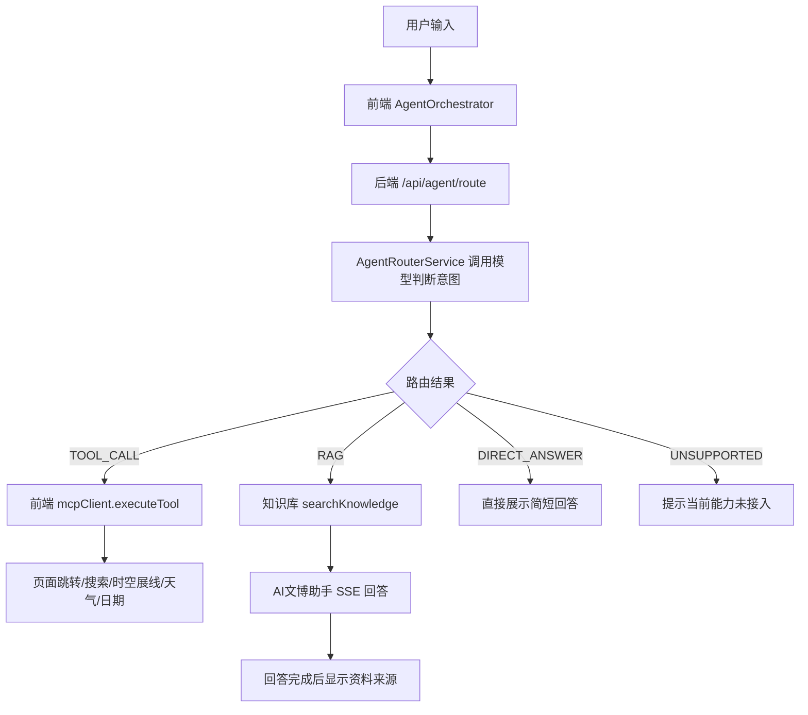

# 青铜数元项目总览与架构交接文档

更新时间：2026-07-11  
主目录：`G:\终版`  
当前定位：三星堆/古蜀文化数字化展示与智能导览项目，重点能力是文博内容展示、时空展线、AI文博助手、悬浮玄喵 Agent、RAG 知识库、多模态问答和商城/活动/课程等配套业务。

本文档用于交给另一个助手或合作者快速理解项目，并在此基础上提出建设性建议。文档只描述配置位置和能力，不包含任何真实 API Key、数据库密码或密钥明文。

## 1. 项目一句话介绍

本项目是一个前后端分离的三星堆数字文博系统。前端用 Vue3/Vite 构建展览、商城、课程、活动、时空展线、AI文博助手和悬浮玄喵交互界面；后端用 Spring Boot 提供业务 API、用户/订单/商品/文物数据接口、AI 对话、TTS、多模态解析、RAG 知识库检索和 Agent 路由能力。

当前重点不是普通信息管理系统，而是一个面向比赛演示的“AI + 文博 + Agent 操作”系统：

1. 用户可以问三星堆相关问题。
2. 系统可以检索 Obsidian Markdown 知识库并给出资料来源。
3. 用户可以上传图片、音频、视频、文档到 AI文博助手进行多模态问答。
4. 悬浮玄喵和 AI文博助手可以先调用 Agent 判断意图，再决定走工具、RAG、直接回答或暂不支持。
5. Agent 可以真实执行部分前端操作，例如商城搜索、时空展线定位、页面跳转、天气和日期查询。

## 2. 项目目录结构

```text
G:\终版
├── springboot/                 后端 Spring Boot 项目
├── vue3/                       前端 Vue3 + Vite 项目
├── docs/                       项目文档、架构说明、任务清单、SQL、比赛资料
├── scripts/                    本地脚本和回归测试脚本
├── data/                       本地种子数据
├── tools/                      辅助工具
├── XunFeiTest/                 早期/实验性 AI 中继项目，当前主线不依赖它
├── heritage_db.sql             数据库初始化/备份 SQL
├── README.md                   项目基础说明，部分中文在当前环境可能显示乱码
└── agent-readme.md             Agent 相关说明
```

核心目录：

```text
springboot/src/main/java/org/example/springboot/
├── agent/                      Agent 路由、工具注册、天气、日期等能力
├── ai/                         AI 文博助手服务
├── controller/                 业务 Controller
├── dto/                        请求和响应 DTO
├── entity/                     数据实体
├── knowledge/                  Obsidian/RAG 知识库索引与检索
├── mcp/                        早期 MCP 工具注册与兼容能力
├── service/                    业务服务、多模态、TTS、文件解析等
└── websocket/                  WebSocket 相关能力
```

```text
vue3/src/
├── agent/                      前端 Agent 编排器
├── api/                        前端 API 封装
├── components/                 公共组件，包含 Live2DAvatar 悬浮玄喵
├── mcp/                        前端 MCP/工具执行层
├── router/                     路由
├── store/                      状态管理
├── utils/                      工具函数，包含 knowledgeSearch
└── views/                      前端页面
```

## 3. 技术栈

### 3.1 后端

路径：`springboot/`

主要技术：

1. Spring Boot `3.4.1`
2. Java，项目配置为 Java `17`，当前本地编译日志显示可用 Java `21` 运行
3. Maven Wrapper：`mvnw.cmd`
4. MySQL：主业务数据库
5. MyBatis Plus：业务数据访问
6. Redis：项目已有相关依赖和配置
7. Spring AI / OpenAI 兼容模型调用
8. WebFlux Flux/SSE：AI文博助手流式回答
9. Neo4j Driver：知识图谱增强相关依赖，是否启用取决于配置
10. 多模态相关服务：图片分析、音频转写、文档解析、TTS

关键配置文件：

```text
springboot/src/main/resources/application.yml
springboot/src/main/resources/application-template.yml
```

注意：`application.yml` 是本地真实配置文件，不应提交真实密钥。交接给他人时建议以 `application-template.yml` 为准说明配置项。

### 3.2 前端

路径：`vue3/`

主要技术：

1. Vue `3`
2. Vite `4.5`
3. Ant Design Vue
4. Vant
5. Pinia 和 Vuex，两套状态方案都存在
6. Axios
7. `@microsoft/fetch-event-source`，用于 SSE 流式回答
8. Three.js，3D 展示
9. AntV G6，图谱/节点关系展示
10. ECharts
11. Playwright，当前用于 Agent UI 回归测试

前端命令：

```powershell
cd G:\终版\vue3
npm run dev -- --host 127.0.0.1 --port 8800
npm run build
npm run test:agent-ui
```

### 3.3 默认端口

```text
前端 Vite：8800
后端 Spring Boot：8889
```

当前常用访问地址：

```text
http://127.0.0.1:8800
http://127.0.0.1:8800/ai-chat
http://127.0.0.1:8889
```

## 4. 项目主要功能模块

### 4.1 首页和文博展示

相关前端：

```text
vue3/src/views/frontend/Home.vue
vue3/src/views/frontend/tanmi.vue
vue3/src/views/frontend/taninfo1.vue
vue3/src/views/frontend/taninfo2.vue
vue3/src/views/frontend/taninfo3.vue
vue3/src/views/Three3dDemo.vue
vue3/src/views/frontend/TimeSpaceTrail.vue
```

能力概览：

1. 首页展示三星堆文博主题内容。
2. 探秘/介绍页面展示文物、遗址、文化背景。
3. Three.js 页面支持 3D 文物展示。
4. 时空展线页面支持按文物和场景推进，当前已重点接入金面具等核心展品。

### 4.2 文物、传承人、活动、课程

相关后端 Controller：

```text
HeritageItemController.java
InheritorController.java
ActivityController.java
CourseController.java
```

相关前端 API：

```text
HeritageApi.js
InheritorApi.js
ActivityApi.js
CourseApi.js
```

能力概览：

1. 文物列表、文物详情、文物检索。
2. 传承人展示。
3. 活动展示与管理。
4. 课程展示与学习页面。

### 4.3 商城和订单

相关后端：

```text
ShopProductController.java
ShopCategoryController.java
OrderController.java
UserAddressController.java
```

相关前端：

```text
vue3/src/views/frontend/shop/
vue3/src/views/frontend/OrderConfirm.vue
vue3/src/views/frontend/OrderDetail.vue
vue3/src/views/frontend/UserOrders.vue
```

能力概览：

1. 商品列表和商品详情。
2. 商品分类。
3. 订单确认和订单详情。
4. 用户订单。
5. Agent 演示中支持“打开商城搜索某个文创产品”，当前只做搜索和跳转，不做自动下单或支付。

### 4.4 AI文博助手

核心前端：

```text
vue3/src/views/frontend/AiChat.vue
```

核心后端：

```text
springboot/src/main/java/org/example/springboot/controller/AiChatController.java
springboot/src/main/java/org/example/springboot/ai/HeritageAssistantService.java
springboot/src/main/java/org/example/springboot/service/AiChatSessionService.java
```

能力概览：

1. 支持普通文本问答。
2. 支持 SSE 流式回答。
3. 支持图片、音频、视频、文档等附件上传和多模态问答。
4. 对文博相关文本问题可以走 RAG 知识库。
5. 回答完成后再显示“资料来源”。
6. 图片/音频/视频等多模态问题默认不显示 RAG 资料来源。
7. 资料来源对象已预留 Obsidian 跳转字段。

### 4.5 悬浮玄喵

核心前端：

```text
vue3/src/components/Live2DAvatar.vue
```

能力概览：

1. 全局悬浮问答入口。
2. 支持文本问题。
3. 支持语音播报和打字机气泡效果。
4. 已接入 Agent 路由。
5. 可以执行部分前端工具，例如页面跳转、商城搜索、时空展线控制。
6. 简单文本附件入口限制为 `.txt/.md/.csv/.json`。
7. 复杂多模态建议引导到 AI文博助手处理。

### 4.6 TTS 和语音

相关后端：

```text
TtsController.java
TtsService.java
AudioTranscriptionService.java
```

相关前端：

```text
vue3/src/api/TtsApi.js
vue3/src/components/Live2DAvatar.vue
```

能力概览：

1. AI 回答可生成语音。
2. 支持配置不同 TTS provider。
3. 当前项目历史中使用过智谱 GLM-TTS、MiMo 等模型能力，具体以 `application.yml` 当前配置为准。
4. 语音和字幕同步依赖前端打字机速度和音频加载时机，后续仍可继续优化。

## 5. Agent 架构总览

当前 Agent 的目标是“比赛演示可用”，不是完整产品级 Agent 平台。核心改造方向是：

```text
用户输入
  -> 前端收集文本、附件、页面上下文
  -> POST /api/agent/route
  -> 后端模型判断意图
  -> 返回 TOOL_CALL / RAG / DIRECT_ANSWER / UNSUPPORTED
  -> 前端按路由执行
```

### 5.1 后端 Agent 核心文件

```text
springboot/src/main/java/org/example/springboot/agent/AgentRouterController.java
springboot/src/main/java/org/example/springboot/agent/AgentRouterService.java
springboot/src/main/java/org/example/springboot/agent/AgentRouteParser.java
springboot/src/main/java/org/example/springboot/agent/AgentToolRegistry.java
springboot/src/main/java/org/example/springboot/agent/AgentToolController.java
springboot/src/main/java/org/example/springboot/agent/AgentWeatherService.java
springboot/src/main/java/org/example/springboot/agent/dto/
```

### 5.2 前端 Agent 核心文件

```text
vue3/src/agent/AgentOrchestrator.js
vue3/src/agent/routes.js
vue3/src/api/AgentApi.js
vue3/src/mcp/index.js
vue3/src/mcp/tools.js
```

### 5.3 四种 Agent 路由

| 路由 | 含义 | 当前处理方式 |
|---|---|---|
| `TOOL_CALL` | 用户要系统真实执行一个操作 | 前端执行对应 MCP 工具 |
| `RAG` | 用户问本地文博知识库相关问题 | 检索知识库后调用聊天模型回答 |
| `DIRECT_ANSWER` | 普通问题或简单问题 | 直接展示路由模型返回的简短回答，或进入普通聊天链路 |
| `UNSUPPORTED` | 当前能力未接入 | 明确告诉用户暂不支持，不假装完成 |

### 5.4 当前演示版工具列表

后端 `AgentToolRegistry` 当前对模型开放的演示工具为：

| 工具名 | 用途 | 示例指令 |
|---|---|---|
| `navigate_to` | 打开公开页面 | 打开 AI文博助手 |
| `search_product` | 商城商品搜索 | 打开商城搜索金面具文创 |
| `search_heritage` | 文物搜索 | 搜索青铜神树相关文物 |
| `control_trail` | 控制时空展线 | 打开金面具的时空展线 |
| `get_weather` | 查询天气 | 成都天气怎么样 |
| `get_current_datetime` | 查询当前日期时间 | 今天几号 |
| `open_artifact_detail` | 打开文物详情 | 打开金面具详情 |
| `play_voice_intro` | 播放文物语音介绍 | 播放金面具语音介绍 |

注意：

1. 真实路由时，模型只能选择后端 `AgentToolRegistry` 中启用的工具。
2. 前端 `vue3/src/mcp/tools.js` 里还有一些历史工具和兼容逻辑，不等于全部对 Agent 开放。
3. 当前 `TOOL_CALL` 的执行主要在前端完成，后端还不是完整工具执行中枢。

### 5.5 Agent 执行示意图



## 6. RAG 和 Obsidian 知识库

### 6.1 核心文件

```text
springboot/src/main/java/org/example/springboot/knowledge/KnowledgeController.java
springboot/src/main/java/org/example/springboot/knowledge/KnowledgeIndexService.java
springboot/src/main/java/org/example/springboot/knowledge/KnowledgeMarkdownParser.java
springboot/src/main/java/org/example/springboot/knowledge/KnowledgeDocument.java
springboot/src/main/java/org/example/springboot/knowledge/KnowledgeSourceDTO.java
vue3/src/utils/knowledgeSearch.js
```

### 6.2 当前能力

1. 后端启动时同步知识库索引。
2. 当前日志显示知识库文档数约 `38`。
3. 支持 Markdown 文档解析。
4. 支持按问题检索文档。
5. 返回资料来源字段，包括标题、路径、匹配度、类型和 Obsidian URI。
6. AI文博助手在回答完成后才展示“资料来源”，避免回答还没出来就显示引用。
7. 普通问题和多模态图片问题不显示资料来源。

### 6.3 关键接口

```text
GET /api/agent/knowledge/status
GET /api/agent/knowledge/search?query=三星堆&limit=3
POST /api/agent/knowledge/sync
```

### 6.4 Obsidian 跳转说明

资料来源对象中已预留或实现：

```json
{
  "title": "文档标题",
  "path": "wiki/xxx.md",
  "score": 0.91,
  "type": "markdown",
  "obsidianUri": "obsidian://open?vault=...&file=...",
  "openUrl": ""
}
```

如果 Obsidian 提示 `Vault not found`，通常是因为 URI 中的 `vault` 名称和本机 Obsidian 里的库名称不一致。解决方向：

1. 确认本机 Obsidian Vault 名称。
2. 确认后端或前端生成的 `obsidianUri` 中 `vault=` 参数。
3. 统一 Vault 名称后再测试跳转。

## 7. 多模态能力

### 7.1 后端核心文件

```text
springboot/src/main/java/org/example/springboot/service/MultimodalContentService.java
springboot/src/main/java/org/example/springboot/service/ImageAnalysisService.java
springboot/src/main/java/org/example/springboot/service/AudioTranscriptionService.java
springboot/src/main/java/org/example/springboot/service/DocumentTextExtractionService.java
springboot/src/main/java/org/example/springboot/dto/command/AiChatAttachmentDTO.java
springboot/src/main/java/org/example/springboot/controller/FileController.java
```

### 7.2 当前流程

```text
用户上传文件
  -> /api/file/upload/temp
  -> 前端生成 attachments
  -> /api/agent/route 携带 message + attachments
  -> 后端 MultimodalContentService 生成 attachmentContext
  -> Agent 判断走 DIRECT_ANSWER / RAG / TOOL_CALL
  -> AI文博助手继续调用聊天/多模态模型回答
```

### 7.3 支持类型

AI文博助手目标支持：

1. 文本
2. 图片
3. 音频
4. 视频
5. 文档

悬浮玄喵当前定位：

1. 支持文字和语音交互。
2. 简单文档附件限制为 `.txt/.md/.csv/.json`。
3. 复杂图片、音频、视频、PDF、Word、Excel 等更适合引导到 AI文博助手处理。

### 7.4 RAG 与多模态分流原则

1. 文博相关文本问题可以走 RAG。
2. 图片/音频/视频上传问题默认不走 RAG，不显示资料来源。
3. 用户上传文档并要求总结时，优先使用附件内容，不因为文档里出现“三星堆”等关键词就强制走知识库。
4. 用户明确要求“结合知识库”时，才考虑走 RAG。

## 8. 前后端 API 概览

### 8.1 AI 和 Agent

```text
POST /api/agent/route                 Agent 统一路由
GET  /api/agent/tools                 当前 Agent 可用工具列表
GET  /api/agent/tools/weather         天气工具
GET  /api/agent/knowledge/search      知识库检索
POST /api/ai-chat/session/start       AI 聊天会话开始
POST /api/ai-chat/stream              AI 聊天 SSE 流式回答
POST /api/file/upload/temp            临时附件上传
POST /api/tts/synthesize              TTS 合成，具体路径以 TtsController 为准
```

### 8.2 业务 API

```text
/api/heritage-item/...                文物
/api/shop-product/...                 商品
/api/shop-category/...                商品分类
/api/order/...                        订单
/api/activity/...                     活动
/api/course/...                       课程
/api/inheritor/...                    传承人
/api/spacetime/...                    时空展线
/api/user/...                         用户
```

## 9. 启动和验证

### 9.1 启动后端

```powershell
cd G:\终版\springboot
.\mvnw.cmd spring-boot:run
```

后端端口：

```text
http://127.0.0.1:8889
```

### 9.2 启动前端

```powershell
cd G:\终版\vue3
npm run dev -- --host 127.0.0.1 --port 8800
```

前端端口：

```text
http://127.0.0.1:8800
```

### 9.3 停止端口进程

```powershell
Get-NetTCPConnection -LocalPort 8800,8889 |
  Where-Object State -eq Listen |
  Select-Object -ExpandProperty OwningProcess -Unique |
  ForEach-Object { Stop-Process -Id $_ -Force }
```

### 9.4 构建验证

后端：

```powershell
cd G:\终版\springboot
.\mvnw.cmd -DskipTests compile
```

前端：

```powershell
cd G:\终版\vue3
npm run build
```

### 9.5 Agent 回归测试

后端 Agent 回归：

```powershell
cd G:\终版
powershell -ExecutionPolicy Bypass -File .\scripts\agent-demo-regression.ps1
```

前端浏览器回归：

```powershell
cd G:\终版\vue3
npm run test:agent-ui
```

当前已验证通过的关键用例：

| 用例 | 预期 |
|---|---|
| 今天几号？ | 走日期工具或直接回答，不能误走商城 |
| 成都天气怎么样？ | 走天气工具 |
| 查找今天天气 | 走天气工具，不能因为“查找”误进商城 |
| 打开商城搜索金面具文创 | 真实跳转商城，并带关键词 |
| 三星堆祭祀坑为什么重要？ | 走 RAG，并在回答完成后显示资料来源 |
| 打开金面具的时空展线 | 真实跳转时空展线并定位 |
| 上传图片提问 | 走多模态，不显示资料来源 |
| 上传 `.txt/.md/.docx` 总结 | 解析附件生成 attachmentContext |

## 10. 当前已知状态

截至 2026-07-11，本地验证结果：

1. 后端编译通过。
2. 前端构建通过。
3. 后端 Agent 回归通过。
4. 前端 Agent UI 回归通过。
5. 后端 `8889` 可启动。
6. 前端 `8800` 可启动。
7. 知识库索引启动日志显示 `documents=38`。

当前工作区存在未提交改动。不要在未征得项目负责人同意前提交或推送。

重要提醒：

1. 不要把真实 API Key 写进文档或提交到 Git。
2. 不要擅自覆盖 `application.yml`。
3. 如果需要回滚或同步 GitHub，先备份工作区。
4. 当前主线目录是 `G:\终版`。

## 11. 项目特色功能和演示话术

### 11.1 Agent 智能选路

操作：

```text
在 AI文博助手输入：今天几号？
```

预期：

```text
系统直接回答日期或调用日期工具，不会误跳商城。
```

价值：

```text
证明系统不再只靠本地关键词判断意图，而是先由模型判断问题类型。
```

### 11.2 真实商城搜索

操作：

```text
在 AI文博助手或悬浮玄喵输入：打开商城搜索金面具文创
```

预期：

```text
页面跳转到商城，并带上“金面具文创”搜索参数。
```

价值：

```text
证明 Agent 不只是聊天，而是能操作前端页面。
```

### 11.3 时空展线控制

操作：

```text
输入：打开金面具的时空展线
```

预期：

```text
页面跳转到时空展线，并定位到金面具相关节点。
```

价值：

```text
证明 Agent 可以控制核心展陈模块。
```

### 11.4 RAG 知识库问答

操作：

```text
输入：三星堆祭祀坑为什么重要？
```

预期：

```text
系统检索 Obsidian 知识库，生成回答，并在回答完成后显示“资料来源”。
```

价值：

```text
证明回答不是纯模型编造，而是可以被本地知识库支撑。
```

### 11.5 多模态图片问答

操作：

```text
进入 AI文博助手，上传一张文物图片，输入：帮我分析这张图片。
```

预期：

```text
系统走多模态回答，不显示 RAG 资料来源。
```

价值：

```text
证明 AI文博助手可以处理非文本输入。
```

### 11.6 文档总结

操作：

```text
上传 txt、md 或 docx 文档，输入：总结这个文档。
```

预期：

```text
系统解析文档内容，结合 attachmentContext 生成总结。
```

价值：

```text
证明系统可以读取用户上传资料，不只是回答固定知识库内容。
```

### 11.7 失败兜底

操作：

```text
输入：帮我预订一张门票。
```

预期：

```text
提示当前没有接入门票预订工具，而不是假装完成。
```

价值：

```text
证明 Agent 有能力边界，不会乱调用工具。
```

## 12. 当前架构的优点

1. 已经从“关键词判断意图”升级为“模型判断意图”。
2. 前端和后端已有统一 Agent 路由协议。
3. RAG、多模态、工具调用、直接回答已经能并存在同一套链路里。
4. 商城搜索、时空展线等演示路径是真实操作，不只是文本回复。
5. 资料来源展示时机更合理，回答完成后才显示。
6. 多模态问题不会强行显示知识库引用。
7. 已有自动化回归脚本，方便防止演示路径被改坏。
8. 工具失败时已有明确错误提示，避免用户看到“没反应”。

## 13. 当前架构的不足

1. `TOOL_CALL` 主要在前端执行，后端还不是完整工具执行中枢。
2. 前端 MCP 历史工具仍较多，和后端 Agent 工具注册表不是完全同一个源。
3. Agent 目前以比赛演示为目标，尚未形成完整产品级权限、确认、审计体系。
4. 多模态解析结果虽然能进入 `attachmentContext`，但还没有形成更复杂的跨模态长期记忆。
5. TTS 和打字机同步仍有继续优化空间。
6. Obsidian 跳转依赖本机 Vault 名称和 URI 配置，跨机器容易出现 Vault not found。
7. 真实部署时还需要完善文件安全扫描、上传限制、接口鉴权和速率限制。
8. `README.md` 和部分旧文档在当前环境显示乱码，新合作者可能优先看本交接文档。

## 14. 建议下一阶段建设方向

### 14.1 短期建议：比赛演示稳定性

1. 固化一键启动脚本和一键停止脚本。
2. 增加演示模式开关，固定模型温度、回答长度和工具选择策略。
3. 在前端增加可见的 Agent 调试面板，展示本次 route、tool、arguments、reason。
4. 增加更多 Playwright 用例覆盖悬浮玄喵、语音开关、Obsidian 来源点击。
5. 准备 8 到 12 条稳定演示话术，避免现场自由发挥触发未覆盖路径。

### 14.2 中期建议：Agent 工具中枢化

1. 把工具执行逐步从前端迁移到后端统一执行，前端只负责展示结果和导航。
2. 后端工具注册表增加 schema，明确每个参数类型、默认值、枚举值。
3. 增加工具调用日志表，记录用户、输入、路由、工具、参数、结果、耗时。
4. 对风险操作增加二次确认，例如下单、删除、修改个人信息。
5. 工具失败时让模型生成自然语言解释，但必须基于真实错误。

### 14.3 中期建议：RAG 升级

1. 给 Obsidian 知识库建立更标准的目录规范。
2. 增加文档元数据，例如作者、来源、年代、标签、可信度。
3. 将检索从简单关键词/加权检索升级为向量检索或混合检索。
4. 资料来源支持点击跳转 Obsidian，且兼容不同机器 Vault 名称。
5. 对 RAG 回答增加引用片段高亮，提升可解释性。

### 14.4 中期建议：多模态升级

1. 图片分析结果结构化，例如文物类型、材质、纹饰、年代、相似文物。
2. 音频转写后可以继续进入 Agent 路由。
3. 视频拆帧和音频摘要后进入统一多模态上下文。
4. 上传文件增加安全扫描和大小限制。
5. 用户上传资料可选择是否加入个人知识库。

### 14.5 长期建议：产品级智能文博系统

1. 建立用户画像和参观路径记忆。
2. 让玄喵支持连续任务，例如“先讲金面具，再带我看青铜神树”。
3. 结合知识图谱做跨文物关联解释。
4. 支持展馆现场导览模式，接入定位、二维码、展柜编号。
5. 支持教师/讲解员模式，自动生成讲稿、问答卡和课堂活动。

## 15. 给下一个助手的阅读顺序

建议另一个助手按这个顺序理解项目：

1. 先读本文档。
2. 再看 `docs/agent-architecture.md`，了解 Agent 设计原则。
3. 看 `vue3/src/views/frontend/AiChat.vue`，理解 AI文博助手主链路。
4. 看 `vue3/src/components/Live2DAvatar.vue`，理解悬浮玄喵。
5. 看 `springboot/src/main/java/org/example/springboot/agent/AgentRouterService.java`，理解后端路由提示词和 fallback。
6. 看 `springboot/src/main/java/org/example/springboot/agent/AgentToolRegistry.java`，理解工具白名单。
7. 看 `vue3/src/agent/AgentOrchestrator.js` 和 `vue3/src/mcp/index.js`，理解前端如何执行工具。
8. 看 `springboot/src/main/java/org/example/springboot/knowledge/KnowledgeIndexService.java`，理解 RAG 索引。
9. 看 `springboot/src/main/java/org/example/springboot/service/MultimodalContentService.java`，理解多模态上下文生成。
10. 最后运行 `scripts/agent-demo-regression.ps1` 和 `npm run test:agent-ui`，用测试结果验证理解是否正确。

## 16. 快速判断某个问题该看哪里

| 问题 | 优先查看 |
|---|---|
| AI文博助手打不开或回答失败 | `AiChat.vue`、`AiChatController.java`、`HeritageAssistantService.java` |
| Agent 选错工具 | `AgentRouterService.java`、`AgentRouteParser.java`、`AgentToolRegistry.java` |
| 工具选对但页面没跳 | `AgentOrchestrator.js`、`vue3/src/mcp/index.js`、`vue3/src/mcp/tools.js` |
| 商城搜索不生效 | `search_product` 工具、商城路由、`ShopProductApi.js` |
| 时空展线定位不生效 | `control_trail` 工具、`TimeSpaceTrail.vue` |
| 资料来源不显示 | `AiChat.vue`、`knowledgeSearch.js`、`KnowledgeController.java` |
| Obsidian 跳转失败 | `KnowledgeSourceDTO`、URI 生成逻辑、Vault 名称 |
| 图片上传后仍显示资料来源 | `AiChat.vue` 中 RAG blocked media 类型判断 |
| 文档总结失败 | `DocumentTextExtractionService.java`、`MultimodalContentService.java` |
| TTS 没声音或慢 | `TtsController.java`、`TtsService.java`、`Live2DAvatar.vue` |
| 端口占用 | 查 `8800/8889` 监听进程并停止 |

## 17. 当前项目结论

这个项目已经不是单纯的文博网站，而是一个具备 Agent 雏形的数字文博系统。当前最有价值的能力是：

1. 文博场景和业务页面完整。
2. AI文博助手支持 RAG 和多模态。
3. 悬浮玄喵可以作为全局智能入口。
4. Agent 能理解意图并执行真实页面操作。
5. 已有自动化回归保证核心演示路径稳定。

如果目标是比赛演示，目前已经具备可展示的完整闭环。如果目标是产品化，还需要重点补齐后端工具执行中枢、权限确认、日志审计、文件安全、知识库治理和跨机器配置稳定性。
