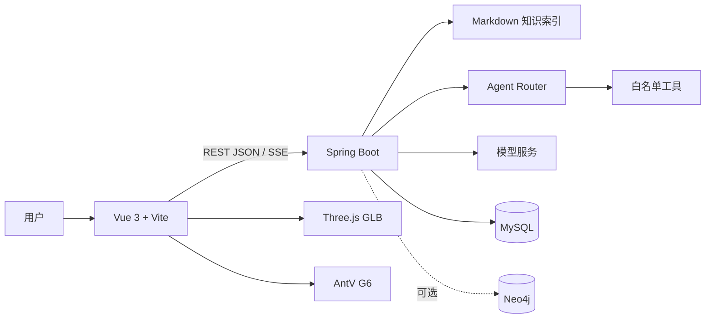

# 青铜数元项目架构说明

本文面向项目使用者和开发者，介绍系统的组成、数据流、关键模块和本地运行方式。

## 1. 项目定位

青铜数元是一套面向三星堆文博场景的数字展示与智能导览系统。它把文物浏览、RAG知识问答、状态驱动Agent、三维模型、知识图谱和多模态能力放在同一条体验链路中。

系统重点解决三件事：

1. 让分散的文博资料可以按来源检索；
2. 让文物、年代、遗址、工艺和文化含义之间的关系更容易探索；
3. 让用户从问答自然进入三维展示、图谱浏览和连续导览。

## 2. 总体架构

### 2.1 前端

- Vue 3 + Vite：页面、交互和开发服务器；
- Axios/fetch：调用普通 JSON 接口；
- SSE：接收 AI 流式回答和 Agent 事件；
- Three.js：加载 GLB 文物模型；
- AntV G6：绘制文物关系图谱；
- `src/agent/`：维护当前文物、页面、导览和最近动作等上下文。

### 2.2 后端

- Spring Boot 3：提供业务 API、问答接口和文件服务；
- Spring AI：通过 OpenAI 兼容协议调用聊天和多模态模型；
- `agent/`：路由、工具注册和执行编排；
- `knowledge/`：Markdown解析、词法索引和来源回传；
- `service/`：会话、附件、媒体、图谱和业务服务；
- MySQL：保存业务数据、会话消息、附件、引用和状态；
- Neo4j：可选的图谱存储，未启用时回退到 MySQL 结构化关系。

## 3. 一次问答的完整数据流

1. 前端提交用户问题、会话 ID、当前页面和当前文物信息；
2. 后端读取会话状态，交给 Agent Router 判断任务类型；
3. 需要知识依据时，检索 Markdown 知识索引，并保留文档标题、路径、标签和来源；
4. 需要执行动作时，检查工具白名单、参数和当前上下文；
5. 模型生成回答，或工具返回执行结果；
6. 后端把回答、来源、工具结果和新状态通过 JSON/SSE 返回前端；
7. 前端更新消息气泡、引用、当前文物和导览状态。

## 4. Agent路由与安全边界

系统目前使用四类路由：

| 路由 | 用途 |
|---|---|
| `TOOL_CALL` | 导航、导览、天气、文物详情等动作 |
| `RAG` | 需要文博资料支持的知识问答 |
| `DIRECT_ANSWER` | 简单解释、闲聊或不需要检索的回答 |
| `UNSUPPORTED` | 无法识别、工具不存在或不允许执行的请求 |

Router主要让模型输出结构化 JSON，后端再进行解析和校验。当前工具注册在白名单中，参数会检查必填字段、类型、枚举值、资源存在性和上下文权限。模型输出异常、置信度过低、参数不合法、工具超时或服务不可用时，系统会停止执行，返回直接回答或不支持提示，并把失败原因回传给前端。

一次请求默认只执行一个主要工具，并设置约6秒超时，避免重复调用和工具死循环。

## 5. RAG知识索引

知识库位于 `springboot/knowledge-vault/wiki`，当前包含38份 Markdown 文档。索引过程会：

1. 读取 Frontmatter 中的标题、类型、状态、标签、关联页面和来源；
2. 解析 Wikilink 关系；
3. 清理 Markdown 格式并生成可检索文本；
4. 对中文进行单字和二元词切分，对英文和数字进行正则切分；
5. 根据词项匹配计算基础分，再叠加标题、元数据、类型和关系加权；
6. 将排名靠前的文档片段注入模型上下文；
7. 在回答中展示来源标题、路径和引用片段。

当前主流程是自定义词法检索，不依赖 Elasticsearch、BM25 或向量数据库。文档规模扩大后，可以在此基础上增加标题层级切分、向量召回和混合排序。

## 6. 三维、图谱与多模态

三维页面通过 `entityId` 和 `glbUrl` 加载对应 GLB 模型，并用相同实体 ID 请求图谱数据。G6负责节点、边、选中和关系展开；后端优先查询 Neo4j，失败时回退到 MySQL。

图片通过 Spring AI 的多模态接口传给配置的视觉语言模型，再结合用户问题回答。当前 GLB 主要采用实体 ID、名称和元数据对齐，并没有做三维几何特征向量提取或 CLIP 图文向量检索。

## 7. 运行配置

- 前端默认端口：`8800`；
- 后端默认端口：`8889`；
- MySQL：默认使用复现数据库 `sanxingdui_repro`；
- Neo4j：默认关闭；
- 真实配置：复制 `springboot/src/main/resources/application-template.yml` 为 `application.yml` 后填写；
- 密钥、数据库密码和本地上传文件不提交到 Git。

## 8. 当前边界

- 当前 RAG 没有向量检索和正式的召回率、准确率评测；
- 当前没有固定 chunk size/overlap，主要按文档索引并对上下文做长度控制；
- Neo4j是可选依赖；
- Three.js与G6目前主要是实体 ID 联动，不是完整的模型网格点击双向联动；
- 回归脚本可以本地重复执行，但尚未接入完整的 GitHub Actions CI。
