# 三星堆与古蜀文化 PPT 高清素材库

共 50 张。已按 PPT 使用场景筛选，排除普通游客照、强反光、主体过小、明显水印和低清图片。

> 素材来自公开网页与官方/专业媒体页面，仅建议用于项目汇报、教学和内部演示。公开发布或商业使用前，请根据 `sourcePage` 再确认授权。数字复原与艺术表达图片不得描述为考古原貌。

## 01-cover-architecture

### 三星堆博物馆航拍

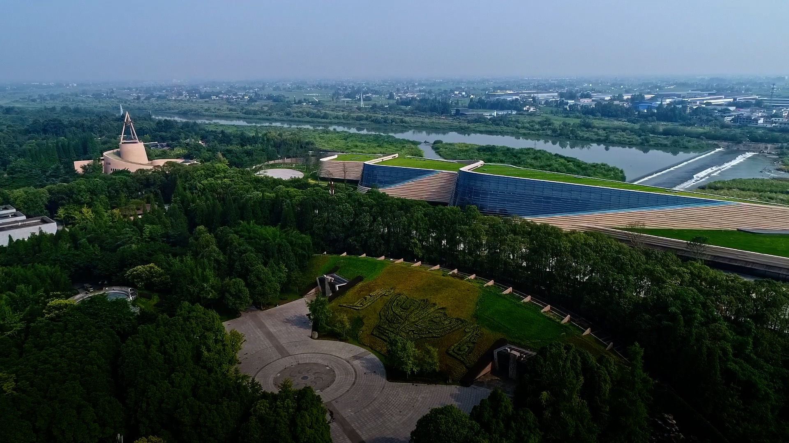

- 推荐用途：封面 / 项目总览
- 尺寸：1920 x 1080
- 本地路径：`01-cover-architecture/01-sanxingdui-museum-aerial.jpg`
- 来源：[Take a look at the New Sanxingdui Museum building - CGTN](https://news.cgtn.com/news/2023-07-27/Take-a-look-at-the-New-Sanxingdui-Museum-building-1lMmvM2jRN6/index.html)

### 三星堆博物馆新馆正面

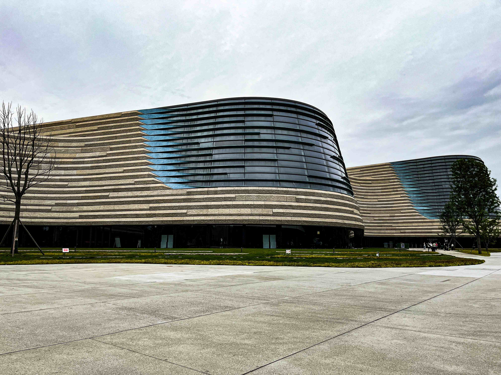

- 推荐用途：封面 / 建筑介绍
- 尺寸：4032 x 3024
- 本地路径：`01-cover-architecture/02-new-museum-front.jpg`
- 来源：[A journey through time to the ancient Shu civilization: Explore the new ...](http://en.people.cn/n3/2024/0430/c90000-20163505-8.html)

### 林木之间的三星堆新馆

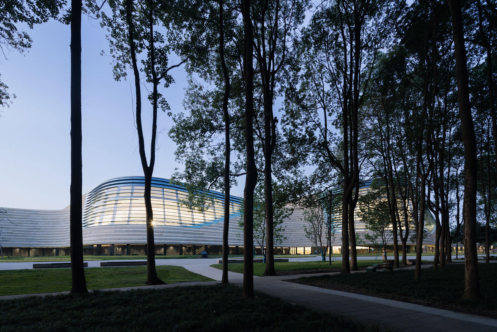

- 推荐用途：章节页 / 建筑介绍
- 尺寸：1700 x 1134
- 本地路径：`01-cover-architecture/03-new-museum-in-forest.jpg`
- 来源：[The New Sanxingdui Museum by China Southwest Architectural Design and ...](https://www.gooood.cn/new-sanxingdui-museum-china-southwest-architectural-design-and-research-institute-corp-ltd.htm)

### 红色光影展厅

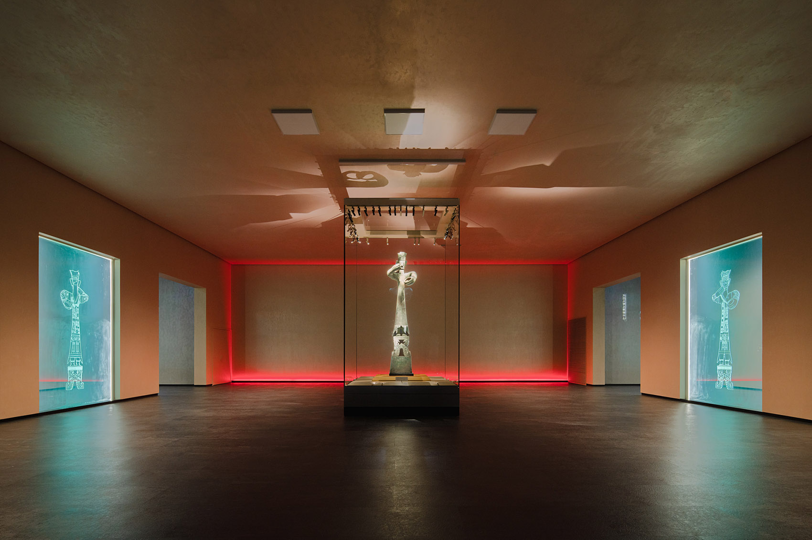

- 推荐用途：章节页 / 数字展陈
- 尺寸：1700 x 1133
- 本地路径：`01-cover-architecture/04-red-lit-exhibition-hall.jpg`
- 来源：[The New Sanxingdui Museum by China Southwest Architectural Design and ...](https://www.gooood.cn/new-sanxingdui-museum-china-southwest-architectural-design-and-research-institute-corp-ltd.htm)

### 三星堆新馆广场

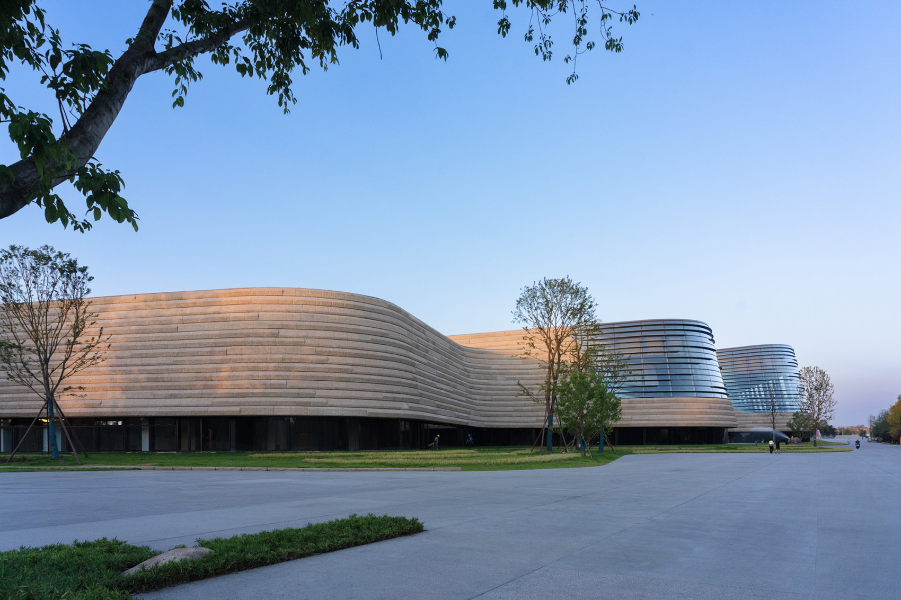

- 推荐用途：封面 / 场馆介绍
- 尺寸：1700 x 1133
- 本地路径：`01-cover-architecture/05-new-museum-plaza.jpg`
- 来源：[The New Sanxingdui Museum by China Southwest Architectural Design and ...](https://www.gooood.cn/new-sanxingdui-museum-china-southwest-architectural-design-and-research-institute-corp-ltd.htm)

### 三星堆新馆旋厅

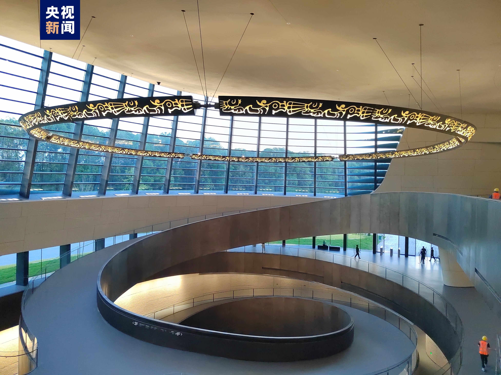

- 推荐用途：章节页 / 场馆介绍
- 尺寸：3904 x 2928
- 本地路径：`01-cover-architecture/06-museum-spiral-interior.jpg`
- 来源：[New exhibition hall at Sanxingdui Museum opens its doors to public - CGTN](https://news.cgtn.com/news/2023-07-27/New-exhibition-hall-at-Sanxingdui-Museum-opens-its-doors-to-public--1lMoQy8nNUA/index.html)

### 三星堆新馆峡谷式内部空间

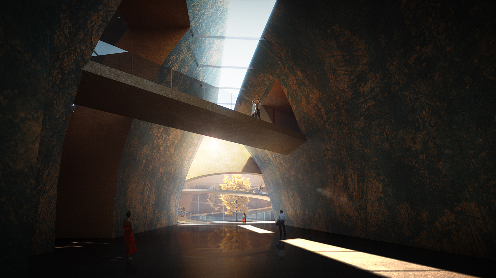

- 推荐用途：封面 / 留白排版
- 尺寸：1700 x 957
- 本地路径：`01-cover-architecture/07-museum-canyon-interior.jpg`
- 来源：[AD: New hall and Visitor Center of Sanxingdui Museum conceptual ...](https://www.gooood.cn/ad-new-hall-and-visitor-center-of-sanxingdui-museum-conceptual-architectural-design-by-biad-6a8studio.htm)

### 三星堆新馆光影大厅

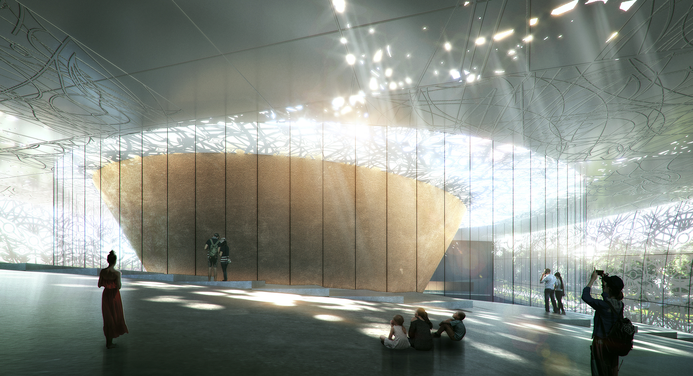

- 推荐用途：封面 / 留白排版
- 尺寸：1700 x 924
- 本地路径：`01-cover-architecture/08-museum-light-hall.jpg`
- 来源：[AD: New hall and Visitor Center of Sanxingdui Museum conceptual ...](https://www.gooood.cn/ad-new-hall-and-visitor-center-of-sanxingdui-museum-conceptual-architectural-design-by-biad-6a8studio.htm)

## 02-iconic-artifacts

### 暗色展陈中的青铜面具

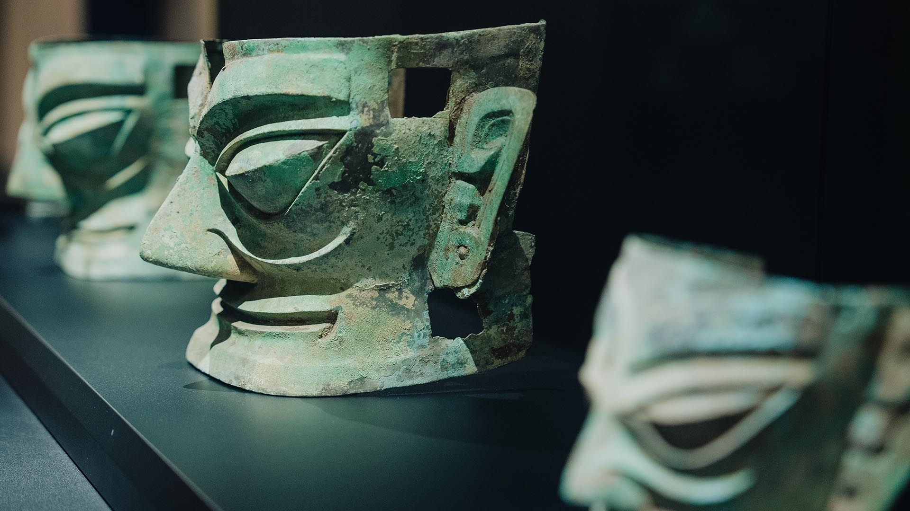

- 推荐用途：核心文物 / 封面
- 尺寸：1920 x 1080
- 本地路径：`02-iconic-artifacts/01-bronze-mask-dark-display.jpg`
- 来源：[New Sanxingdui Museum wows visitors with newly discovered artifacts - CGTN](https://news.cgtn.com/news/2023-08-12/New-Sanxingdui-Museum-wows-visitors-with-newly-discovered-artifacts-1md1OmDxGvK/index.html)

### 青铜纵目面具正面展陈

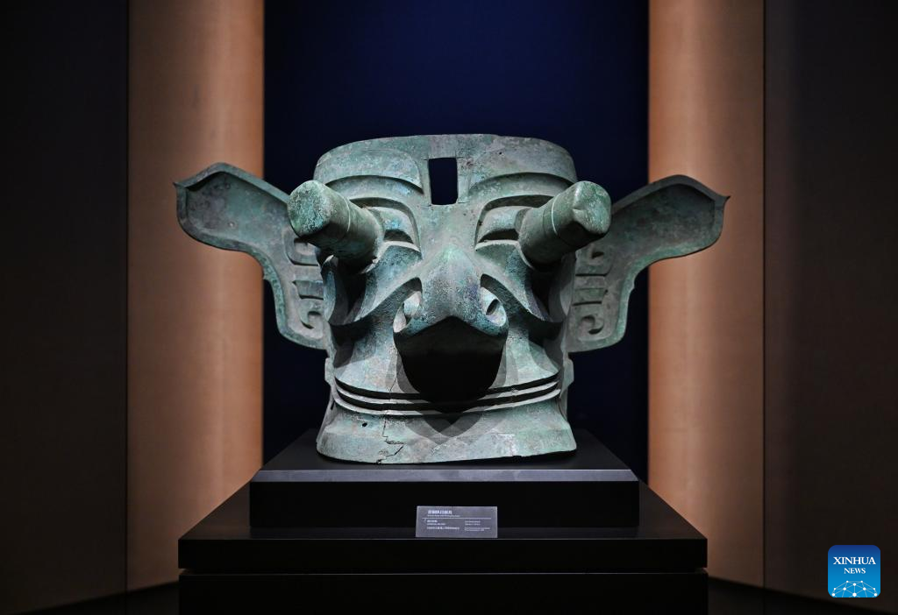

- 推荐用途：核心文物
- 尺寸：1024 x 702
- 本地路径：`02-iconic-artifacts/02-bronze-mask-pedestal.png`
- 来源：[New Sanxingdui Museum building starts trial operation in SW China's ...](http://english.news.cn/20230727/cbc9b76d50554596907823f8a5dbbbef/c.html)

### 青铜纵目面具斜侧面

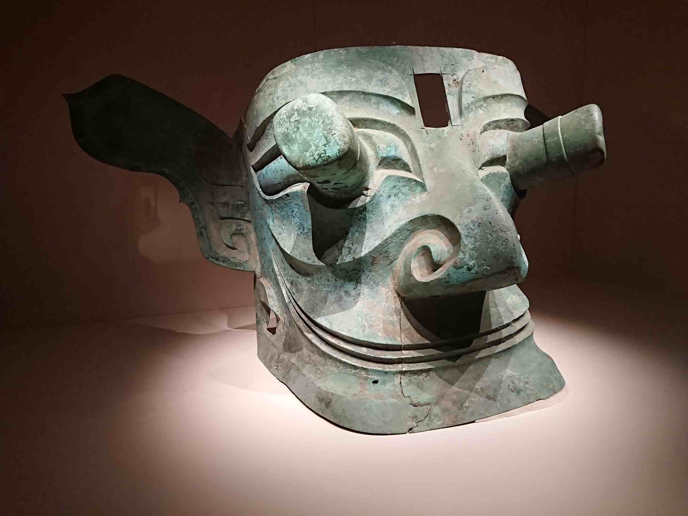

- 推荐用途：核心文物 / 细节
- 尺寸：2500 x 1875
- 本地路径：`02-iconic-artifacts/03-vertical-eye-mask-angle.jpg`
- 来源：[Mystery of Sanxingdui culture on display in museum exhibition - CGTN](https://news.cgtn.com/news/3d3d414f78596a4e7a457a6333566d54/index.html)

### 青铜纵目面具侧面

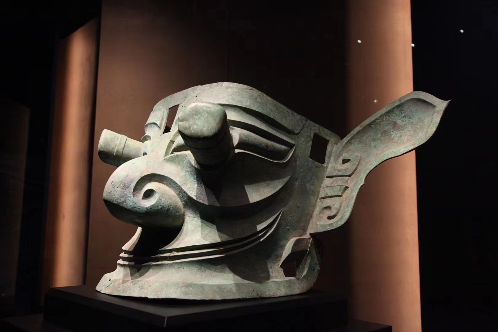

- 推荐用途：核心文物 / 细节
- 尺寸：1620 x 1080
- 本地路径：`02-iconic-artifacts/04-vertical-eye-mask-profile.jpg`
- 来源：[Mysterious masks and heads at Sanxingdui - CGTN](https://news.cgtn.com/news/2023-08-31/Mysterious-masks-and-heads-at-Sanxingdui-1mIEBclT2Yo/index.html)

### 青铜人头像

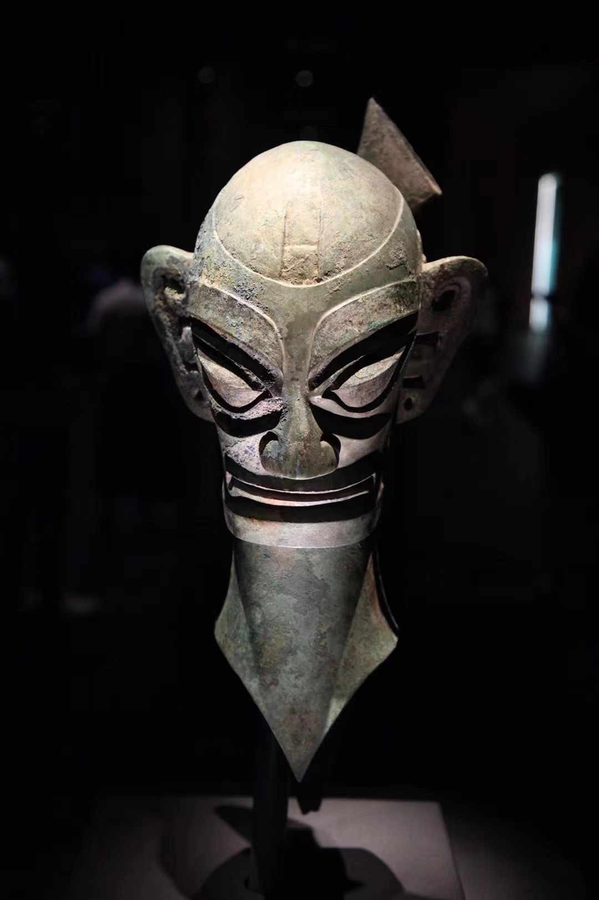

- 推荐用途：核心文物
- 尺寸：1080 x 1620
- 本地路径：`02-iconic-artifacts/05-bronze-head-green.jpg`
- 来源：[Mysterious masks and heads at Sanxingdui - CGTN](https://news.cgtn.com/news/2023-08-31/Mysterious-masks-and-heads-at-Sanxingdui-1mIEBclT2Yo/index.html)

### 戴金面罩青铜人头像

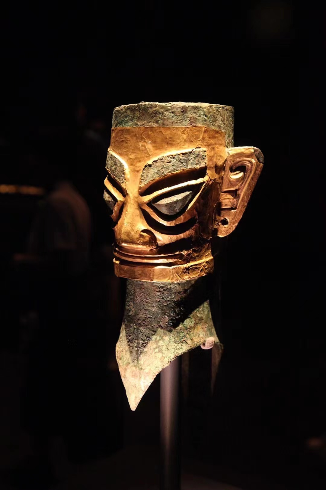

- 推荐用途：核心文物 / 金铜对比
- 尺寸：1080 x 1620
- 本地路径：`02-iconic-artifacts/06-gold-faced-bronze-head.jpg`
- 来源：[Mysterious masks and heads at Sanxingdui - CGTN](https://news.cgtn.com/news/2023-08-31/Mysterious-masks-and-heads-at-Sanxingdui-1mIEBclT2Yo/index.html)

### 白底青铜面具

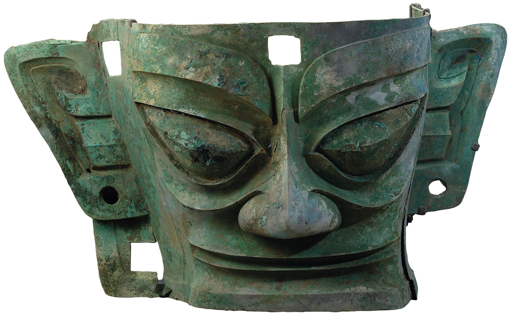

- 推荐用途：抠图式排版 / 文物介绍
- 尺寸：1500 x 931
- 本地路径：`02-iconic-artifacts/07-bronze-mask-isolated-white.jpg`
- 来源：[Features - The Many Faces of the Kingdom of Shu - Archaeology Magazine ...](https://archaeology.org/issues/november-december-2024/features/the-many-faces-of-the-kingdom-of-shu/)

### 灰底青铜大面具

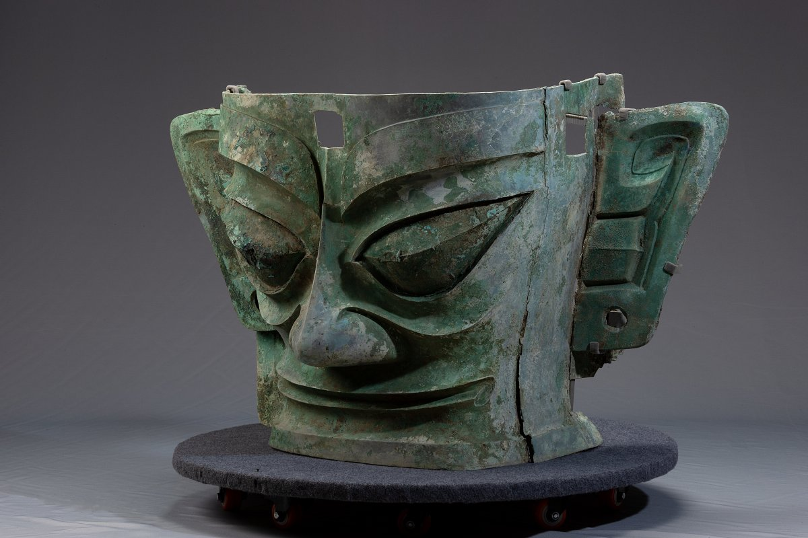

- 推荐用途：抠图式排版 / 文物介绍
- 尺寸：1200 x 800
- 本地路径：`02-iconic-artifacts/08-giant-bronze-mask-isolated.jpg`
- 来源：[Bronze mask from Sanxingdui site showcased at CCTV gala - Chinadaily.com.cn](http://www.chinadaily.com.cn/a/202202/02/WS61f9eb94a310cdd39bc8477b.html)

### 三星堆青铜鸟

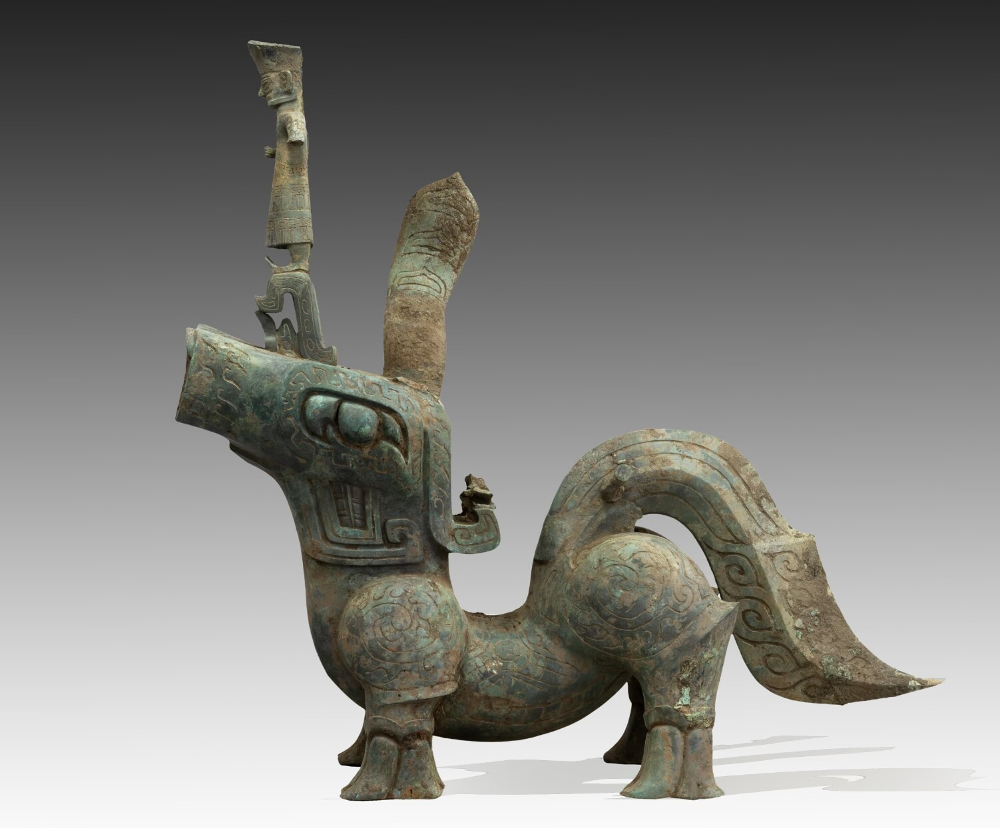

- 推荐用途：核心文物 / 图腾
- 尺寸：1502 x 1245
- 本地路径：`02-iconic-artifacts/09-bronze-bird.jpg`
- 来源：[震撼揭幕，三星堆博物馆近600件文物首次亮相新馆展出_四川在线](https://sichuan.scol.com.cn/ggxw/202307/58941542.html)

### 三星堆代表文物组合展陈

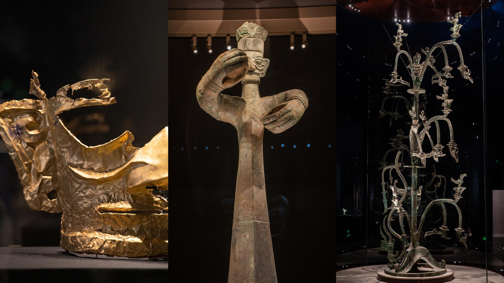

- 推荐用途：文物体系 / 总览
- 尺寸：1920 x 1080
- 本地路径：`02-iconic-artifacts/10-artifact-group-display.jpg`
- 来源：[Treasures of Sanxingdui unveil ancient Shu civilization - CGTN](https://news.cgtn.com/news/2024-02-23/Treasures-of-Sanxingdui-unveil-ancient-Shu-civilization-1rqx8SUv4I0/p.html)

### 青铜面具12K微距光影

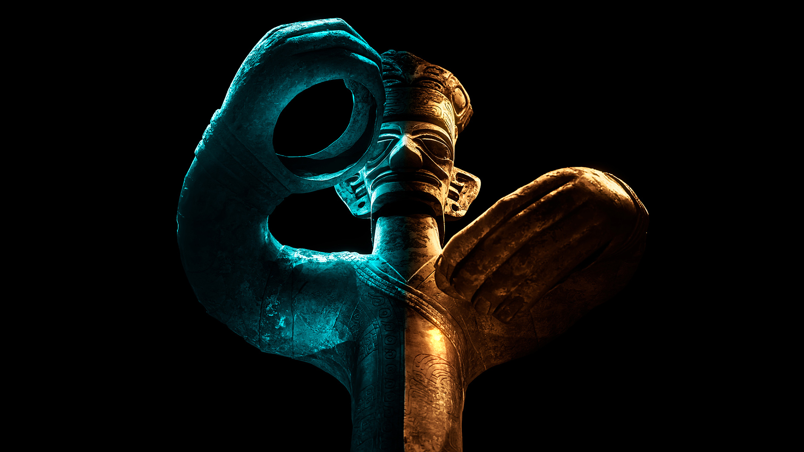

- 推荐用途：封面 / 微距细节
- 尺寸：1890 x 1063
- 本地路径：`02-iconic-artifacts/11-mask-macro-12k.jpg`
- 来源：[Macro photography of Sanxingdui cultural relics in 12K - CGTN](https://news.cgtn.com/news/2021-09-09/Macro-photography-of-Sanxingdui-cultural-relics-in-12K-13qgCKRa8h2/index.html)

### 祭祀面具艺术化展陈

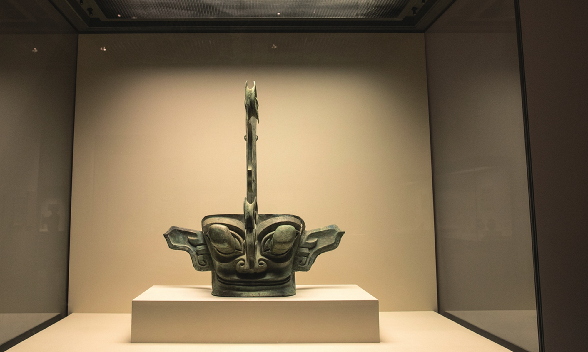

- 推荐用途：封面 / 神秘氛围
- 尺寸：2000 x 1200
- 本地路径：`02-iconic-artifacts/12-ritual-mask-display.jpg`
- 来源：[Game collaborates with "Sanxingdui" and "Longmen Grottoes," fulfill ...](https://www.globaltimes.cn/page/202312/1304375.shtml)

### 金面具明亮展陈

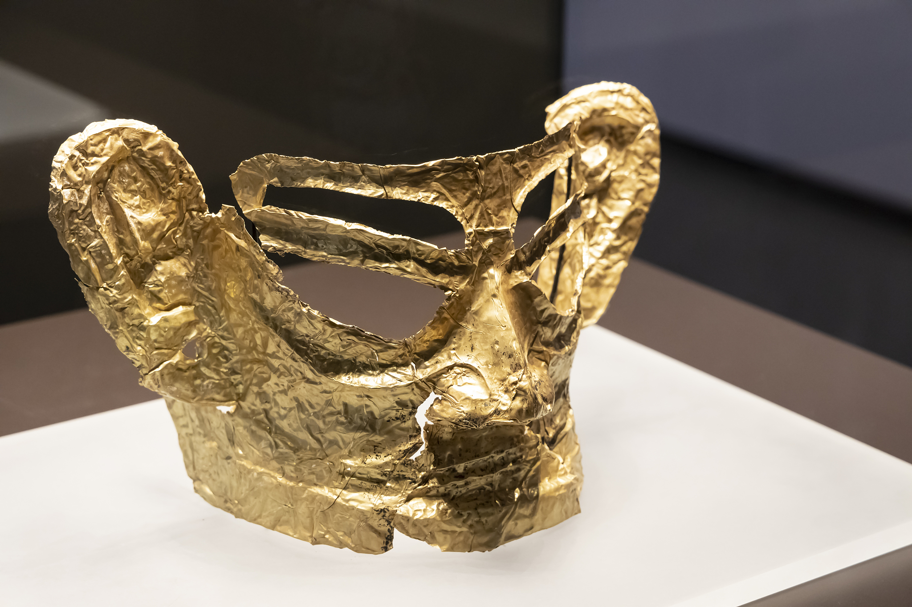

- 推荐用途：核心文物 / 金器
- 尺寸：2048 x 1365
- 本地路径：`02-iconic-artifacts/13-gold-mask-bright.jpg`
- 来源：[Unveiling Sanxingdui: Revealing the enigma of ancient Shu civilization ...](https://news.cgtn.com/news/2024-07-17/Unveiling-Sanxingdui-Revealing-the-enigma-of-ancient-Shu-civilization-1vje3yQ2qJ2/p.html)

### 黑底金面具正面

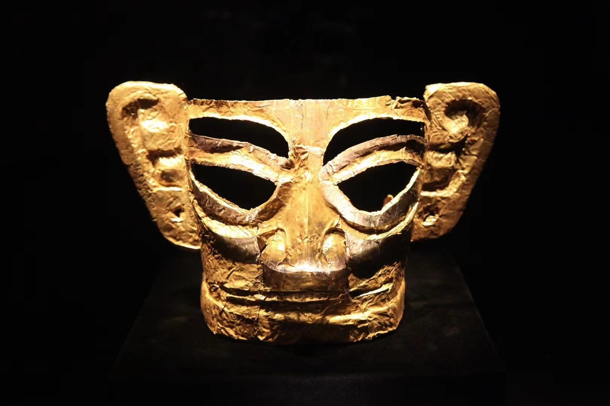

- 推荐用途：封面 / 核心文物
- 尺寸：1620 x 1080
- 本地路径：`02-iconic-artifacts/14-gold-mask-front.jpg`
- 来源：[Mysterious masks and heads at Sanxingdui - CGTN](https://news.cgtn.com/news/2023-08-31/Mysterious-masks-and-heads-at-Sanxingdui-1mIEBclT2Yo/index.html)

### 金面具斜侧面

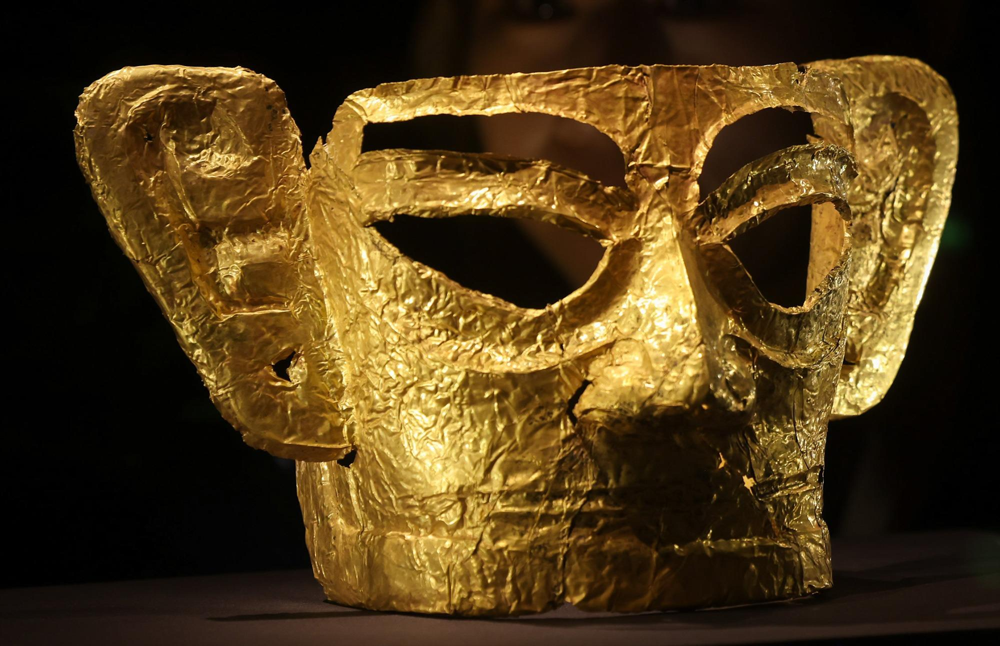

- 推荐用途：核心文物 / 细节
- 尺寸：2000 x 1292
- 本地路径：`02-iconic-artifacts/15-gold-mask-angle.jpg`
- 来源：[The Sanxingdui connection](https://www.chinadailyhk.com/hk/article/358292)

### 青铜大立人展陈

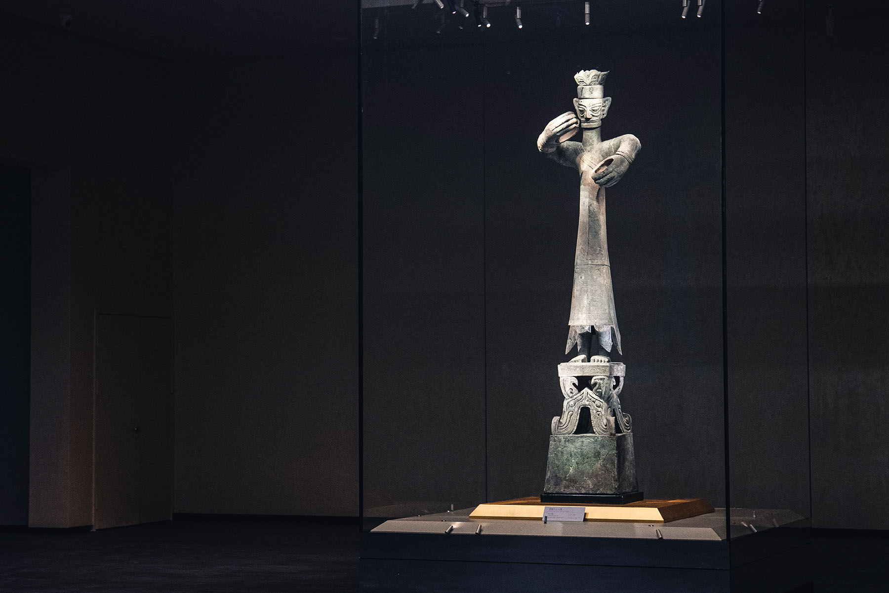

- 推荐用途：核心文物 / 人物
- 尺寸：1800 x 1202
- 本地路径：`02-iconic-artifacts/16-bronze-standing-figure.jpg`
- 来源：[A gripping mystery](https://www.chinadailyhk.com/hk/article/582418)

### 金沙金面具

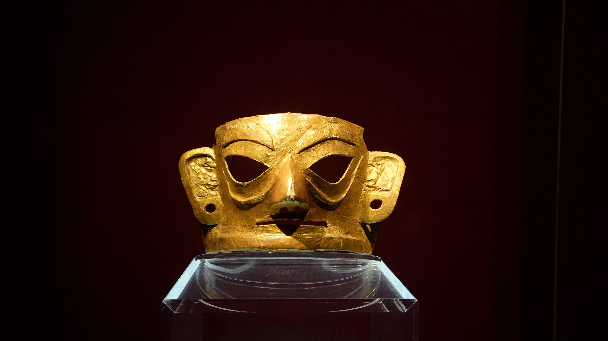

- 推荐用途：三星堆与金沙对比
- 尺寸：3840 x 2160
- 本地路径：`02-iconic-artifacts/17-jinsha-gold-mask.jpg`
- 来源：[A Slice of Chengdu: Jinsha Site Museum - CGTN](https://news.cgtn.com/news/2024-11-15/A-Slice-of-Chengdu-Jinsha-Site-Museum-1yuuKBqltfi/index.html)

### 扭头跪坐人像艺术渲染

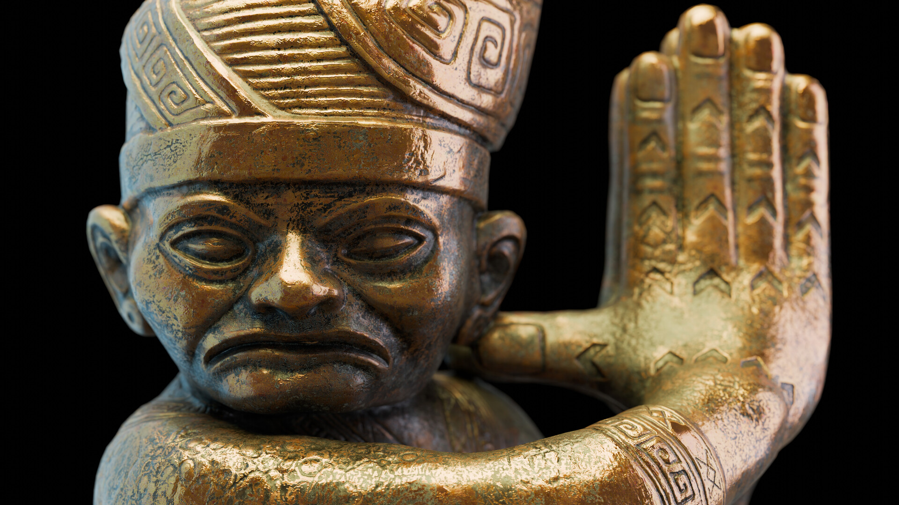

- 推荐用途：艺术表达 / 非考古原貌
- 尺寸：1920 x 1080
- 本地路径：`02-iconic-artifacts/18-kneeling-figure-art-render.jpg`
- 来源：[ArtStation - Bronze Kneeling Figure with Turned from Sanxingdui三星堆青铜扭头跪坐人像](https://www.artstation.com/artwork/WXqbYD)
- 注意：数字复原或艺术表达，非考古原貌

## 03-sacred-tree-details

### 青铜神树剪影式全景

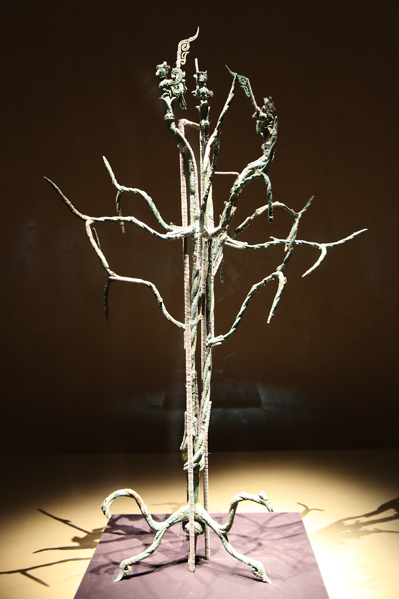

- 推荐用途：核心文物 / 章节页
- 尺寸：1067 x 1600
- 本地路径：`03-sacred-tree-details/01-sacred-tree-silhouette.jpg`
- 来源：[Bronze sacred trees at Sanxingdui Museum - CGTN](https://news.cgtn.com/news/2025-08-13/Bronze-sacred-trees-at-Sanxingdui-Museum-1FNZY0xoKD6/p.html)

### 青铜神树环形灯光展陈

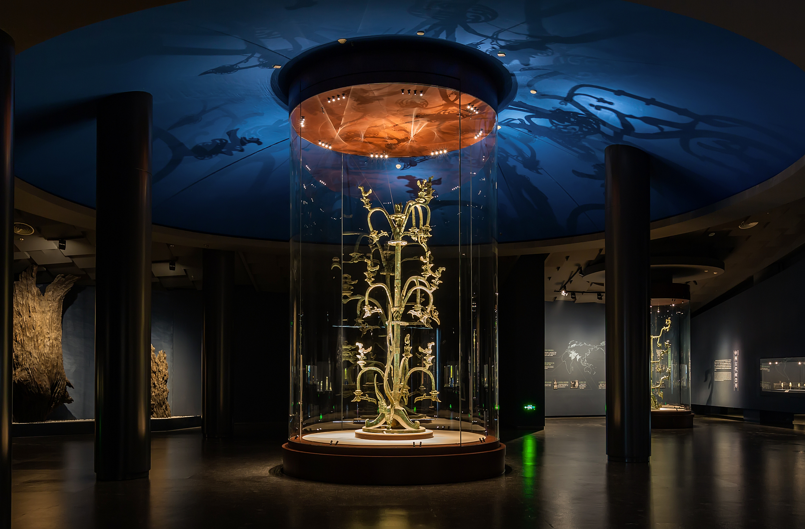

- 推荐用途：核心文物 / 封面
- 尺寸：2048 x 1348
- 本地路径：`03-sacred-tree-details/02-sacred-tree-lit-display.jpg`
- 来源：[Sanxingdui Museum more popular during Qingming Festival - CGTN](https://news.cgtn.com/news/2021-04-05/Sanxingdui-Museum-more-popular-during-Qingming-Festival-Zde7EtlDnG/index.html)

### 青铜神树树冠

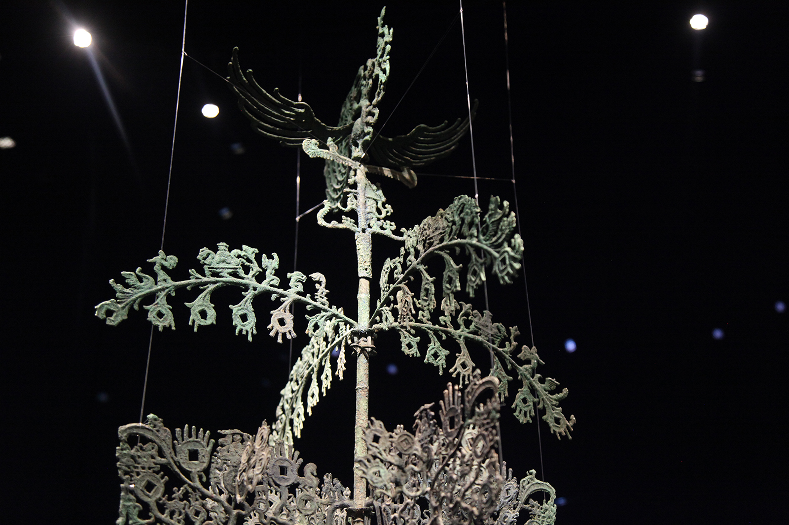

- 推荐用途：局部细节
- 尺寸：1600 x 1067
- 本地路径：`03-sacred-tree-details/03-sacred-tree-crown.jpg`
- 来源：[Bronze sacred trees at Sanxingdui Museum - CGTN](https://news.cgtn.com/news/2025-08-13/Bronze-sacred-trees-at-Sanxingdui-Museum-1FNZY0xoKD6/p.html)

### 青铜神树枝干

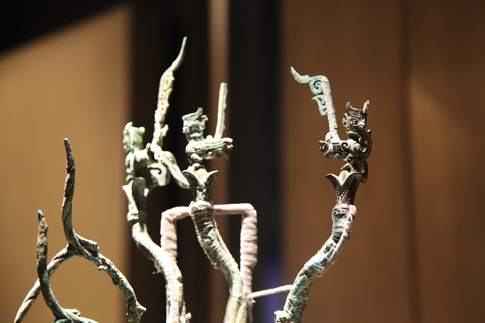

- 推荐用途：局部细节
- 尺寸：1600 x 1067
- 本地路径：`03-sacred-tree-details/04-sacred-tree-branches.jpg`
- 来源：[Bronze sacred trees at Sanxingdui Museum - CGTN](https://news.cgtn.com/news/2025-08-13/Bronze-sacred-trees-at-Sanxingdui-Museum-1FNZY0xoKD6/p.html)

### 青铜神树神鸟细节

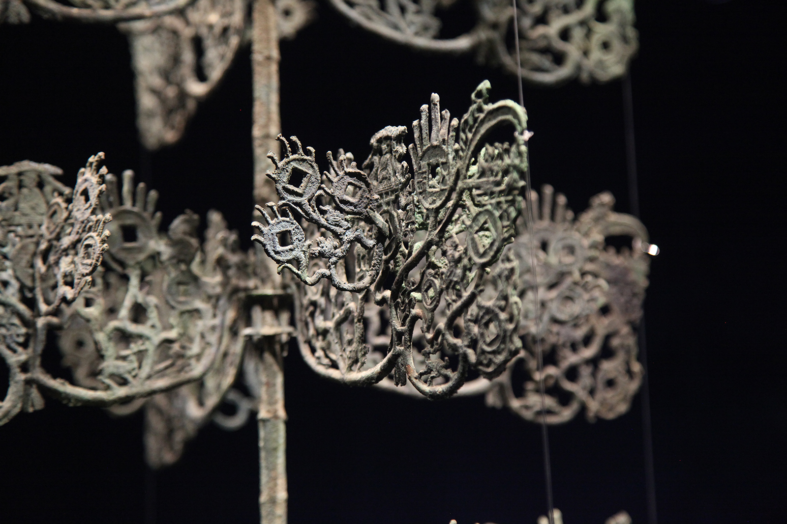

- 推荐用途：局部细节 / 图腾
- 尺寸：1600 x 1067
- 本地路径：`03-sacred-tree-details/05-sacred-tree-bird-detail.jpg`
- 来源：[Bronze sacred trees at Sanxingdui Museum - CGTN](https://news.cgtn.com/news/2025-08-13/Bronze-sacred-trees-at-Sanxingdui-Museum-1FNZY0xoKD6/p.html)

### 蓝色展厅中的青铜神树

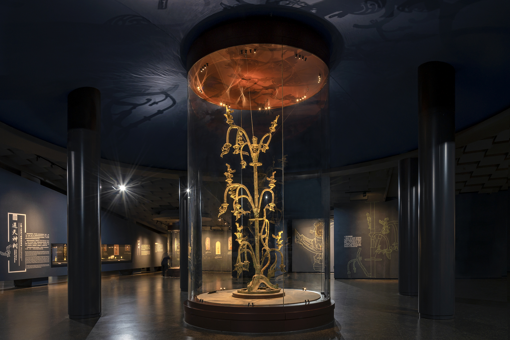

- 推荐用途：核心文物 / 封面
- 尺寸：2048 x 1365
- 本地路径：`03-sacred-tree-details/06-sacred-tree-blue-hall.jpg`
- 来源：[From ancient Shu to shared heritage: The global meaning of Sanxingdui ...](https://news.cgtn.com/news/2026-05-19/From-ancient-Shu-to-shared-heritage-The-global-meaning-of-Sanxingdui-1NgCATNWPW8/p.html)

### 青铜神树纵向全景

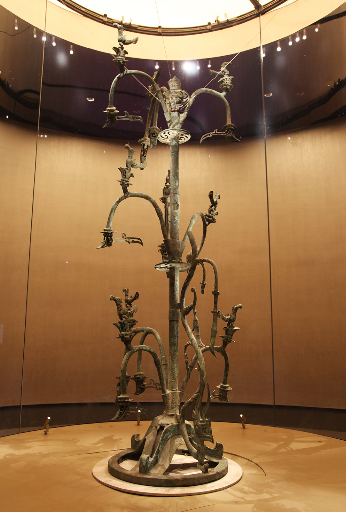

- 推荐用途：核心文物 / 竖版
- 尺寸：1082 x 1600
- 本地路径：`03-sacred-tree-details/07-sacred-tree-vertical.jpg`
- 来源：[Bronze sacred trees at Sanxingdui Museum - CGTN](https://news.cgtn.com/news/2025-08-13/Bronze-sacred-trees-at-Sanxingdui-Museum-1FNZY0xoKD6/p.html)

### 青铜神树龙形构件

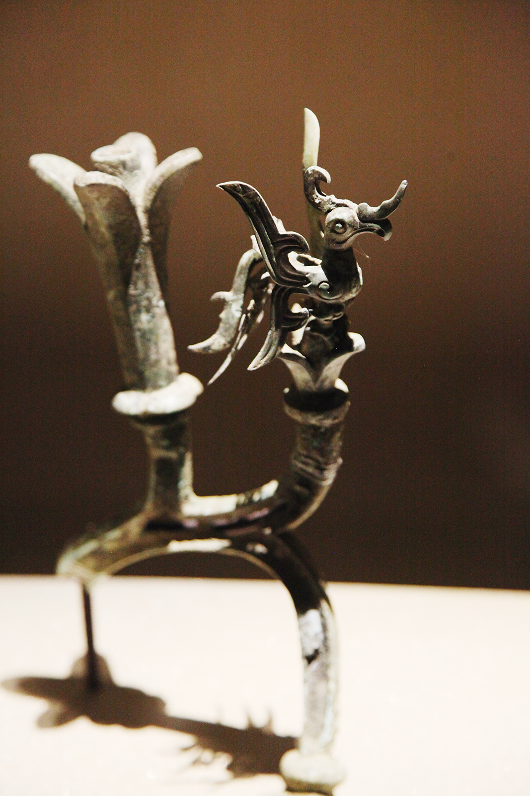

- 推荐用途：局部细节 / 图腾
- 尺寸：1067 x 1600
- 本地路径：`03-sacred-tree-details/08-sacred-tree-dragon-detail.jpg`
- 来源：[Bronze sacred trees at Sanxingdui Museum - CGTN](https://news.cgtn.com/news/2025-08-13/Bronze-sacred-trees-at-Sanxingdui-Museum-1FNZY0xoKD6/p.html)

## 04-digital-immersive

### 12K数字展面具光廊

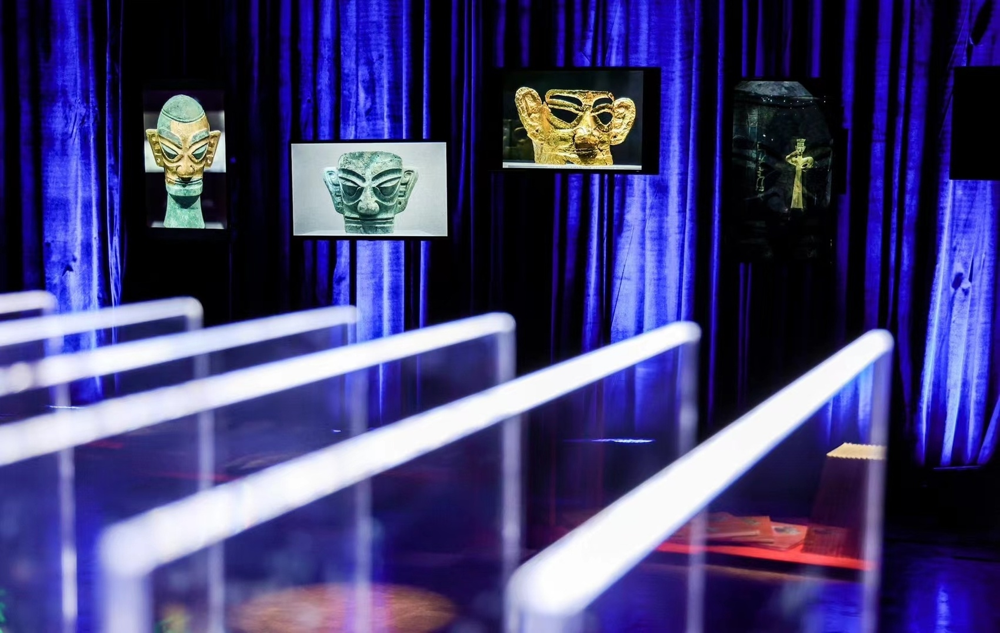

- 推荐用途：数字展 / 章节页
- 尺寸：1700 x 1077
- 本地路径：`04-digital-immersive/01-12k-mask-light-tunnel.jpg`
- 来源：[三星堆文物+12K超高清画面 这场数字展带你看清古蜀文明的细节_四川在线](https://sichuan.scol.com.cn/ggxw/202212/58787561.html)

### 数字文物装置

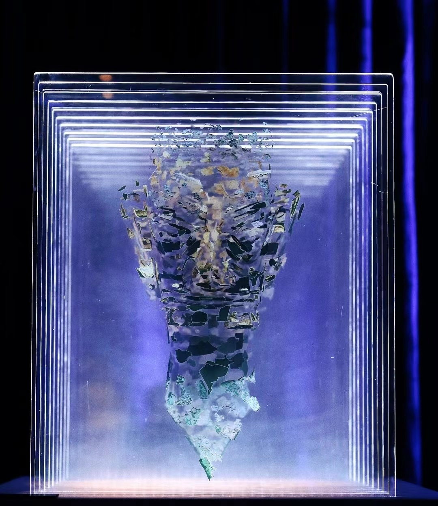

- 推荐用途：数字展 / 科技表达
- 尺寸：1080 x 1246
- 本地路径：`04-digital-immersive/02-digital-artifact-installation.jpg`
- 来源：[三星堆文物+12K超高清画面 这场数字展带你看清古蜀文明的细节_四川在线](https://sichuan.scol.com.cn/ggxw/202212/58787561.html)

### 古蜀光影沉浸通道

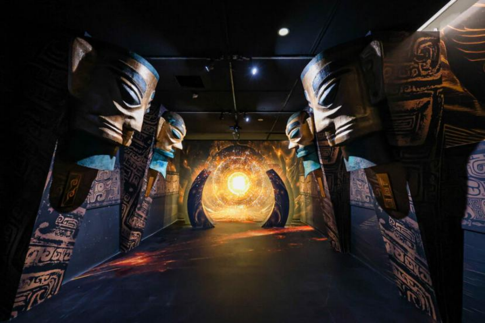

- 推荐用途：数字展 / 封面
- 尺寸：1081 x 720
- 本地路径：`04-digital-immersive/03-ancient-shu-light-tunnel.png`
- 来源：[邂逅千年古蜀，三星堆沉浸式光影艺术展亮相上海](http://www.sh.news.cn/20230824/c36650e21edc48d0abe33b06fdcfe9b0/c.html)

### 三星堆数字艺术海报

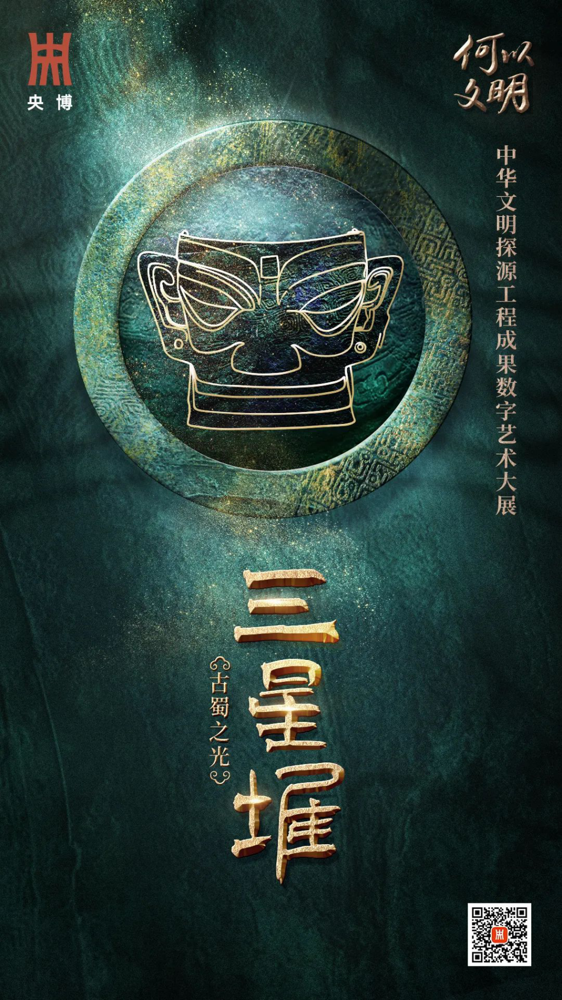

- 推荐用途：海报参考 / 视觉风格
- 尺寸：1025 x 1823
- 本地路径：`04-digital-immersive/04-sanxingdui-digital-poster.png`
- 来源：[朱广权带您探寻古蜀之光 何以文明-三星堆数字大展即将上线_经济频道_央视网(cctv.com)](https://jingji.cctv.com/2023/11/01/ARTInVlGVt2LgV1uFd53ZXt3231101.shtml)

### 金面具沉浸式展厅

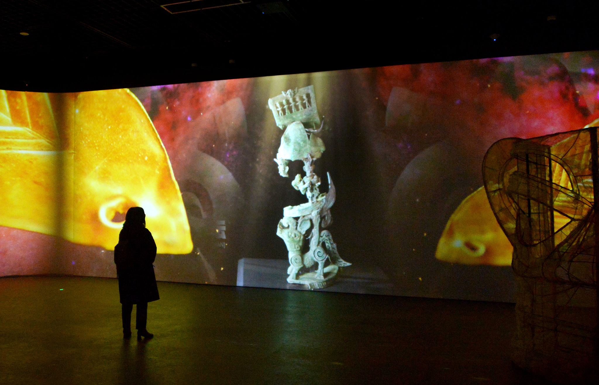

- 推荐用途：数字展 / 科技表达
- 尺寸：2048 x 1315
- 本地路径：`04-digital-immersive/05-gold-mask-immersive-hall.jpg`
- 来源：[Exploring Sanxingdui: Embrace the fusion of culture and technology - CGTN](https://news.cgtn.com/news/2024-07-17/Exploring-Sanxingdui-Embrace-the-fusion-of-culture-and-technology-1vjesRZJRTi/p.html)

### 金面具环幕光影

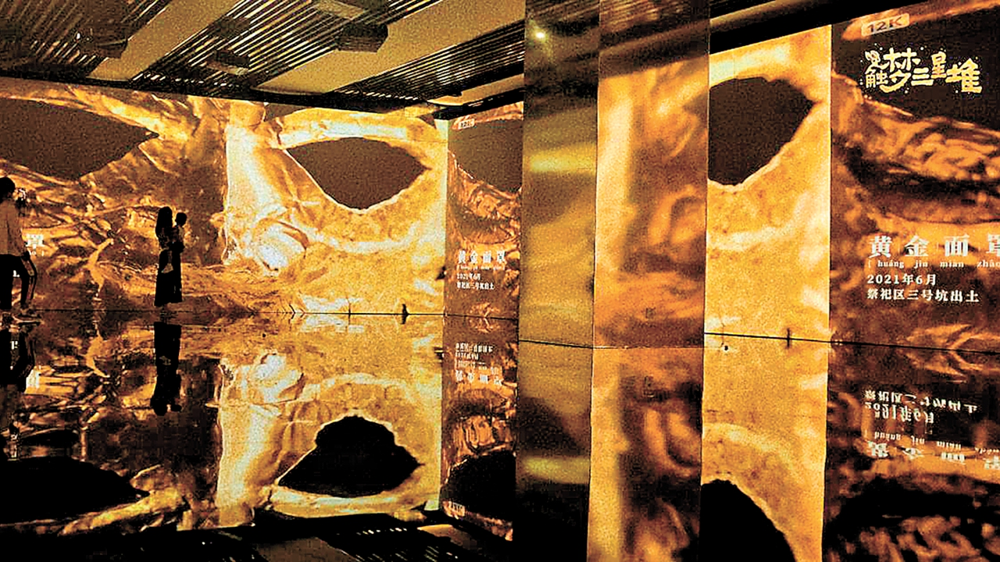

- 推荐用途：数字展 / 章节页
- 尺寸：1280 x 720
- 本地路径：`04-digital-immersive/06-gold-mask-light-walls.jpg`
- 来源：[Immersive digital exhibitions offer unique experiences_EYESHENZHEN](https://www.eyeshenzhen.com/content/2023-06/28/content_30302031.htm)

### 古蜀神树幻想场景

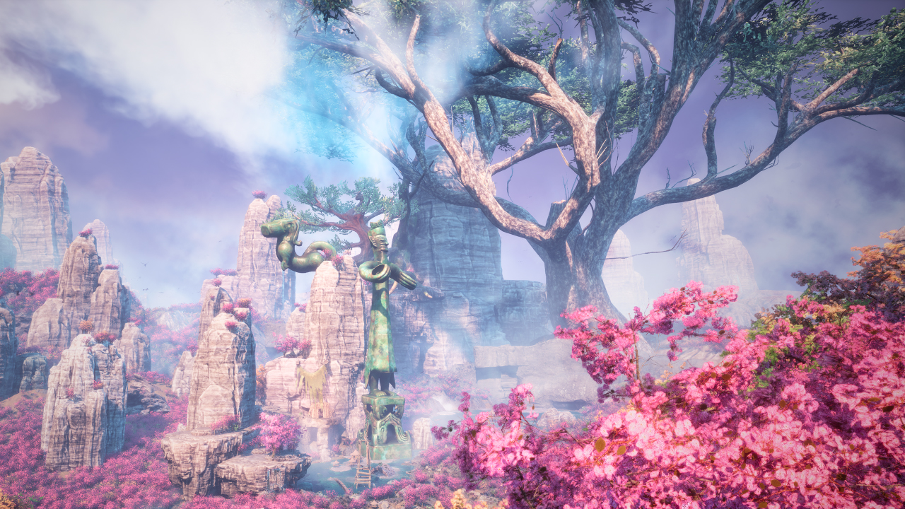

- 推荐用途：数字复原 / 非考古原貌
- 尺寸：1280 x 720
- 本地路径：`04-digital-immersive/07-ancient-shu-fantasy-scene.jpg`
- 来源：[VR exhibition brings Sanxingdui civilization to life | EYESHENZHEN](https://www.eyeshenzhen.com/content/2026-03/16/content_31975813.htm)
- 注意：数字复原或艺术表达，非考古原貌

### 蓝色面具沉浸空间

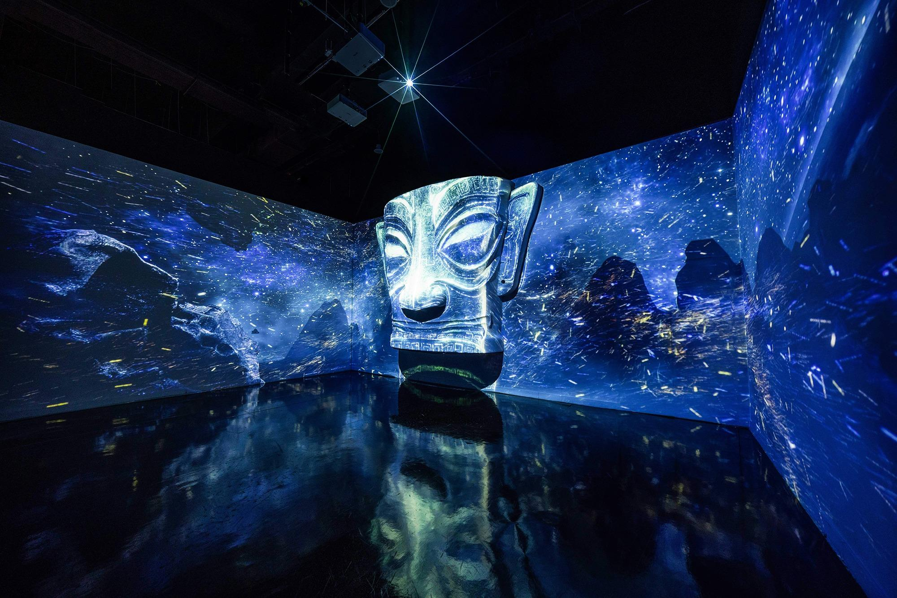

- 推荐用途：数字展 / 封面
- 尺寸：2000 x 1334
- 本地路径：`04-digital-immersive/08-blue-mask-immersive-room.jpg`
- 来源：[Sanxingdui exhibition offers immersive peek behind the masks](https://www.chinadailyhk.com/hk/article/364552)

## 05-gold-jade-patterns

### 金杖鱼鳞纹细节

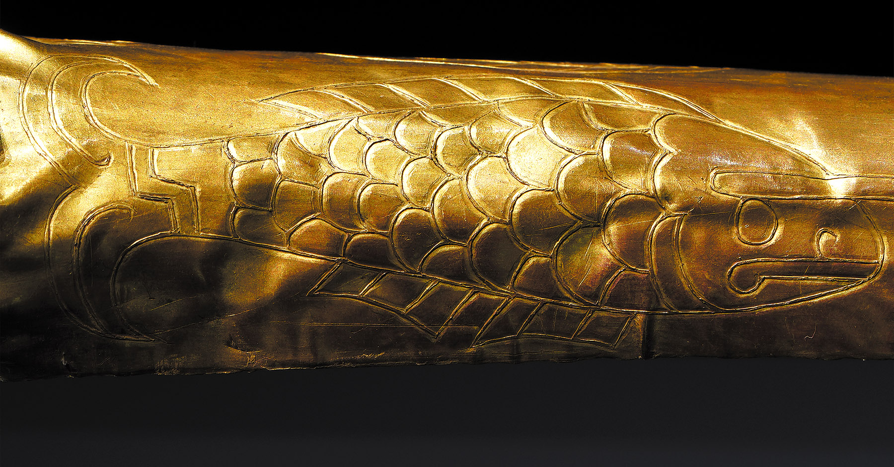

- 推荐用途：纹样 / 背景
- 尺寸：1800 x 943
- 本地路径：`05-gold-jade-patterns/01-gold-scepter-fish-scale.jpg`
- 来源：[A gripping mystery](https://www.chinadailyhk.com/hk/article/582418)

### 三星堆玉器刃部细节

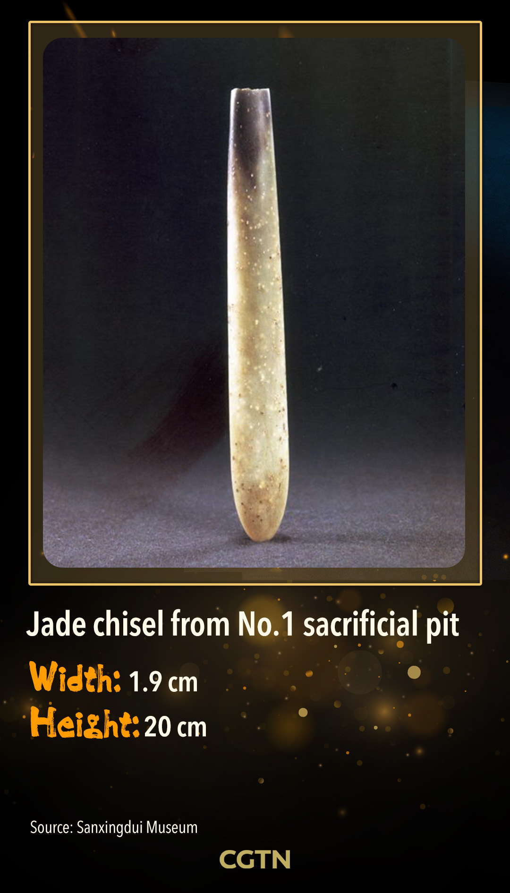

- 推荐用途：玉器 / 细节
- 尺寸：1080 x 1891
- 本地路径：`05-gold-jade-patterns/02-jade-blade-detail.jpg`
- 来源：[Wonders of Sanxingdui: Jade wares - CGTN](https://news.cgtn.com/news/2021-04-18/Wonders-of-Sanxingdui-Jade-wares-ZzaZUscP3q/index.html)

### 三星堆玉璋细节

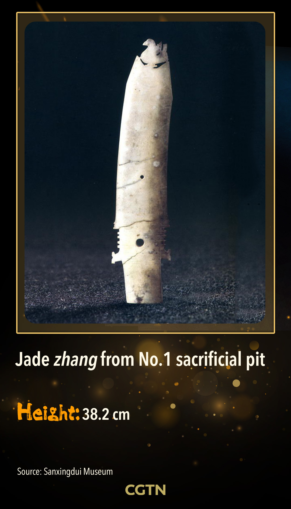

- 推荐用途：玉器 / 细节
- 尺寸：1080 x 1891
- 本地路径：`05-gold-jade-patterns/03-jade-zhang-detail.jpg`
- 来源：[Wonders of Sanxingdui: Jade wares - CGTN](https://news.cgtn.com/news/2021-04-18/Wonders-of-Sanxingdui-Jade-wares-ZzaZUscP3q/index.html)

### 三星堆玉器材质细节

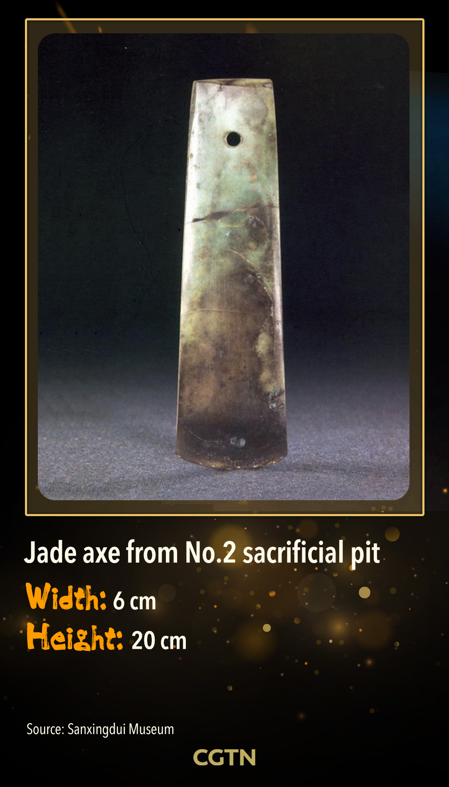

- 推荐用途：玉器 / 细节
- 尺寸：1080 x 1891
- 本地路径：`05-gold-jade-patterns/04-jade-tool-detail.jpg`
- 来源：[Wonders of Sanxingdui: Jade wares - CGTN](https://news.cgtn.com/news/2021-04-18/Wonders-of-Sanxingdui-Jade-wares-ZzaZUscP3q/index.html)

### 太阳神鸟穹顶视觉

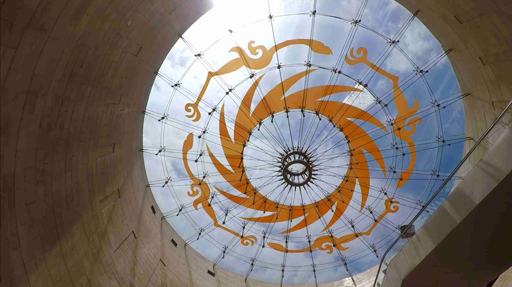

- 推荐用途：金沙 / 封面背景
- 尺寸：2001 x 1125
- 本地路径：`05-gold-jade-patterns/05-sun-bird-ceiling.jpg`
- 来源：[Modern technology helps reveal SW China's ancient civilization - CGTN](https://news.cgtn.com/news/3d4d544e786b7a4d/share_p.html)

### 金沙金器环带特写

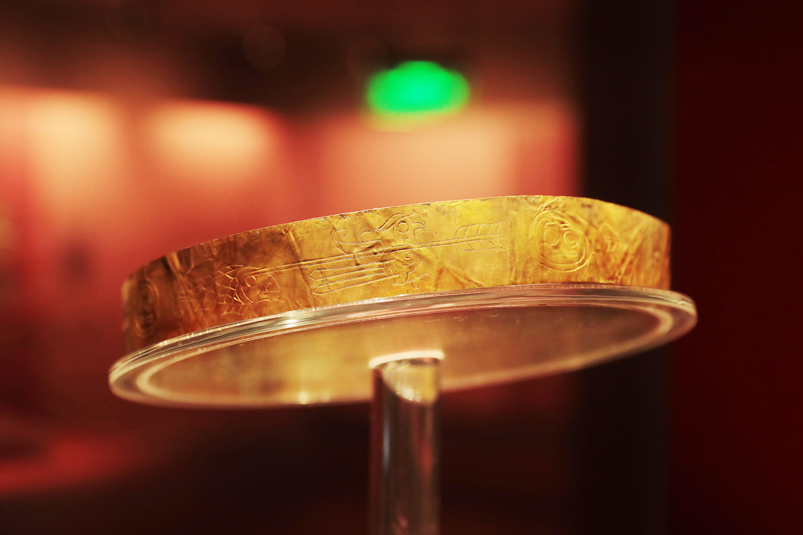

- 推荐用途：金器 / 材质细节
- 尺寸：1600 x 1067
- 本地路径：`05-gold-jade-patterns/06-gold-band-closeup.jpg`
- 来源：[Jinsha Site: A glimpse into China's ancient Shu civilization - CGTN](https://news.cgtn.com/news/2025-09-14/Jinsha-Site-A-glimpse-into-China-s-ancient-Shu-civilization-1GF6Jtjriw0/p.html)

### 古蜀金器纹样条带

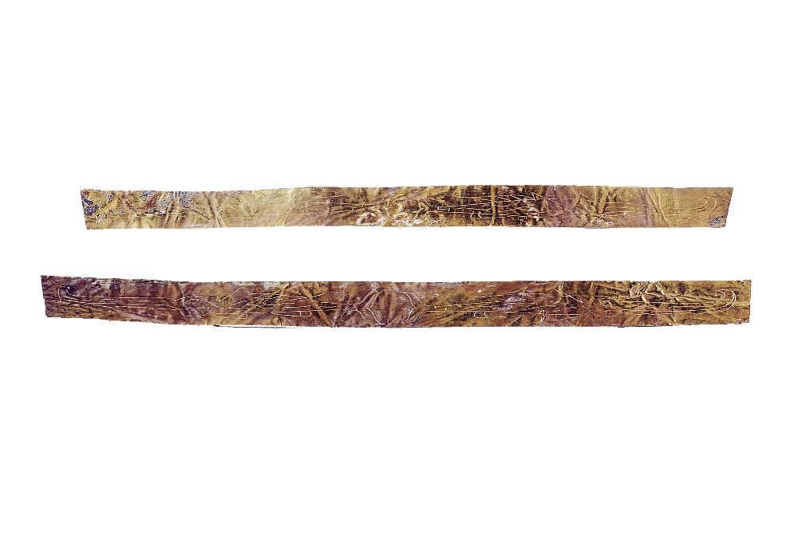

- 推荐用途：纹样 / 信息图
- 尺寸：1000 x 700
- 本地路径：`05-gold-jade-patterns/07-gold-pattern-strips.png`
- 来源：[Jinsha Site Museum](https://www.jinshasitemuseum.com/site-75/node/336)

### 太阳神鸟金饰图形

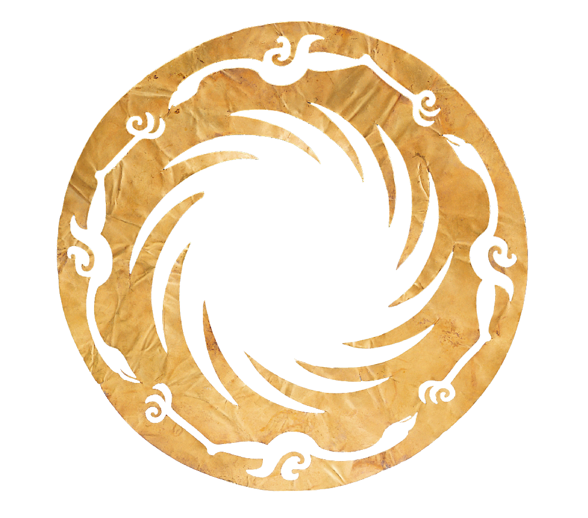

- 推荐用途：金沙 / 图标 / 封面
- 尺寸：1000 x 882
- 本地路径：`05-gold-jade-patterns/08-sun-bird-symbol.png`
- 来源：[Jinsha Site Museum](https://www.jinshasitemuseum.com/site-75/node/336)
